<div align="center">

**MÉMOIRE DE FIN DE CYCLE**

Licence professionnelle — **Systèmes d'Information et Réseaux**

---

## CONCEPTION ET RÉALISATION D'UNE PLATEFORME DE GESTION DE L'INFORMATION PRODUITS ET OFFRES (PIM) POUR MOOV AFRICA BURKINA FASO

---

**Présenté par :** KOUSSOUBÉ Drissa

**Directeur de mémoire :** Monsieur TINDANO Olivier

**Maître de stage :** Monsieur KEITA Boubacar — Département du Système Informatique, Moov Africa Burkina Faso

**Période de stage :** du 1er juin au 30 août 2025

**Année académique 2025-2026**

</div>

<div style="page-break-after: always;"></div>

# RÉSUMÉ

Moov Africa Burkina Faso commercialise une gamme étendue de produits et d'offres — terminaux, forfaits data et voix, services Mobile Money, packs convergents — dont l'information est aujourd'hui produite et diffusée de façon cloisonnée entre plusieurs directions. Il n'existe ni référentiel central, ni gouvernance partagée de la donnée produit, ni traçabilité du circuit de validation. Il en résulte des incohérences entre canaux de diffusion, des délais de mise sur le marché mal maîtrisés et une absence de mesure objective de la performance des équipes.

Ce mémoire présente la conception et la réalisation d'une plateforme de **gestion de l'information produits et offres (PIM)**. La plateforme centralise le catalogue en briques réutilisables — produits, services, packs — assemblées en offres commerciales, pilote le cycle de vie de chaque offre à travers un workflow de validation à quatre acteurs, contrôle les actifs numériques associés au moyen d'un circuit de validation graphique dédié, journalise l'intégralité des actions à des fins d'audit et diffuse automatiquement l'information finalisée vers les systèmes tiers dès la publication.

La démarche méthodologique combine le processus **2TUP**, pour la séparation entre branche fonctionnelle et branche technique, et le cadre agile **Scrum**, pour le pilotage itératif. L'analyse a produit un modèle **UML** complet : cas d'utilisation, classes, états-transitions, séquences, activité, composants et déploiement. La réalisation s'appuie sur une architecture modulaire **Spring Boot 3.4 / Java 21** exposant 109 points d'entrée REST sur 34 tables PostgreSQL, une interface web **Next.js / React / TypeScript** de quinze écrans, et une couverture de 444 tests automatisés.

La contribution centrale de ce travail est un **contrôle d'accès à double détente** : les permissions sont vérifiées côté serveur sur chaque point d'entrée et l'interface est composée dynamiquement à partir de ces mêmes permissions, de sorte qu'un acteur ne se voit jamais proposer une action que le serveur lui refuserait. Appliqué **champ par champ** et non écran par écran, ce principe permet à six profils métier de travailler sur une fiche unique qui s'enrichit successivement, sans silo ni ressaisie.

**Mots-clés :** PIM, référentiel produit, workflow de validation, RBAC, Spring Boot, Next.js, télécommunications, Time To Market.

# ABSTRACT

Moov Africa Burkina Faso markets a wide range of products and offers — handsets, data and voice bundles, Mobile Money services, converged packs — whose information is currently produced and distributed in silos across several departments. There is no central repository, no shared data governance and no traceability of the approval circuit. This results in inconsistencies between distribution channels, poorly controlled time to market and no objective measurement of team performance.

This thesis presents the design and implementation of a **Product Information Management (PIM)** platform. The platform centralises the catalogue into reusable building blocks — products, services and packs — assembled into commercial offers, drives the lifecycle of each offer through a four-actor approval workflow, controls the associated digital assets by means of a dedicated graphic validation circuit, logs every action for audit purposes and automatically distributes finalised information to third-party systems upon publication.

The methodology combines the **2TUP** process, for the separation between functional and technical branches, with the **Scrum** agile framework for iterative management. The analysis produced a complete **UML** model: use cases, classes, state machines, sequences, activity, components and deployment. The implementation relies on a modular **Spring Boot 3.4 / Java 21** architecture exposing 109 REST endpoints over 34 PostgreSQL tables, a **Next.js / React / TypeScript** web interface of fifteen screens, and a suite of 444 automated tests.

The central contribution of this work is **two-tier access control**: permissions are enforced server-side on every endpoint and the interface is composed dynamically from those same permissions, so that an actor is never offered an action the server would deny. Applied **field by field** rather than screen by screen, this principle allows six business profiles to work on a single record that is enriched successively, without silos or re-keying.

**Keywords:** PIM, product repository, approval workflow, RBAC, Spring Boot, Next.js, telecommunications, time to market.

<div style="page-break-after: always;"></div>

# LISTE DES TABLEAUX

| Référence | Intitulé |
|---|---|
| Tableau 0-1 | Liste des sigles et abréviations |
| Tableau I-1 | Diagnostic de l'existant |
| Tableau I-2 | Comparaison des outils existants |
| Tableau I-3 | Comparaison des méthodologies de développement |
| Tableau I-4 | Planning de réalisation |
| Tableau II-1 | Exigences fonctionnelles par module |
| Tableau II-2 | Exigences non fonctionnelles |
| Tableau II-3 | Identification des acteurs |
| Tableau II-4 | Matrice rôles / permissions |
| Tableau II-5 | Liste des cas d'utilisation |
| Tableau II-6 | Description du CU « Créer une offre » |
| Tableau II-7 | Description du CU « Affecter une offre à un analyste » |
| Tableau II-8 | Description du CU « Enrichir la fiche d'une offre » |
| Tableau II-9 | Description du CU « Valider ou rejeter une offre » |
| Tableau II-10 | Description du CU « Publier une offre » |
| Tableau II-11 | Description du CU « Valider un actif graphique » |
| Tableau II-12 | Statuts du cycle de vie d'une offre |
| Tableau II-13 | Transitions autorisées et permissions requises |
| Tableau II-14 | Propriété des champs de la fiche par métier |
| Tableau III-1 | Environnement logiciel |
| Tableau III-2 | Environnement matériel |
| Tableau III-3 | Répartition des points d'entrée REST par module |
| Tableau III-4 | Composition des écrans par rôle |
| Tableau III-5 | Différenciation à l'intérieur des écrans partagés |
| Tableau III-6 | Couverture des tests automatisés par module |
| Tableau III-7 | Cas de tests réalisés |
| Tableau III-8 | Synthèse des tests |
| Tableau III-9 | Menaces et mesures de sécurité |
| Tableau III-10 | Calcul des points de fonction bruts |
| Tableau III-11 | Facteurs d'ajustement du système |
| Tableau III-12 | Coût total du projet |

# LISTE DES FIGURES

| Référence | Intitulé |
|---|---|
| Figure I-1 | Position du PIM dans le système d'information |
| Figure I-2 | Circuit actuel de production d'une offre |
| Figure I-3 | Cycle de développement en Y (2TUP) |
| Figure I-4 | Diagramme de Gantt — planning de réalisation |
| Figure II-1 | Processus de fonctionnement du futur système |
| Figure II-2 | Diagramme de cas d'utilisation — Comptes et habilitations |
| Figure II-3 | Diagramme de cas d'utilisation — Catalogue et règles métier |
| Figure II-4 | Diagramme de cas d'utilisation — Cycle de vie de l'offre |
| Figure II-5 | Diagramme de cas d'utilisation — Médias, diffusion et pilotage |
| Figure II-6 | Diagramme de séquence — Créer et soumettre une offre |
| Figure II-7 | Diagramme de séquence — Affecter et enrichir une fiche |
| Figure II-8 | Diagramme de séquence — Valider, publier et diffuser |
| Figure II-9 | Architecture 3 tiers ou à 3 niveaux |
| Figure II-10 | Diagramme de classes — Comptes et habilitations |
| Figure II-11 | Diagramme de classes — Catalogue et règles métier |
| Figure II-12 | Diagramme de classes — Offre et cycle de vie |
| Figure II-13 | Diagramme de classes — Médias, diffusion et pilotage |
| Figure II-14 | Diagramme de déploiement |
| Figure II-15 | Diagramme de composants |
| Figure II-16 | Diagramme d'activité — circuit de validation d'une offre |
| Figure II-17 | Diagramme d'états-transitions de l'offre |
| Figure III-1 | Architecture en couches d'un module |
| Figure III-2 | Chaîne de composition d'un écran à partir des permissions |
| Figure III-3 | Chaîne événementielle déclenchée par une transition |
| Figure III-4 à III-17 | Interfaces homme-machine (14 écrans) |

<div style="page-break-after: always;"></div>

# SIGLES ET ABRÉVIATIONS

**Tableau 0-1 : Liste des sigles et abréviations**

| Sigle | Signification |
|---|---|
| 2TUP | *Two Track Unified Process* — processus de développement unifié en Y |
| API | *Application Programming Interface* — interface de programmation applicative |
| CDCF | Cahier des Charges Fonctionnel |
| CRM | *Customer Relationship Management* — gestion de la relation client |
| DAM | *Digital Asset Management* — gestion des actifs numériques |
| DSI | Département du Système Informatique |
| DTO | *Data Transfer Object* — objet de transfert de données |
| FCFA | Franc de la Communauté Financière Africaine |
| HTTPS | *HyperText Transfer Protocol Secure* |
| IFPUG | *International Function Point Users Group* |
| JPA | *Jakarta Persistence API* |
| JSON | *JavaScript Object Notation* |
| JWT | *JSON Web Token* |
| KPI | *Key Performance Indicator* — indicateur clé de performance |
| LTS | *Long Term Support* — support à long terme |
| MFA | *Multi-Factor Authentication* — authentification multifacteur |
| MVC | Modèle-Vue-Contrôleur |
| ORM | *Object-Relational Mapping* — correspondance objet-relationnel |
| PF / PFB / PFA | Point de Fonction / Points de Fonction Bruts / Ajustés |
| PIM | *Product Information Management* — gestion de l'information produits |
| RBAC | *Role-Based Access Control* — contrôle d'accès fondé sur les rôles |
| REST | *Representational State Transfer* |
| RUP | *Rational Unified Process* |
| S3 | *Simple Storage Service* — protocole de stockage objet |
| SEO | *Search Engine Optimization* — optimisation pour les moteurs de recherche |
| SGBD | Système de Gestion de Base de Données |
| SIR | Systèmes d'Information et Réseaux |
| SQL | *Structured Query Language* |
| SSO | *Single Sign-On* — authentification unique |
| TLS | *Transport Layer Security* |
| TOTP | *Time-based One-Time Password* |
| TTM | *Time To Market* — délai de mise sur le marché |
| UML | *Unified Modeling Language* |
| VAF | *Value Adjustment Factor* — facteur d'ajustement de la valeur |
| WebAuthn | *Web Authentication* — standard d'authentification sans mot de passe |

<div style="page-break-after: always;"></div>

# SOMMAIRE

**INTRODUCTION GÉNÉRALE**

**CHAPITRE I : CADRE THÉORIQUE ET CONCEPTUEL**
- I. La gestion de l'information produits
- II. Étude préalable
- III. Analyse de l'existant
- IV. Méthode d'analyse et de conception

**CHAPITRE II : ANALYSE ET CONCEPTION DU SYSTÈME**
- I. Expression des besoins
- II. Spécification technique
- III. Conception globale

**CHAPITRE III : RÉALISATION ET DÉPLOIEMENT DE L'APPLICATION**
- I. Présentation de l'environnement de travail
- II. Choix architecturaux
- III. Présentation des interfaces homme-machine
- IV. Test du système
- V. Politique de sécurité
- VI. Coût de réalisation
- VII. Bilan de stage

**CONCLUSION GÉNÉRALE**

**BIBLIOGRAPHIE — WEBOGRAPHIE — TABLE DES MATIÈRES**

<div style="page-break-after: always;"></div>

# INTRODUCTION GÉNÉRALE

Le secteur des télécommunications burkinabè se caractérise par une concurrence vive entre opérateurs et par un rythme de renouvellement des offres commerciales particulièrement soutenu. Dans ce contexte, la capacité d'un opérateur à concevoir, valider et diffuser rapidement une offre cohérente sur l'ensemble de ses canaux constitue un avantage concurrentiel direct. Une offre annoncée en boutique mais absente du site web, un tarif divergent entre l'application mobile et le centre d'appel, ou un visuel non conforme à la charte du groupe ne sont pas de simples désagréments : ils dégradent la confiance du client et génèrent un coût de traitement en aval.

L'information produit est donc un actif à part entière. Sa gestion relève d'une discipline identifiée, le *Product Information Management* (PIM), dont l'objet est de constituer un référentiel unique, gouverné et traçable, à partir duquel tous les canaux de diffusion sont alimentés [1]. Les acteurs majeurs du marché — Akeneo [22], Pimcore [23] — ou, dans le domaine spécifique des télécommunications, Amdocs Catalog et Netcracker Product Management, en proposent des implémentations industrielles.

C'est dans cette perspective que s'inscrit le stage effectué au Département du Système Informatique de Moov Africa Burkina Faso. Le constat posé par la structure d'accueil est celui d'une gestion cloisonnée : chaque direction produit sa propre version de l'information, les échanges se font par courrier électronique et par tableur, aucune trace exploitable ne subsiste du circuit de validation, et aucun indicateur ne permet de mesurer le délai réel entre l'idée d'une offre et sa mise en ligne.

La question centrale de ce mémoire est la suivante : **comment concevoir et réaliser un référentiel unique de l'information produits et offres qui, tout en réunissant six métiers autour d'une même fiche, garantisse à chacun un périmètre d'intervention strictement conforme à sa responsabilité, et rende mesurable le délai de mise sur le marché ?**

Cette question en appelle trois autres, qui structurent le travail :

1. **Quel modèle de données** permet de représenter à la fois des briques élémentaires réutilisables, leurs règles de compatibilité et les offres commerciales qui en résultent, sans duplication de l'information ?
2. **Quel mécanisme de contrôle d'accès** permet de faire cohabiter six acteurs sur une fiche unique qui s'enrichit successivement, chacun n'agissant que sur les champs et les transitions qui relèvent de son métier ?
3. **Quelle instrumentation** permet de reconstituer *a posteriori* le délai de mise sur le marché et d'identifier les étapes de blocage, à partir des seules actions réellement effectuées dans le système ?

L'hypothèse de travail retenue est que la réponse à ces trois questions repose sur un même principe : **faire de la permission la donnée pivot du système**. Modélisées en base plutôt que codées en dur, les permissions peuvent simultanément protéger les points d'entrée du serveur, composer l'interface de chaque acteur et servir de grille de lecture aux indicateurs de productivité.

Le document est organisé en trois chapitres. Le **chapitre I** expose le cadre théorique et conceptuel : la discipline PIM, l'étude préalable, l'analyse critique de l'existant et la méthode retenue. Le **chapitre II** est consacré à l'analyse et à la conception : expression des besoins, spécification technique et conception globale en UML. Le **chapitre III** traite de la réalisation et du déploiement : environnement, choix architecturaux, interfaces, tests, sécurité, coût et bilan de stage.

<div style="page-break-after: always;"></div>

# CHAPITRE I : CADRE THÉORIQUE ET CONCEPTUEL

## I. La gestion de l'information produits

### 1. Définition et périmètre

Un système **PIM** (*Product Information Management*) est un référentiel centralisé destiné à collecter, enrichir, gouverner et diffuser l'information relative aux produits d'une organisation vers l'ensemble de ses canaux de vente et de communication [1].

Il se distingue de deux familles voisines avec lesquelles il est souvent confondu :

- d'un **progiciel de gestion intégré**, qui gère les flux physiques, comptables et financiers : le PIM ne gère ni stock, ni facture, ni écriture comptable ;
- d'un **système de gestion de contenu**, qui gère la publication éditoriale d'un site : le PIM ne publie pas, il alimente ceux qui publient.

Le PIM gère la **donnée produit elle-même** : sa structure, sa qualité, son cycle de vie, sa gouvernance et sa distribution. Sa valeur tient à une propriété unique — il est la source de vérité. Tout canal qui s'en écarte est en tort par construction, ce qui rend les divergences détectables au lieu d'être négociables.

**Figure I-1 : Position du PIM dans le système d'information**

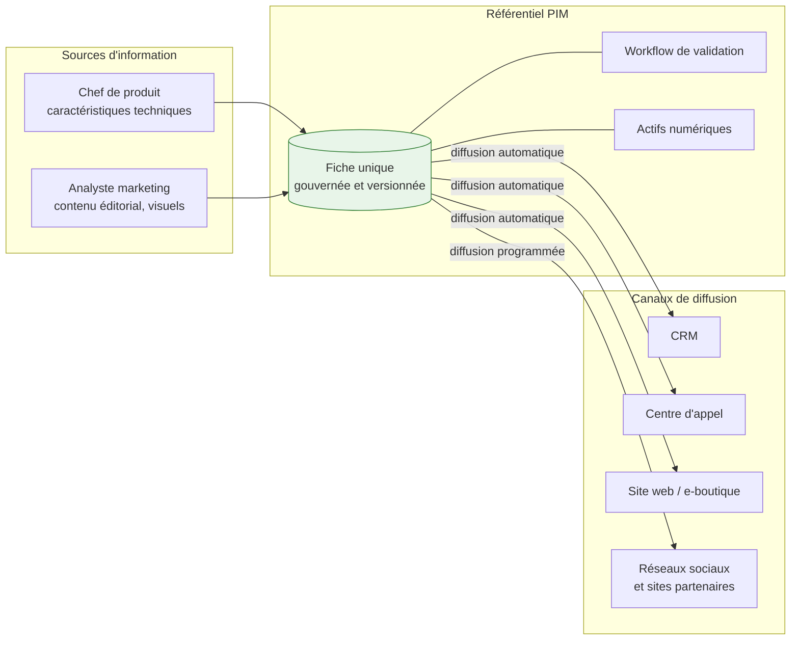
```mermaid
flowchart LR
    subgraph SOURCES["Sources d'information"]
        CDP["Chef de produit<br/>caractéristiques techniques"]
        AM["Analyste marketing<br/>contenu éditorial, visuels"]
    end
    subgraph PIM["Référentiel PIM"]
        REF[("Fiche unique<br/>gouvernée et versionnée")]
        WF["Workflow de validation"]
        DAM["Actifs numériques"]
    end
    subgraph CANAUX["Canaux de diffusion"]
        CRM["CRM"]
        CC["Centre d'appel"]
        WEB["Site web / e-boutique"]
        RS["Réseaux sociaux<br/>et sites partenaires"]
    end

    CDP --> REF
    AM --> REF
    REF --- WF
    REF --- DAM
    REF -->|diffusion automatique| CRM
    REF -->|diffusion automatique| CC
    REF -->|diffusion automatique| WEB
    REF -->|diffusion programmée| RS

    style REF fill:#e8f5e9,stroke:#2e7d32
```

### 2. Spécificités du secteur des télécommunications

Trois caractéristiques distinguent l'information produit d'un opérateur télécom de celle d'un distributeur classique.

**La composition.** Un opérateur ne vend pas seulement des articles unitaires : il vend des **assemblages**. Une offre convergente associe un terminal, un forfait data et un service de paiement mobile. La fiche décrit donc une combinaison, dont les éléments existent par ailleurs et sont réutilisés dans d'autres offres. Un modèle où chaque offre porterait sa propre description dupliquerait l'information autant de fois qu'elle est réutilisée.

**Les dépendances.** Certaines combinaisons sont interdites, d'autres obligatoires. Une offre annoncée comme convergente qui ne comporterait pas de composante Mobile Money serait commercialement fausse. Ces règles doivent être vérifiées **avant** que l'offre n'entre dans le circuit de validation, faute de quoi l'erreur remonte toute la chaîne avant d'être détectée.

**La volatilité.** Les offres promotionnelles ont des dates de validité courtes. Le cycle de vie ne s'arrête donc pas à la publication : suspension, obsolescence, retrait et archivage en font partie intégrante, et une offre dont la validité expire sans que le système ne réagisse reste annoncée alors qu'elle n'est plus commercialisable.

### 3. Contexte de l'étude

Moov Africa Burkina Faso, filiale du groupe Maroc Telecom exploitée sous la marque Moov Africa, commercialise cinq familles de produits et services : téléphonie mobile, internet mobile, services financiers Moov Money, terminaux, et offres convergentes. Le stage s'est déroulé au **Département du Système Informatique**, structure chargée du développement et de l'intégration des applications internes.

Le sujet se situe à l'intersection de deux directions : la **Direction Marketing et Produits**, propriétaire fonctionnelle de l'information produit, et la **DSI**, qui en assure la mise en œuvre technique. Cette double appartenance explique la place prise, dans ce travail, par la formalisation du circuit de validation : l'apport attendu n'était pas une prouesse technique isolée, mais la **mise en forme informatique d'un processus métier jusque-là implicite**. Jusqu'à présent, l'ordre des validations et le périmètre d'intervention de chacun relevaient de l'usage et de la mémoire des équipes, non d'une règle écrite et opposable.

L'appartenance au groupe emporte par ailleurs une contrainte directe sur le sujet : une **charte graphique commune**, notamment un usage normé du logotype selon le fond d'affichage, dont le respect fait partie des contrôles à exercer sur les actifs numériques associés aux offres.

## II. Étude préalable

### 1. Présentation du thème

Le thème est intitulé : **« Conception et réalisation d'une plateforme de gestion de l'information produits et offres (PIM) pour Moov Africa Burkina Faso »**. Il comporte trois dimensions :

- une **dimension référentielle** : constituer une source unique de vérité pour les produits, services, packs et offres ;
- une **dimension processus** : formaliser et automatiser le circuit qui conduit une offre de l'idée à la diffusion ;
- une **dimension gouvernance** : garantir que chaque acteur n'intervient que dans le périmètre de sa responsabilité, et conserver la trace de chaque intervention.

### 2. Problématique

L'absence de référentiel central conduit à une situation où l'information produit **circule sans jamais résider nulle part**. Or ce qui ne réside nulle part ne peut être ni gouverné, ni tracé, ni mesuré. La problématique se formule ainsi :

> Comment concevoir un référentiel unique de l'information produits et offres qui réunisse six métiers autour d'une même fiche, tout en garantissant à chacun un périmètre d'intervention strictement conforme à sa responsabilité, et qui rende mesurable le délai de mise sur le marché ?

La difficulté centrale n'est pas la centralisation — une base de données unique la résout — mais la **cohabitation**. Une fiche partagée entre six acteurs pose un problème qu'un système où chacun détient son propre document ne pose pas : il faut décider, pour chaque champ et à chaque instant, qui a le droit d'écrire.

Deux modèles simples échouent l'un et l'autre :

| Modèle | Règle | Pourquoi il échoue |
|---|---|---|
| Propriété par étape | « Celui dont c'est le tour touche à tout, les autres ne touchent à rien » | Empêche un chef de produit de corriger un prix erroné pendant que l'analyste rédige les textes, alors que le prix relève de son métier et d'aucun autre |
| Écriture ouverte | « Chacun modifie ce qu'il voit » | Ruine la séparation des tâches que le circuit de validation est précisément censé garantir |

La réponse développée au chapitre II consiste à déplacer l'unité de propriété : ce n'est pas la fiche qui appartient à un acteur, c'est **chaque champ**.

### 3. Objectifs de l'étude

**Objectif général :** doter Moov Africa Burkina Faso d'une plateforme opérationnelle de gestion de l'information produits et offres.

| # | Objectif spécifique | Critère de vérification |
|---|---|---|
| O1 | Centraliser produits, services, packs et offres dans un référentiel unique | Une fiche, une seule ligne en base, consultée par les six acteurs |
| O2 | Structurer le catalogue en briques réutilisables assemblées en offres | Un même service figurant dans plusieurs offres sans duplication |
| O3 | Formaliser et automatiser les règles de composition et de compatibilité | Blocage effectif d'un assemblage interdit avant soumission |
| O4 | Piloter le cycle de vie complet de l'offre par un workflow à quatre acteurs | Dix statuts, transitions contrôlées par permission et historisées |
| O5 | Contrôler la conformité des actifs numériques par un circuit dédié | Validation graphique distincte de la validation métier |
| O6 | Gérer finement les habilitations et conserver l'historique complet | Permissions en base, journal d'audit, versions et restauration |
| O7 | Notifier automatiquement chaque acteur à chaque étape pertinente | Notification produite à chaque transition, adressée au bon destinataire |
| O8 | Fournir les indicateurs de pilotage | TTM, temps par étape et goulot, calculés sur les transitions réelles |
| O9 | Assister la production de contenu et l'extraction des caractéristiques | Génération de descriptions et étiquetage, séparés par métier |
| O10 | Diffuser l'information finalisée vers les systèmes tiers | Export déclenché automatiquement par la publication |

### 4. Résultats attendus

1. une **application web fonctionnelle** et déployable, couvrant les onze modules du cahier des charges ;
2. un **modèle de données** relationnel documenté et versionné ;
3. un **dossier de conception UML** complet ;
4. une **interface différenciée par rôle**, dans laquelle chaque acteur ne dispose que des écrans et actions relevant de sa responsabilité ;
5. un **jeu de tests automatisés** couvrant les règles métier et les habilitations ;
6. une **documentation d'exploitation** permettant à la DSI de reprendre le produit.

## III. Analyse de l'existant

L'analyse a été conduite au moyen de trois techniques complémentaires : des **entretiens semi-directifs** avec les acteurs du circuit, une **analyse documentaire** portant notamment sur le cahier des charges fonctionnel de référence [24], et l'**observation directe** des supports de travail effectivement utilisés.

### 1. Présentation de l'existant

La gestion du catalogue repose aujourd'hui sur un ensemble d'outils bureautiques et de canaux informels :

- des **fichiers de type tableur**, utilisés indépendamment par chaque direction pour décrire ses produits, tarifs et conditions commerciales ;
- des **échanges par courriel et par réunion** pour la validation, sans formalisme ni trace structurée ;
- des **dossiers partagés dispersés**, sans dépôt commun, pour les visuels et documents associés ;
- les **systèmes de diffusion existants** — site web, CRM, centre d'appel — alimentés manuellement et de façon non synchronisée.

**Figure I-2 : Circuit actuel de production d'une offre**

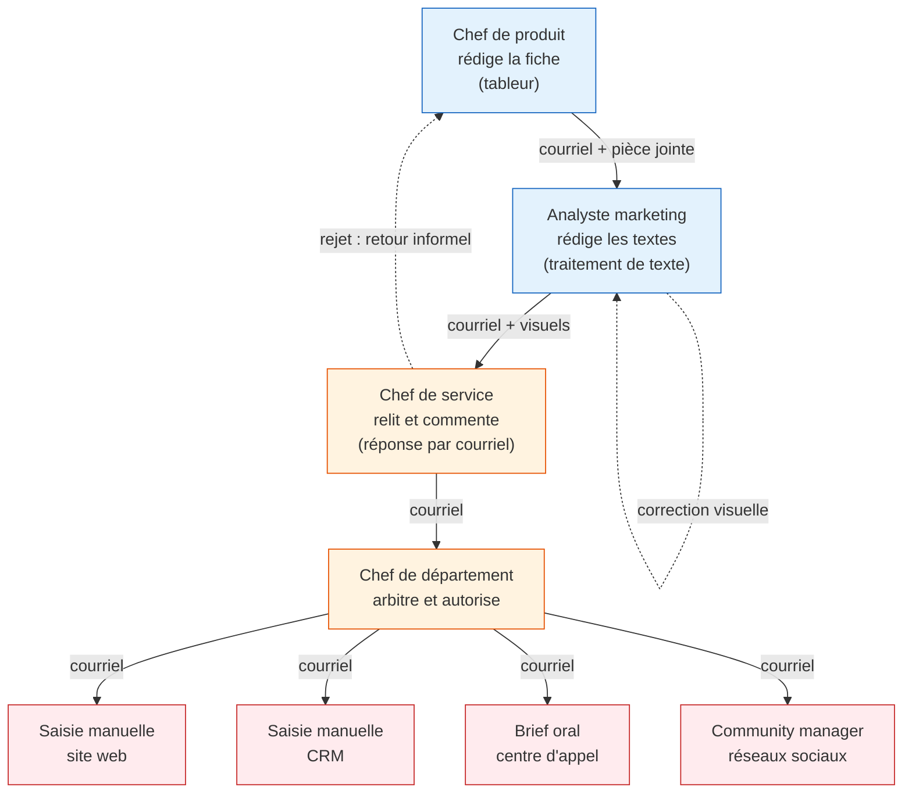
```mermaid
flowchart TD
    A["Chef de produit<br/>rédige la fiche<br/>(tableur)"] -->|courriel + pièce jointe| B["Analyste marketing<br/>rédige les textes<br/>(traitement de texte)"]
    B -->|courriel + visuels| C["Chef de service<br/>relit et commente<br/>(réponse par courriel)"]
    C -->|courriel| D["Chef de département<br/>arbitre et autorise"]
    D -->|courriel| E["Saisie manuelle<br/>site web"]
    D -->|courriel| F["Saisie manuelle<br/>CRM"]
    D -->|courriel| G["Brief oral<br/>centre d'appel"]
    D -->|courriel| H["Community manager<br/>réseaux sociaux"]

    C -.->|rejet : retour informel| A
    B -.->|correction visuelle| B

    style A fill:#e3f2fd,stroke:#1565c0
    style B fill:#e3f2fd,stroke:#1565c0
    style C fill:#fff3e0,stroke:#e65100
    style D fill:#fff3e0,stroke:#e65100
    style E fill:#ffebee,stroke:#c62828
    style F fill:#ffebee,stroke:#c62828
    style G fill:#ffebee,stroke:#c62828
    style H fill:#ffebee,stroke:#c62828
```

Les quatre encadrés rouges figurent des **saisies manuelles indépendantes de la même information dans quatre systèmes différents**. C'est là que naissent les divergences entre canaux.

### 2. Diagnostic de l'existant

**Tableau I-1 : Diagnostic de l'existant**

| # | Dysfonctionnement observé | Cause | Conséquence |
|---|---|---|---|
| D1 | Absence de référentiel central | Chaque direction détient sa propre copie | Divergences de prix et de libellés entre canaux |
| D2 | Ressaisie multiple de la même information | Quatre canaux alimentés à la main | Coût de saisie, erreurs de recopie |
| D3 | Aucune trace exploitable du circuit de validation | Validation par courriel | Impossible de répondre à « qui a validé quoi, et quand ? » |
| D4 | Absence de mesure du délai de mise en marché | Aucune date d'étape enregistrée | Le Time To Market n'est pas connu, donc pas pilotable |
| D5 | Pas de contrôle systématique des visuels | Contrôle visuel humain | Visuels hors charte publiés, risque sur les droits d'auteur |
| D6 | Pas de gestion des dépendances entre produits | Règles de composition non formalisées | Offres convergentes incomplètes détectées après publication |
| D7 | Habilitations implicites | Périmètre fondé sur l'usage | Modifications non autorisées, responsabilité diluée |
| D8 | Répartition du travail informelle | Aucune désignation d'un responsable par fiche | Travail fait deux fois, ou pas du tout |
| D9 | Détection des doublons inexistante | Aucune vérification à la création | Références produits créées en double |

Ces neuf constats se ramènent à une cause unique : **l'information produit n'a pas de lieu**.

### 3. Étude comparative des outils existants

**Tableau I-2 : Comparaison des outils existants**

| Critère | Akeneo [22] | Pimcore [23] | Amdocs / Netcracker | Développement spécifique |
|---|---|---|---|---|
| Modèle catalogue en briques | Oui | Oui | Oui, orienté télécom | À concevoir |
| Workflow de validation configurable | Édition payante | Oui | Oui | À concevoir |
| Circuit de validation graphique dédié | Non natif | Partiel | Non | À concevoir |
| Habilitations au niveau du champ | Non | Partiel | Oui, complexe | Native |
| Adaptation aux rôles internes de Moov | Paramétrage lourd | Paramétrage lourd | Surdimensionné | Native |
| Coût de licence | Élevé | Modéré à élevé | Très élevé | Nul |
| Dépendance à un éditeur externe | Forte | Moyenne | Très forte | Nulle |
| Maîtrise interne du code | Nulle | Partielle | Nulle | Totale |

### 4. Solution proposée

Le **développement d'une solution spécifique** a été retenu pour trois raisons.

D'abord, le **circuit de validation graphique dédié**, distinct de la validation métier, est une exigence propre à l'organisation de Moov Africa Burkina Faso qu'aucune solution du marché ne couvre nativement. Ensuite, la **granularité des habilitations** demandée — un périmètre défini champ par champ et non écran par écran — supposerait dans tous les cas un développement d'adaptation important, qui annulerait une partie de l'avantage d'une solution sur étagère. Enfin, le contexte est celui d'un projet de fin d'études dont la finalité pédagogique est la conception et la réalisation d'un système d'information complet.

Cette décision est assumée avec sa contrepartie : un développement spécifique reporte sur l'entreprise la charge de maintenance et d'évolution que porterait autrement un éditeur. Le choix d'une pile technologique standard et largement diffusée, exposé au chapitre III, vise à limiter ce risque.

## IV. Méthode d'analyse et de conception

### 1. Cycle de développement

**Tableau I-3 : Comparaison des méthodologies de développement**

| Méthode | Principe | Avantages | Limites | Retenue ? |
|---|---|---|---|---|
| Cascade | Phases séquentielles figées | Simple, documentée | Besoins figés dès le départ | Non |
| Cycle en V | Cascade + tests miroirs | Traçabilité exigence/test | Rigidité identique | Non |
| RUP [4] | Itératif, piloté par les cas d'utilisation | Complet, outillé | Formalisme disproportionné pour une équipe réduite | Non |
| **2TUP** [2] | Deux branches réunies en Y | Sépare le métier de la technique | Ne prescrit aucun rythme de livraison | **Oui, pour la structure** |
| **Scrum** [5] | Itérations courtes, démonstration régulière | Correction rapide des écarts | Ne prescrit aucune démarche de modélisation | **Oui, pour le pilotage** |
| XP | Binômage, tests d'abord | Qualité de code élevée | Suppose plusieurs développeurs | Non |

La démarche retenue est **hybride** : le 2TUP fournit la *structure* — que produire à chaque phase — et Scrum fournit le *rythme* — à quelle cadence livrer et faire valider.

**Figure I-3 : Cycle de développement en Y (2TUP) [2]**

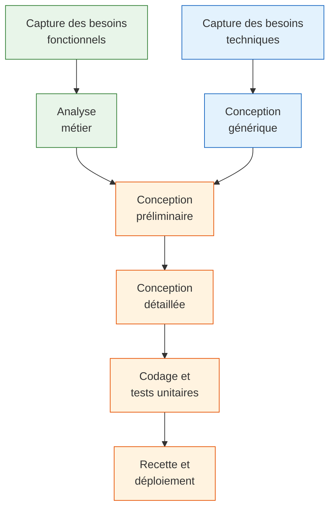
```mermaid
flowchart TD
    A["Capture des besoins<br/>fonctionnels"] --> B["Analyse<br/>métier"]
    C["Capture des besoins<br/>techniques"] --> D["Conception<br/>générique"]
    B --> E["Conception<br/>préliminaire"]
    D --> E
    E --> F["Conception<br/>détaillée"]
    F --> G["Codage et<br/>tests unitaires"]
    G --> H["Recette et<br/>déploiement"]

    style A fill:#e8f5e9,stroke:#2e7d32
    style B fill:#e8f5e9,stroke:#2e7d32
    style C fill:#e3f2fd,stroke:#1565c0
    style D fill:#e3f2fd,stroke:#1565c0
    style E fill:#fff3e0,stroke:#e65100
    style F fill:#fff3e0,stroke:#e65100
    style G fill:#fff3e0,stroke:#e65100
    style H fill:#fff3e0,stroke:#e65100
```

La **branche fonctionnelle** a produit le modèle des cas d'utilisation, le dictionnaire des données et le modèle de classes métier, indépendamment de toute technologie. La **branche technique** a fixé la pile logicielle, le modèle de sécurité, la stratégie de persistance et l'architecture de déploiement, indépendamment du métier. La **branche de réalisation** a fusionné les deux.

L'apport de **Scrum** mérite d'être souligné : trois décisions de conception documentées dans ce mémoire — la granularité champ par champ des habilitations, la désignation nominative de l'analyste chargé d'une fiche, et l'exigence d'honnêteté de l'interface — ne sont pas issues de l'analyse initiale mais de remarques formulées lors de démonstrations de fin d'itération. La démonstration régulière a joué le rôle de mécanisme de correction.

### 2. Langage de modélisation

Le langage retenu est **UML 2.5.1** [6], normalisé par l'*Object Management Group*, indépendant de tout langage de programmation et devenu le standard de fait pour la modélisation des systèmes d'information [2].

| Diagramme | Nature | Objet dans le projet |
|---|---|---|
| Cas d'utilisation | Statique, fonctionnel | Délimiter le système et identifier les acteurs |
| Séquence | Dynamique | Décrire les échanges entre acteurs et composants |
| Activité | Dynamique | Modéliser le circuit de validation |
| États-transitions | Dynamique | Modéliser le cycle de vie de l'offre |
| Classes | Statique, structurel | Décrire les entités du domaine et leurs relations |
| Composants | Statique, architectural | Décrire le découpage logiciel en modules |
| Déploiement | Statique, architectural | Décrire la répartition matérielle |

Les diagrammes sont produits au format **Mermaid**, syntaxe textuelle rendue graphiquement, ce qui permet de les versionner avec le code source et évite la désynchronisation entre modèle et implémentation.

### 3. Planning de réalisation

**Tableau I-4 : Planning de réalisation**

| Sprint | Objet | Livrable principal |
|---|---|---|
| S0 | Cadrage, étude de l'existant, comparatif | Dossier d'analyse, choix de la solution |
| S1 | Modélisation UML, modèle de données | Diagrammes UML, schéma physique |
| S2 | Socle technique, authentification, RBAC | Connexion, rôles et permissions en base |
| S3 | Module catalogue et catégories | Création de produits, services et packs |
| S4 | Règles métier et dépendances | Moteur de contrôle de composition |
| S5 | Cycle de vie de l'offre | Dix statuts, transitions contrôlées |
| S6 | Actifs numériques et validation graphique | Dépôt de médias, circuit dédié |
| S7 | Notifications, audit, versions | Journal, notifications, restauration |
| S8 | Analytique et indicateurs | Time To Market, temps par étape |
| S9 | Assistance au contenu, campagnes | Génération de contenu, diffusion programmée |
| S10 | Composition des écrans par rôle | Interface différenciée par acteur |
| S11 | Diffusion automatique et recette | Chaîne événementielle, tests, déploiement |

**Figure I-4 : Diagramme de Gantt — planning de réalisation**

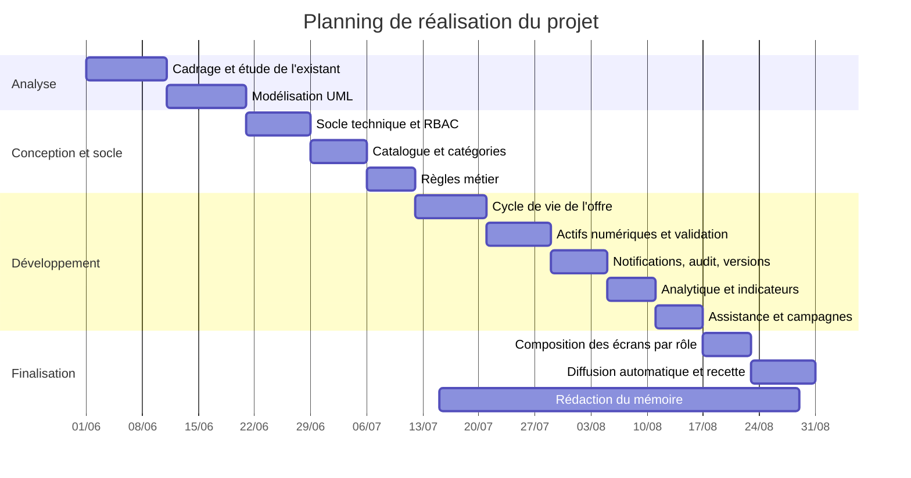
```mermaid
gantt
    title Planning de réalisation du projet
    dateFormat YYYY-MM-DD
    axisFormat %d/%m
    section Analyse
    Cadrage et étude de l'existant   :a1, 2025-06-01, 10d
    Modélisation UML                 :a2, after a1, 10d
    section Conception et socle
    Socle technique et RBAC          :b1, after a2, 8d
    Catalogue et catégories          :b2, after b1, 7d
    Règles métier                    :b3, after b2, 6d
    section Développement
    Cycle de vie de l'offre          :c1, after b3, 9d
    Actifs numériques et validation  :c2, after c1, 8d
    Notifications, audit, versions   :c3, after c2, 7d
    Analytique et indicateurs        :c4, after c3, 6d
    Assistance et campagnes          :c5, after c4, 6d
    section Finalisation
    Composition des écrans par rôle  :d1, after c5, 6d
    Diffusion automatique et recette :d2, after d1, 8d
    Rédaction du mémoire             :d3, 2025-07-15, 45d
```

## Conclusion du chapitre I

Ce chapitre a établi que le problème rencontré n'est pas l'absence d'outil mais l'absence de lieu de résidence de l'information produit, cause unique des neuf dysfonctionnements diagnostiqués. Le comparatif a justifié le développement spécifique par deux exigences qu'aucune solution du marché ne couvre nativement : le circuit graphique dédié et les habilitations à granularité de champ. La démarche 2TUP enrichie de Scrum, appuyée sur UML, a été retenue pour conduire le projet.

<div style="page-break-after: always;"></div>
# CHAPITRE II : ANALYSE ET CONCEPTION DU SYSTÈME

## I. Expression des besoins

### 1. Description du processus de fonctionnement du futur système

Le futur système repose sur un principe directeur : **une fiche unique qui s'enrichit successivement, sans silo ni recopie**. Là où l'existant fait circuler des documents d'un acteur à l'autre, le système fait intervenir les acteurs successivement sur un même enregistrement.

Le processus se déroule comme suit :

1. le **chef de produit** crée l'offre à partir de produits, services ou packs existants. Le moteur de règles vérifie la composition. L'offre est au statut *Brouillon* ;
2. le chef de produit **soumet** la fiche pour habillage : l'offre passe *En enrichissement* ;
3. le **chef de service répartit le travail** en désignant nominativement l'analyste chargé de la fiche, **en fonction de la charge de chacun** ;
4. l'**analyste marketing** enrichit la même fiche : descriptions, référencement, dépôt et association des visuels. Il soumet ensuite pour validation ;
5. le **chef de service** valide ou rejette avec commentaire. En cas de rejet, la fiche revient *En enrichissement* et le circuit reprend au même point ;
6. en parallèle, le chef de service valide ou rejette les **actifs graphiques** selon un circuit distinct du circuit métier ;
7. le **chef de département** effectue la validation finale, **vérifie les mentions légales** et publie l'offre, immédiatement ou à une date programmée ;
8. la publication déclenche **automatiquement la diffusion** de la fiche complète vers le CRM, le centre d'appel et le site web ; le **community manager** est notifié et prépare ses campagnes vers les réseaux sociaux et sites partenaires ;
9. une fois publiée, l'offre peut être **suspendue**, rendue **obsolète**, **retirée** puis **archivée**. L'expiration de sa date de validité produit ce déclassement automatiquement.

**Figure II-1 : Processus de fonctionnement du futur système**


```mermaid
flowchart TD
    START(("Début")) --> CREA["Chef de produit :<br/>créer l'offre à partir<br/>de briques du catalogue"]
    CREA --> RULE{"Composition<br/>conforme aux<br/>règles métier ?"}
    RULE -->|Non, règle bloquante| CREA
    RULE -->|Oui| DRAFT["Statut : Brouillon"]
    DRAFT --> SUBM["Chef de produit :<br/>soumettre pour enrichissement"]
    SUBM --> ENR["Statut : En enrichissement"]
    ENR --> ASSIGN["Chef de service : affecter<br/>selon la charge des analystes"]
    ASSIGN --> NOTIF["Notification à<br/>l'analyste désigné"]
    NOTIF --> WORK["Analyste marketing :<br/>descriptions, SEO, visuels"]
    WORK --> SUBV["Analyste : soumettre<br/>pour validation"]
    SUBV --> VAL["Statut : En validation"]
    VAL --> DEC{"Chef de service :<br/>décision"}
    DEC -->|Rejet + commentaire| ENR
    DEC -->|Validation| OK["Statut : Validée"]
    OK --> LEGAL["Chef de département :<br/>vérifier les mentions légales"]
    LEGAL --> PUB{"Publication"}
    PUB -->|Immédiate| PUBLI["Statut : Publiée"]
    PUB -->|Programmée| PLAN["Statut : Planifiée"]
    PLAN -->|Échéance atteinte| PUBLI
    PUBLI --> DIFF["Diffusion automatique :<br/>CRM, centre d'appel, site web"]
    DIFF --> CM["Community manager :<br/>campagnes réseaux sociaux"]
    CM --> FIN["Suspension, obsolescence,<br/>retrait puis archivage"]
    FIN --> END(("Fin"))

    style DRAFT fill:#eceff1,stroke:#546e7a
    style ENR fill:#e3f2fd,stroke:#1565c0
    style VAL fill:#fff8e1,stroke:#f9a825
    style OK fill:#e0f2f1,stroke:#00897b
    style PUBLI fill:#e8f5e9,stroke:#2e7d32
    style DIFF fill:#e8f5e9,stroke:#2e7d32
```

### 2. Spécification fonctionnelle

#### a. Exigences fonctionnelles

**Tableau II-1 : Exigences fonctionnelles par module**

| Module | Exigences fonctionnelles |
|---|---|
| **M1 — Authentification et comptes** | Connexion, déconnexion, renouvellement sécurisé de session, verrouillage après échecs répétés, gestion du statut du compte, audit des connexions, architecture compatible avec une évolution vers le SSO |
| **M2 — Catalogue** | Trois types de briques : produits physiques, services d'offre, packs. Création, modification, consultation, classement par catégories, archivage, association de briques à un pack, détection de doublons, score de qualité de fiche avant soumission |
| **M3 — Règles et dépendances** | Compatibilité et incompatibilité entre produits, composition obligatoire, produit vendable uniquement en pack. Évaluation à la création, à chaque modification de la composition et à la soumission ; chaque règle porte sa sévérité — bloquante ou simple avertissement |
| **M4 — Cycle de vie des offres** | Dix statuts, transitions contrôlées, fiche unique enrichie successivement, répartition nominative du travail, correction et resoumission après rejet, historique des versions et restauration |
| **M5 — Actifs numériques** | Stockage et association d'images, vidéos et notices ; contrôle automatique de résolution et de format ; signalement des risques de droits d'auteur ; bibliothèque réutilisable incluant les éléments de charte du groupe |
| **M6 — Validation graphique** | Circuit dédié et distinct de la validation métier : validation ou rejet des visuels avec annotation, correction et redépôt après rejet |
| **M7 — Droits et habilitations** | Rôles fixes prédéfinis, permissions stockées en base, historique complet consultable par l'administrateur avec restauration, lecture seule sur ses propres fiches pour les autres acteurs |
| **M8 — Notifications** | Notification de l'analyste désigné, du chef de service à la soumission, du chef de département à la validation, du chef de produit en cas de rejet et de publication, du community manager à la publication, de l'auteur à l'approche de l'expiration |
| **M9 — Analytique et KPI** | Time To Market, productivité par étape, identification des goulots. Vue globale réservée à l'encadrement, vue individuelle pour l'analyste marketing |
| **M10 — Assistance à la production de contenu** | Extraction et étiquetage des caractéristiques côté chef de produit ; génération de descriptions optimisées côté analyste marketing ; assistant conversationnel ; recherche sémantique |
| **M11 — Diffusion multicanale** | Diffusion automatique de la fiche complète vers CRM, centre d'appel et site web dès la publication ; diffusion manuelle ou programmée vers réseaux sociaux et sites partenaires ; statistiques de diffusion par canal ; export autonome du catalogue |

#### b. Exigences non fonctionnelles

**Tableau II-2 : Exigences non fonctionnelles**

| # | Exigence | Traduction en contrainte de conception |
|---|---|---|
| NF1 | Temps de réponse acceptable sur les actions courantes | Index sur les colonnes de filtrage, pagination systématique côté serveur |
| NF2 | Disponibilité de la diffusion, reprise après erreur sans perte de fiche | Export enregistré avec son corps et son statut, rejouable ; clés d'idempotence |
| NF3 | Traçabilité systématique : qui, quoi, quand | Journal d'audit alimenté par événements sur toute action sensible |
| NF4 | Scalabilité au-delà du jeu de démonstration | Aucun calcul en mémoire sur l'intégralité du catalogue dans les chemins critiques |
| NF5 | Accessibilité et adaptation aux écrans | Interface fluide du téléphone au grand écran ; information jamais portée par la seule couleur |
| NF6 | Sécurité | Chiffrement du transport, jetons signés, contrôle par permission, validation des entrées, secrets hors dépôt |
| NF7 | Maintenabilité | Découpage par domaine, objets de transfert distincts des entités, tests automatisés |
| NF8 | Honnêteté de l'interface et des traces | Aucune donnée simulée présentée comme réelle ; aucun succès affiché sur un échec ; aucune trace d'action sans action |

L'exigence **NF8** n'est pas usuelle et mérite d'être justifiée. Elle est née d'un incident : un écran affichait la création réussie d'un élément et l'insérait localement alors que le serveur avait refusé l'opération. Après rafraîchissement, la donnée avait disparu et l'erreur réelle était restée invisible pendant toute une séance de démonstration. Formalisée, elle interdit quatre pratiques : les jeux de données simulés affichés comme réels, les confirmations de succès sur un échec, les commandes sans effet persistant, et — extension apportée en fin de projet — les **traces d'opération sans opération**, c'est-à-dire l'enregistrement d'un export réussi dont le corps serait vide.

#### c. Identification des acteurs

**Tableau II-3 : Identification des acteurs**

| Acteur | Abrév. | Type | Responsabilités principales |
|---|---|---|---|
| Administrateur système | Admin | Principal | Comptes et rôles, audit complet, restauration de version, configuration des indicateurs et des canaux de notification, export autonome du catalogue |
| Chef de produit | CdP | Principal | Création des produits, services et packs ; assemblage des offres ; étiquetage assisté ; correction et resoumission en cas de rejet |
| Analyste marketing | AM | Principal | Enrichissement de la fiche : descriptions, référencement ; dépôt et association des médias ; bibliothèque de médias ; tests A/B ; suivi de son propre temps de traitement |
| Chef de service | CdS | Principal | **Répartition du travail entre analystes selon leur charge** ; validation ou rejet des actifs graphiques ; validation ou rejet opérationnel de l'offre avec commentaire ; vue transversale sur plusieurs chefs de produit |
| Chef de département marketing et produits | CdD | Principal | Validation finale décisionnelle ; annulation d'une offre déjà validée sur consigne de la direction ; **vérification des mentions légales** ; publication ; vue globale du TTM et de la productivité ; **rapprochement de la diffusion avec les systèmes tiers** |
| Community manager | CM | Principal | Consultation des offres publiées ; préparation et programmation des campagnes vers réseaux sociaux et sites partenaires ; suivi des statistiques de diffusion par canal |
| Système | Sys | Secondaire | Publication à l'échéance, déclassement à expiration, diffusion automatique, contrôle de conformité des médias, journalisation |
| CRM, Centre d'appel, Site web | — | Secondaires | Systèmes externes destinataires de la fiche complète dès publication |

Quatre **règles de visibilité** conditionnent la conception :

1. un chef de produit ne voit que les offres qu'il a lui-même créées, jamais celles des autres chefs de produit ;
2. le chef de service dispose d'une vue transversale et voit qui a créé quelle offre ;
3. les chefs de produit entre eux ne voient jamais qui a créé quel produit ;
4. l'historique est consultable intégralement par l'administrateur, avec restauration ; chaque autre acteur ne le consulte que sur ses propres fiches.

À ces quatre règles s'en ajoute une cinquième, déduite du rôle du community manager : **un acteur qui n'a aucune part au cycle de vie ne voit que les offres publiques**. Elle est vérifiée côté serveur, et non seulement masquée dans l'interface.

#### d. Matrice rôles / permissions

Les habilitations sont exprimées au moyen de dix-neuf permissions, **stockées en base et non codées en dur**.

**Tableau II-4 : Matrice rôles / permissions**

| Permission | Admin | CdP | AM | CdS | CdD | CM |
|---|:---:|:---:|:---:|:---:|:---:|:---:|
| USER_MANAGE | ● | | | | | |
| CATALOG_READ | ● | ● | ● | ● | ● | ● |
| CATALOG_MANAGE | ● | ● | | | | |
| CATALOG_WRITE | ● | | ● | | | |
| RULE_MANAGE | ● | ● | | | | |
| OFFER_CREATE | ● | ● | | | | |
| OFFER_ENRICH | ● | | ● | | | |
| OFFER_ASSIGN | ● | | | ● | | |
| OFFER_SUBMIT | ● | ● | ● | | | |
| OFFER_VALIDATE | ● | | | ● | | |
| OFFER_PUBLISH | ● | | | | ● | |
| MEDIA_UPLOAD | ● | ● | ● | | | |
| MEDIA_VALIDATE | ● | | | ● | | |
| CAMPAIGN_MANAGE | ● | | | | | ● |
| ANALYTICS_VIEW | ● | | ● | ● | ● | |
| ANALYTICS_TEAM_VIEW | ● | | | ● | ● | |
| AUDIT_VIEW | ● | | | | | |
| CONFIG_MANAGE | ● | | | | | |
| EXPORT_MANAGE | ● | | | | | |

Quatre choix méritent justification :

- **OFFER_ASSIGN est une permission distincte**, et non un attribut de OFFER_VALIDATE. Répartir le travail est un acte d'encadrement, distinct de la validation : les séparer permet de confier plus tard la répartition à un autre rôle sans toucher au code.
- **OFFER_SUBMIT est détenue par l'analyste marketing** autant que par le chef de produit. Le passage de *En enrichissement* à *En validation* appartient à celui qui termine l'enrichissement. Sans cette permission, l'analyste restait bloqué et le chef de produit devait revenir soumettre à sa place. La séparation des tâches n'en est pas affaiblie : OFFER_SUBMIT ne donne ni la validation, ni la publication.
- **ANALYTICS_VIEW et ANALYTICS_TEAM_VIEW sont dissociées.** La première ouvre l'écran, la seconde ouvre les chiffres de toute l'équipe. Un analyste détenant la première sans la seconde ne voit que son propre temps de traitement.
- **CATALOG_WRITE, qui commande les tests A/B, a été retirée au chef de produit** et attribuée à l'analyste marketing, à qui la spécification confie les tests A/B.

#### e. Identification des cas d'utilisation

**Tableau II-5 : Liste des cas d'utilisation**

| N° | Cas d'utilisation | Description | Acteurs |
|---|---|---|---|
| CU01 | S'authentifier | Connexion sécurisée, avec second facteur si activé | Tous |
| CU02 | Gérer son profil | Informations personnelles, mot de passe, second facteur | Tous |
| CU03 | Se déconnecter | Révocation effective du jeton de renouvellement | Tous |
| CU04 | Gérer les comptes utilisateurs | Créer, modifier, activer, désactiver un compte et son rôle | Admin |
| CU05 | Consulter le journal d'audit | Historique complet, filtrable par entité ou utilisateur | Admin |
| CU06 | Restaurer une version antérieure | Rétablir l'état antérieur d'une fiche | Admin |
| CU07 | Configurer indicateurs et notifications | Choisir les indicateurs suivis et les canaux actifs | Admin |
| CU08 | Créer un produit, un service ou un pack | Enregistrer une brique, avec détection de doublons | CdP |
| CU09 | Classer les briques en catégories | Créer et organiser l'arborescence | CdP |
| CU10 | Définir une règle métier | Déclarer une contrainte de compatibilité ou de composition | CdP |
| CU11 | Créer une offre | Assembler une offre sous contrôle des règles | CdP |
| CU12 | Modifier les champs commerciaux | Corriger nom, prix, dates, segment, composition | CdP |
| CU13 | Soumettre pour enrichissement | Brouillon → En enrichissement | CdP |
| CU14 | **Affecter une offre à un analyste** | Désigner le responsable de l'enrichissement selon la charge | CdS |
| CU15 | Enrichir la fiche | Descriptions, référencement, visuels associés | AM |
| CU16 | Déposer un média | Téléverser une image, une vidéo ou une notice | AM, CdP |
| CU17 | Associer un média à une offre | Rattacher un visuel de la bibliothèque à une fiche | AM |
| CU18 | Gérer un test A/B | Créer, lancer et arbitrer un test de contenu | AM |
| CU19 | Soumettre pour validation | En enrichissement → En validation | AM |
| CU20 | Valider ou rejeter une offre | Décision opérationnelle, commentaire obligatoire au rejet | CdS |
| CU21 | Valider ou rejeter un actif graphique | Décision sur la conformité d'un visuel | CdS |
| CU22 | Publier une offre | Validation finale, mentions légales, mise en ligne | CdD |
| CU23 | Planifier la publication | Programmer la mise en ligne à une date future | CdD |
| CU24 | Suspendre, retirer ou archiver | Faire évoluer l'offre après publication | CdD |
| CU25 | Consulter les indicateurs | TTM, temps par étape, goulots | CdD, CdS, AM |
| CU26 | Préparer une campagne | Créer une campagne sur une offre publiée | CM |
| CU27 | Programmer une campagne | Fixer la date et l'heure de diffusion | CM |
| CU28 | Suivre les statistiques de diffusion | Consulter les résultats par canal | CM |
| CU29 | Exporter le catalogue | Déclencher une réexpédition vers les systèmes tiers | Admin |
| CU30 | Consulter ses notifications | Consulter et marquer comme lues | Tous |

#### f. Diagrammes de cas d'utilisation

**Figure II-2 : Diagramme de cas d'utilisation — Comptes et habilitations**

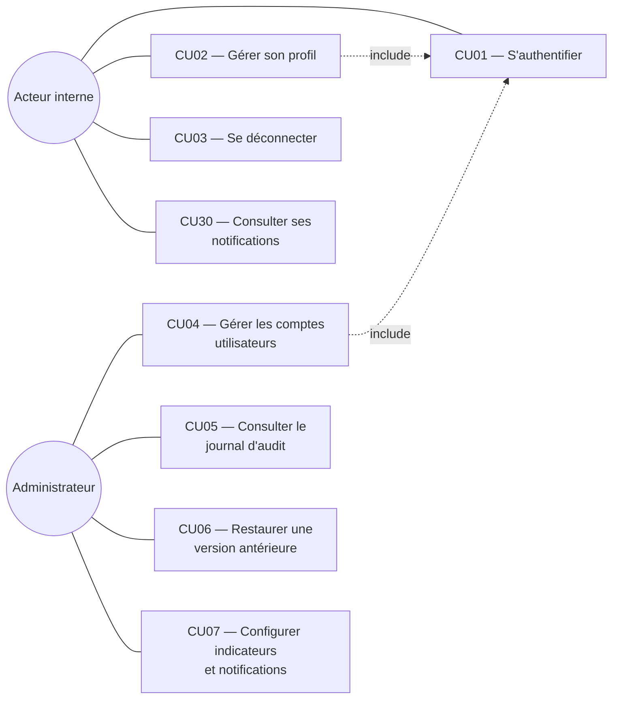
```mermaid
flowchart LR
    ADM(("Administrateur"))
    USR(("Acteur interne"))

    CU01["CU01 — S'authentifier"]
    CU02["CU02 — Gérer son profil"]
    CU03["CU03 — Se déconnecter"]
    CU04["CU04 — Gérer les comptes<br/>utilisateurs"]
    CU05["CU05 — Consulter le<br/>journal d'audit"]
    CU06["CU06 — Restaurer une<br/>version antérieure"]
    CU07["CU07 — Configurer indicateurs<br/>et notifications"]
    CU30["CU30 — Consulter ses<br/>notifications"]

    USR --- CU01
    USR --- CU02
    USR --- CU03
    USR --- CU30
    ADM --- CU04
    ADM --- CU05
    ADM --- CU06
    ADM --- CU07
    CU02 -.->|include| CU01
    CU04 -.->|include| CU01
```

**Figure II-3 : Diagramme de cas d'utilisation — Catalogue et règles métier**

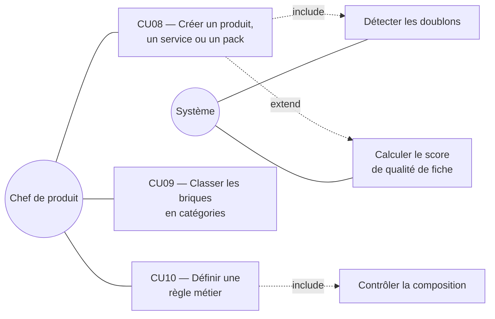
```mermaid
flowchart LR
    CDP(("Chef de produit"))
    SYS(("Système"))

    CU08["CU08 — Créer un produit,<br/>un service ou un pack"]
    CU09["CU09 — Classer les briques<br/>en catégories"]
    CU10["CU10 — Définir une<br/>règle métier"]
    DUP["Détecter les doublons"]
    SCORE["Calculer le score<br/>de qualité de fiche"]
    CHECK["Contrôler la composition"]

    CDP --- CU08
    CDP --- CU09
    CDP --- CU10
    CU08 -.->|include| DUP
    CU08 -.->|extend| SCORE
    CU10 -.->|include| CHECK
    SYS --- DUP
    SYS --- SCORE
```

**Figure II-4 : Diagramme de cas d'utilisation — Cycle de vie de l'offre**

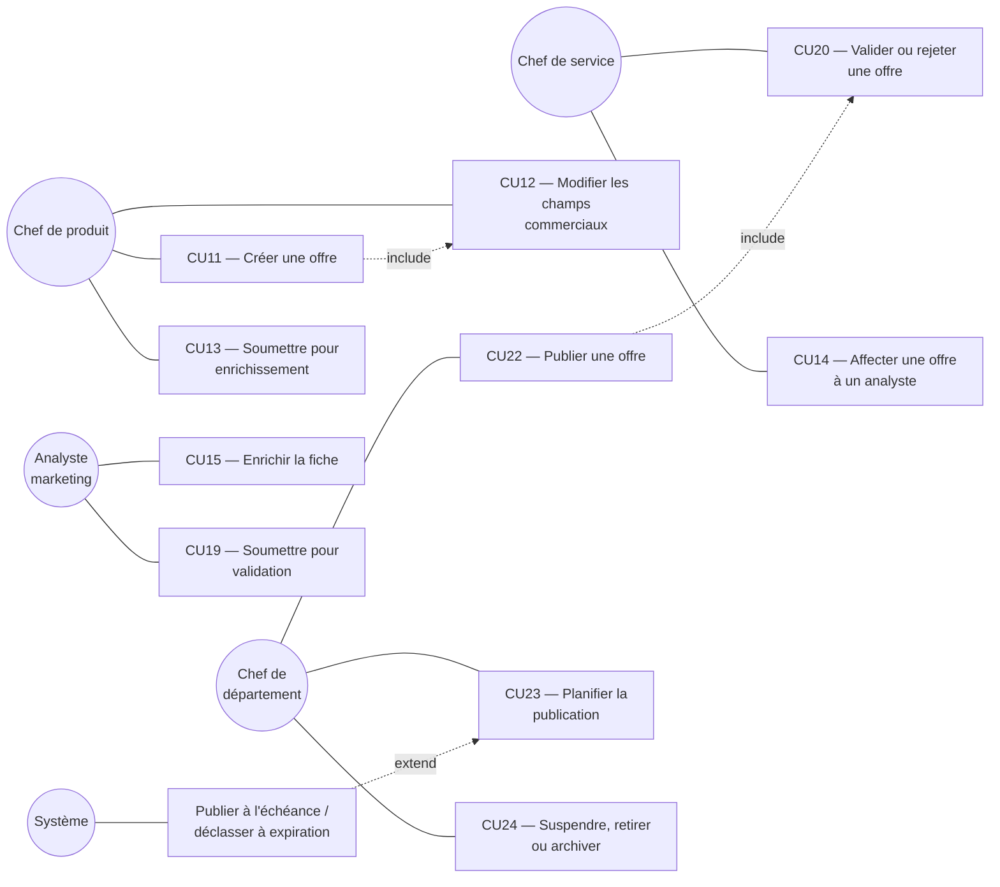
```mermaid
flowchart LR
    CDP(("Chef de produit"))
    AM(("Analyste<br/>marketing"))
    CDS(("Chef de service"))
    CDD(("Chef de<br/>département"))
    SYS(("Système"))

    CU11["CU11 — Créer une offre"]
    CU12["CU12 — Modifier les champs<br/>commerciaux"]
    CU13["CU13 — Soumettre pour<br/>enrichissement"]
    CU14["CU14 — Affecter une offre<br/>à un analyste"]
    CU15["CU15 — Enrichir la fiche"]
    CU19["CU19 — Soumettre pour<br/>validation"]
    CU20["CU20 — Valider ou rejeter<br/>une offre"]
    CU22["CU22 — Publier une offre"]
    CU23["CU23 — Planifier la<br/>publication"]
    CU24["CU24 — Suspendre, retirer<br/>ou archiver"]
    AUTO["Publier à l'échéance /<br/>déclasser à expiration"]

    CDP --- CU11
    CDP --- CU12
    CDP --- CU13
    CDS --- CU14
    CDS --- CU20
    AM --- CU15
    AM --- CU19
    CDD --- CU22
    CDD --- CU23
    CDD --- CU24
    SYS --- AUTO
    CU11 -.->|include| CU12
    CU22 -.->|include| CU20
    AUTO -.->|extend| CU23
```

**Figure II-5 : Diagramme de cas d'utilisation — Médias, diffusion et pilotage**

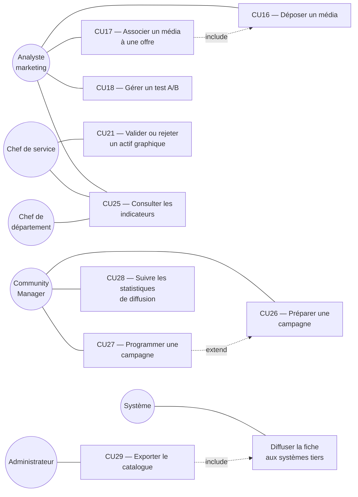
```mermaid
flowchart LR
    AM(("Analyste<br/>marketing"))
    CDS(("Chef de service"))
    CM(("Community<br/>Manager"))
    CDD(("Chef de<br/>département"))
    ADM(("Administrateur"))
    SYS(("Système"))

    CU16["CU16 — Déposer un média"]
    CU17["CU17 — Associer un média<br/>à une offre"]
    CU18["CU18 — Gérer un test A/B"]
    CU21["CU21 — Valider ou rejeter<br/>un actif graphique"]
    CU25["CU25 — Consulter les<br/>indicateurs"]
    CU26["CU26 — Préparer une<br/>campagne"]
    CU27["CU27 — Programmer une<br/>campagne"]
    CU28["CU28 — Suivre les statistiques<br/>de diffusion"]
    CU29["CU29 — Exporter le catalogue"]
    DIFF["Diffuser la fiche<br/>aux systèmes tiers"]

    AM --- CU16
    AM --- CU17
    AM --- CU18
    AM --- CU25
    CDS --- CU21
    CDS --- CU25
    CDD --- CU25
    CM --- CU26
    CM --- CU27
    CM --- CU28
    ADM --- CU29
    SYS --- DIFF
    CU17 -.->|include| CU16
    CU27 -.->|extend| CU26
    CU29 -.->|include| DIFF
```

#### g. Description textuelle des principaux cas d'utilisation

**Tableau II-6 : Description du CU « Créer une offre » (CU11)**

| Rubrique | Contenu |
|---|---|
| **Acteur principal** | Chef de produit |
| **Objectif** | Assembler une nouvelle offre commerciale à partir de briques existantes |
| **Préconditions** | L'acteur est authentifié et détient OFFER_CREATE ; les briques existent au catalogue |
| **Postconditions** | Une offre est créée au statut *Brouillon* ; un événement de création est publié |
| **Scénario nominal** | 1. Le chef de produit ouvre le formulaire de création.<br/>2. Il renseigne les champs commerciaux : nom, descriptions, prix promotionnel, dates de validité, segment, type de client.<br/>3. Il sélectionne les briques composant l'offre.<br/>4. Le système contrôle la composition au regard des règles applicables.<br/>5. Le système enregistre l'offre au statut *Brouillon*.<br/>6. Le système publie un événement consommé par l'audit et les indicateurs.<br/>7. Le système affiche la fiche créée. |
| **Alternatives** | 4a. Règle bloquante violée : refus, la règle en cause est affichée.<br/>4b. Règle non bloquante : avertissement, enregistrement autorisé. |

**Tableau II-7 : Description du CU « Affecter une offre à un analyste » (CU14)**

| Rubrique | Contenu |
|---|---|
| **Acteur principal** | Chef de service |
| **Objectif** | Désigner nominativement l'analyste chargé d'enrichir une fiche, selon sa disponibilité |
| **Préconditions** | L'acteur détient OFFER_ASSIGN ; au moins un analyste marketing actif existe |
| **Postconditions** | L'offre porte un analyste désigné ; celui-ci est notifié et la fiche entre dans sa file |
| **Scénario nominal** | 1. Le chef de service ouvre la fiche à répartir.<br/>2. Le système lui présente les analystes marketing actifs, **triés du moins chargé au plus chargé**, avec pour chacun le nombre de fiches en cours et le total déjà traité.<br/>3. Le chef de service choisit un analyste.<br/>4. Le système vérifie que le compte choisi détient bien OFFER_ENRICH.<br/>5. Le système enregistre la désignation et publie un événement d'affectation.<br/>6. L'analyste désigné reçoit une notification ; les autres n'en reçoivent aucune. |
| **Alternatives** | 3a. Le chef de service choisit « aucun » : la fiche est libérée et retourne dans le lot commun.<br/>4a. Le compte choisi ne peut pas enrichir : la demande est refusée avec un message explicite. |
| **Règle métier** | La charge affichée est **comptée sur les offres réellement affectées et encore en enrichissement**, jamais déclarée : une disponibilité saisie à la main serait fausse dès le lendemain. |
| **Exigences** | M4, M8, D8 |

**Tableau II-8 : Description du CU « Enrichir la fiche d'une offre » (CU15)**

| Rubrique | Contenu |
|---|---|
| **Acteur principal** | Analyste marketing |
| **Objectif** | Compléter la fiche par son habillage éditorial et visuel |
| **Préconditions** | L'acteur détient OFFER_ENRICH ; l'offre est au statut *En enrichissement* |
| **Postconditions** | Les champs éditoriaux sont renseignés ; une nouvelle version est enregistrée |
| **Scénario nominal** | 1. L'analyste ouvre la fiche qui lui est affectée depuis sa file de travail.<br/>2. Il rédige la description courte et la description longue.<br/>3. Il renseigne le titre et la description de référencement, éventuellement assisté par le module de génération.<br/>4. Il associe des visuels issus de la bibliothèque, ou en dépose de nouveaux.<br/>5. Le système enregistre, incrémente la version et journalise l'action. |
| **Alternatives** | 4a. Visuel non conforme en format ou résolution : signalé et placé en attente de validation graphique.<br/>2a. Les champs commerciaux lui sont présentés en consultation seule : ils appartiennent au chef de produit. |

**Tableau II-9 : Description du CU « Valider ou rejeter une offre » (CU20)**

| Rubrique | Contenu |
|---|---|
| **Acteur principal** | Chef de service |
| **Objectif** | Se prononcer au niveau opérationnel sur une offre soumise |
| **Préconditions** | L'acteur détient OFFER_VALIDATE ; l'offre est *En validation* |
| **Postconditions** | L'offre passe *Validée*, ou revient *En enrichissement* avec un commentaire |
| **Scénario nominal** | 1. Le chef de service ouvre sa file des offres en validation.<br/>2. Il consulte la fiche complète : champs commerciaux, contenu éditorial, visuels, **créateur de la fiche**.<br/>3. Il valide.<br/>4. Le système vérifie que la transition est autorisée et que la permission est détenue.<br/>5. Le système enregistre, historise la transition et son auteur.<br/>6. Le système notifie le chef de département. |
| **Alternatives** | 3a. Il rejette : le système **exige un commentaire**, ramène l'offre *En enrichissement* et notifie l'analyste et le chef de produit. |

**Tableau II-10 : Description du CU « Publier une offre » (CU22)**

| Rubrique | Contenu |
|---|---|
| **Acteur principal** | Chef de département marketing et produits |
| **Objectif** | Mettre l'offre en ligne et déclencher sa diffusion |
| **Préconditions** | L'acteur détient OFFER_PUBLISH ; l'offre est *Validée* ou *Planifiée* |
| **Postconditions** | L'offre passe *Publiée* ; les exports vers les systèmes tiers sont déclenchés |
| **Scénario nominal** | 1. Le chef de département ouvre la fiche validée.<br/>2. Le système lui **présente les mentions légales de l'offre**, ou l'avertit explicitement de leur absence.<br/>3. Il déclenche la publication.<br/>4. Le système vérifie la transition et la permission, renseigne la date de publication.<br/>5. Le système enregistre *Publiée*, historise et versionne.<br/>6. Le système publie deux événements : la transition, qui clôt la mesure du TTM et notifie ; et la publication, qui porte la fiche complète.<br/>7. Le module de diffusion constitue et dépose un export vers le CRM, le centre d'appel et le site web.<br/>8. Le community manager est notifié. |
| **Alternatives** | 3a. Date future choisie : l'offre passe *Planifiée* et sera publiée automatiquement à l'échéance, **par le même chemin**.<br/>7a. Un export échoue : il est enregistré en échec avec son motif, et sera rejoué sans perte de fiche. |

**Tableau II-11 : Description du CU « Valider un actif graphique » (CU21)**

| Rubrique | Contenu |
|---|---|
| **Acteur principal** | Chef de service |
| **Objectif** | Se prononcer sur la conformité d'un visuel, indépendamment du circuit métier |
| **Préconditions** | L'acteur détient MEDIA_VALIDATE ; le média est en attente |
| **Postconditions** | Le média est approuvé ou rejeté ; la décision est consignée avec son auteur |
| **Scénario nominal** | 1. Le chef de service ouvre l'écran, **qui s'ouvre directement sur sa file des médias en attente**.<br/>2. Il consulte le média, son format, sa résolution et les signalements automatiques.<br/>3. Il approuve.<br/>4. Le système enregistre la validation, son auteur et son horodatage. |
| **Alternatives** | 3a. Il rejette en motivant : l'analyste est notifié et doit corriger puis redéposer. **Le statut de l'offre n'est pas modifié** : les deux circuits sont indépendants. |

#### h. Diagrammes de séquence

**Figure II-6 : Diagramme de séquence — Créer et soumettre une offre**

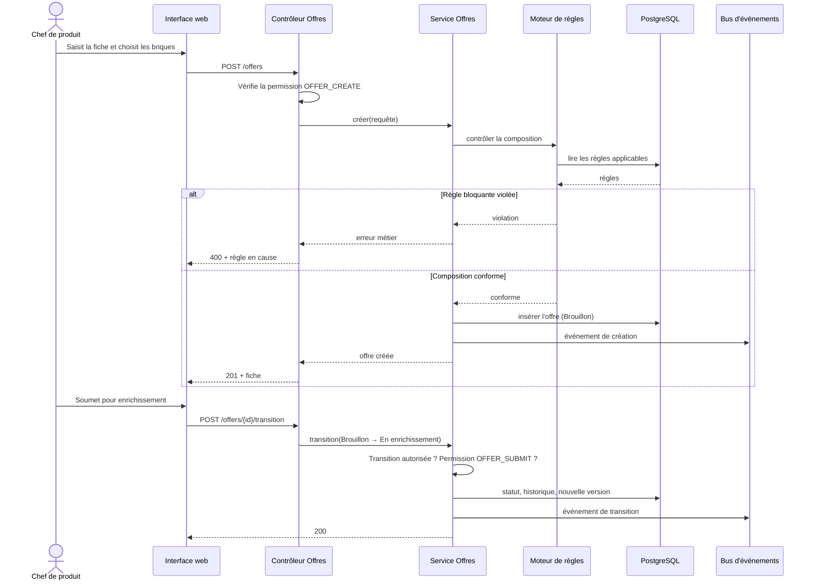
```mermaid
sequenceDiagram
    actor CdP as Chef de produit
    participant UI as Interface web
    participant API as Contrôleur Offres
    participant SVC as Service Offres
    participant RUL as Moteur de règles
    participant DB as PostgreSQL
    participant BUS as Bus d'événements

    CdP->>UI: Saisit la fiche et choisit les briques
    UI->>API: POST /offers
    API->>API: Vérifie la permission OFFER_CREATE
    API->>SVC: créer(requête)
    SVC->>RUL: contrôler la composition
    RUL->>DB: lire les règles applicables
    DB-->>RUL: règles
    alt Règle bloquante violée
        RUL-->>SVC: violation
        SVC-->>API: erreur métier
        API-->>UI: 400 + règle en cause
    else Composition conforme
        RUL-->>SVC: conforme
        SVC->>DB: insérer l'offre (Brouillon)
        SVC->>BUS: événement de création
        SVC-->>API: offre créée
        API-->>UI: 201 + fiche
    end

    CdP->>UI: Soumet pour enrichissement
    UI->>API: POST /offers/{id}/transition
    API->>SVC: transition(Brouillon → En enrichissement)
    SVC->>SVC: Transition autorisée ? Permission OFFER_SUBMIT ?
    SVC->>DB: statut, historique, nouvelle version
    SVC->>BUS: événement de transition
    SVC-->>UI: 200
```

**Figure II-7 : Diagramme de séquence — Affecter et enrichir une fiche**

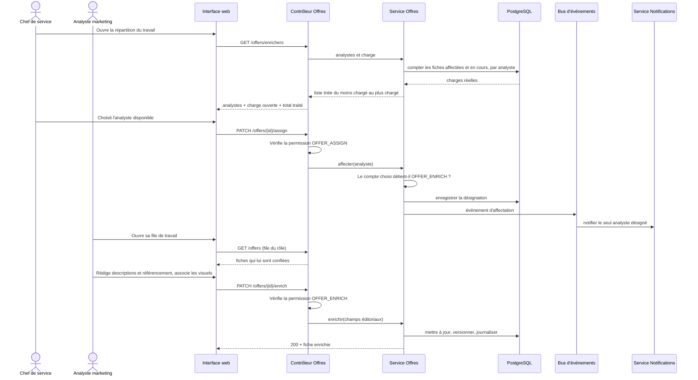
```mermaid
sequenceDiagram
    actor CdS as Chef de service
    actor AM as Analyste marketing
    participant UI as Interface web
    participant API as Contrôleur Offres
    participant SVC as Service Offres
    participant DB as PostgreSQL
    participant BUS as Bus d'événements
    participant NOT as Service Notifications

    CdS->>UI: Ouvre la répartition du travail
    UI->>API: GET /offers/enrichers
    API->>SVC: analystes et charge
    SVC->>DB: compter les fiches affectées et en cours, par analyste
    DB-->>SVC: charges réelles
    SVC-->>API: liste triée du moins chargé au plus chargé
    API-->>UI: analystes + charge ouverte + total traité
    CdS->>UI: Choisit l'analyste disponible
    UI->>API: PATCH /offers/{id}/assign
    API->>API: Vérifie la permission OFFER_ASSIGN
    API->>SVC: affecter(analyste)
    SVC->>SVC: Le compte choisi détient-il OFFER_ENRICH ?
    SVC->>DB: enregistrer la désignation
    SVC->>BUS: événement d'affectation
    BUS->>NOT: notifier le seul analyste désigné

    AM->>UI: Ouvre sa file de travail
    UI->>API: GET /offers (file du rôle)
    API-->>UI: fiches qui lui sont confiées
    AM->>UI: Rédige descriptions et référencement, associe les visuels
    UI->>API: PATCH /offers/{id}/enrich
    API->>API: Vérifie la permission OFFER_ENRICH
    API->>SVC: enrichir(champs éditoriaux)
    SVC->>DB: mettre à jour, versionner, journaliser
    SVC-->>UI: 200 + fiche enrichie
```

**Figure II-8 : Diagramme de séquence — Valider, publier et diffuser**

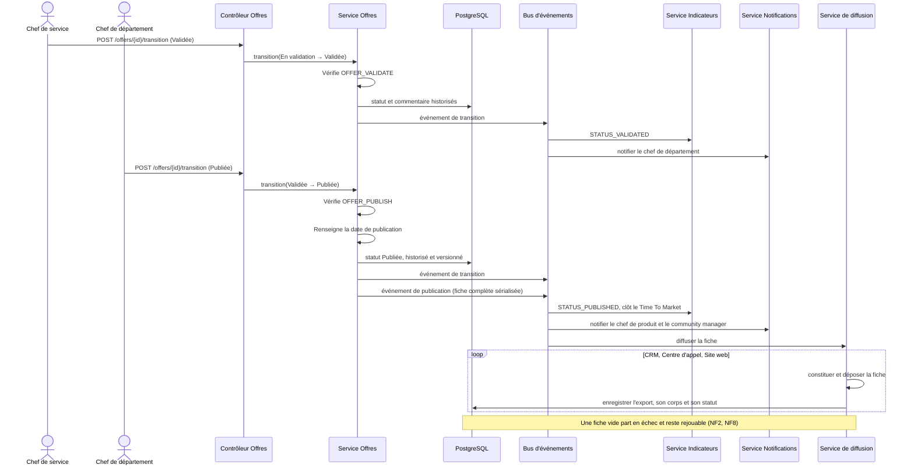
```mermaid
sequenceDiagram
    actor CdS as Chef de service
    actor CdD as Chef de département
    participant API as Contrôleur Offres
    participant SVC as Service Offres
    participant DB as PostgreSQL
    participant BUS as Bus d'événements
    participant KPI as Service Indicateurs
    participant NOT as Service Notifications
    participant EXP as Service de diffusion

    CdS->>API: POST /offers/{id}/transition (Validée)
    API->>SVC: transition(En validation → Validée)
    SVC->>SVC: Vérifie OFFER_VALIDATE
    SVC->>DB: statut et commentaire historisés
    SVC->>BUS: événement de transition
    BUS->>KPI: STATUS_VALIDATED
    BUS->>NOT: notifier le chef de département

    CdD->>API: POST /offers/{id}/transition (Publiée)
    API->>SVC: transition(Validée → Publiée)
    SVC->>SVC: Vérifie OFFER_PUBLISH
    SVC->>SVC: Renseigne la date de publication
    SVC->>DB: statut Publiée, historisé et versionné
    SVC->>BUS: événement de transition
    SVC->>BUS: événement de publication (fiche complète sérialisée)
    BUS->>KPI: STATUS_PUBLISHED, clôt le Time To Market
    BUS->>NOT: notifier le chef de produit et le community manager
    BUS->>EXP: diffuser la fiche
    loop CRM, Centre d'appel, Site web
        EXP->>EXP: constituer et déposer la fiche
        EXP->>DB: enregistrer l'export, son corps et son statut
    end
    Note over EXP,DB: Une fiche vide part en échec et reste rejouable (NF2, NF8)
```

## II. Spécification technique

### 1. Architecture logicielle

L'architecture retenue est une architecture **trois tiers**, dans laquelle présentation, logique applicative et persistance sont séparées et peuvent évoluer indépendamment [3].

**Figure II-9 : Architecture 3 tiers ou à 3 niveaux**

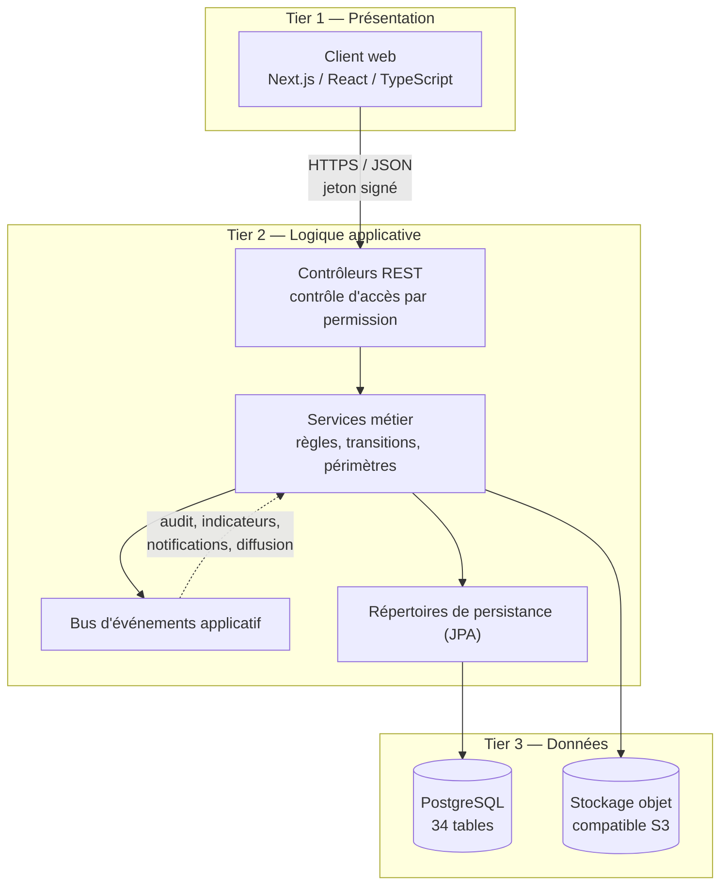
```mermaid
flowchart TD
    subgraph T1["Tier 1 — Présentation"]
        W["Client web<br/>Next.js / React / TypeScript"]
    end
    subgraph T2["Tier 2 — Logique applicative"]
        CTRL["Contrôleurs REST<br/>contrôle d'accès par permission"]
        SVC["Services métier<br/>règles, transitions, périmètres"]
        EVT["Bus d'événements applicatif"]
        REPO["Répertoires de persistance (JPA)"]
    end
    subgraph T3["Tier 3 — Données"]
        DB[("PostgreSQL<br/>34 tables")]
        S3[("Stockage objet<br/>compatible S3")]
    end

    W -->|HTTPS / JSON<br/>jeton signé| CTRL
    CTRL --> SVC
    SVC --> REPO
    SVC --> EVT
    EVT -.->|audit, indicateurs,<br/>notifications, diffusion| SVC
    REPO --> DB
    SVC --> S3
```

Deux choix sont structurants.

**Le découpage par domaine fonctionnel.** Le tier applicatif n'est pas organisé en couches techniques — un paquetage de contrôleurs, un de services, un d'entités — mais en **modules métier** : un module contient son contrôleur, ses objets de transfert, ses entités, son répertoire et son service. Une évolution du cycle de vie se lit ainsi dans un seul répertoire.

**Le bus d'événements applicatif.** Plutôt que de faire appeler par le service des offres les services d'audit, d'indicateurs, de notification et de diffusion, chaque transition **publie un événement** que ces quatre services consomment indépendamment. Trois bénéfices : le service des offres ne connaît aucun de ses consommateurs ; l'ajout d'un consommateur ne modifie pas le code existant ; l'échec d'un consommateur — une notification non délivrée — ne fait pas échouer la transition métier, qui est une décision déjà prise et historisée.

Ce choix a une conséquence pratique qui a compté dans le projet : **la diffusion multicanale se branche sans toucher au cycle de vie**. Le module de diffusion s'abonne à l'événement de publication ; le service des offres ignore jusqu'à son existence.

### 2. Contraintes et exigences techniques

| Contrainte | Exigence retenue |
|---|---|
| Interopérabilité | Interface REST documentée au format OpenAPI ; échanges en JSON |
| Portabilité | Application entièrement conteneurisée |
| Sécurité du transport | Chiffrement TLS ; secrets injectés par variables d'environnement |
| Authentification | Jetons signés de courte durée, jeton de renouvellement révocable stocké sous forme d'empreinte |
| Autorisation | Contrôle par permission sur chaque point d'entrée ; périmètre de visibilité appliqué dans le service |
| Intégrité des données | Contraintes d'unicité, clés étrangères, transactions ; suppression logique lorsque la donnée doit survivre à l'audit |
| Évolution du schéma | Migrations versionnées, jouées automatiquement, rejouables à l'identique |
| Traçabilité | Journal d'audit alimenté par événements, indépendant du code métier |
| Idempotence | Clés d'idempotence sur les opérations de diffusion |
| Testabilité | Objets de transfert distincts des entités ; services injectables et testables isolément |

## III. Conception globale

### 1. Diagramme de classes

Le modèle du domaine comprend trente-deux entités persistantes, présentées en quatre vues.

La difficulté principale du modèle de catalogue tient à la coexistence de trois natures d'éléments qui partagent des attributs communs mais possèdent chacune des attributs propres. Trois solutions étaient envisageables :

| Solution | Avantage | Inconvénient |
|---|---|---|
| Une table par type, sans parent | Attributs propres bien typés | Impossible de référencer « un élément de catalogue » sans connaître son type |
| Une table unique à colonnes optionnelles | Référence unique simple | Colonnes majoritairement nulles ; aucune contrainte d'intégrité par type |
| **Table de base et spécialisations** | Référence unique **et** attributs typés | Une jointure supplémentaire à la lecture |

La troisième a été retenue : `CatalogItem` porte l'identité et les attributs communs ; `Product`, `Service` et `Pack` portent les attributs propres et partagent la clé primaire. Toute relation vers un élément de catalogue — composition d'un pack, composition d'une offre, règle métier — pointe alors vers une seule entité.

**Figure II-10 : Diagramme de classes — Comptes et habilitations**

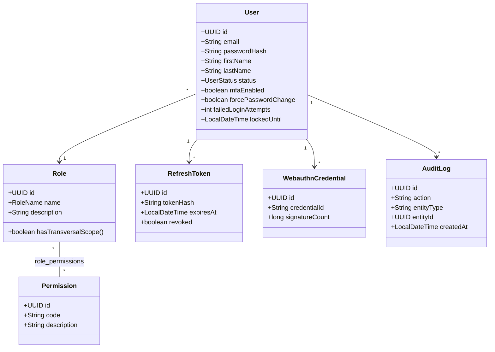
```mermaid
classDiagram
    class User {
        +UUID id
        +String email
        +String passwordHash
        +String firstName
        +String lastName
        +UserStatus status
        +boolean mfaEnabled
        +boolean forcePasswordChange
        +int failedLoginAttempts
        +LocalDateTime lockedUntil
    }
    class Role {
        +UUID id
        +RoleName name
        +String description
        +boolean hasTransversalScope()
    }
    class Permission {
        +UUID id
        +String code
        +String description
    }
    class RefreshToken {
        +UUID id
        +String tokenHash
        +LocalDateTime expiresAt
        +boolean revoked
    }
    class WebauthnCredential {
        +UUID id
        +String credentialId
        +long signatureCount
    }
    class AuditLog {
        +UUID id
        +String action
        +String entityType
        +UUID entityId
        +LocalDateTime createdAt
    }

    User "*" --> "1" Role
    Role "*" -- "*" Permission : role_permissions
    User "1" --> "*" RefreshToken
    User "1" --> "*" WebauthnCredential
    User "1" --> "*" AuditLog
```

**Figure II-11 : Diagramme de classes — Catalogue et règles métier**

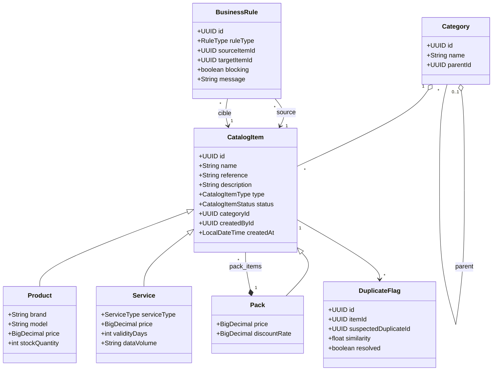
```mermaid
classDiagram
    class CatalogItem {
        +UUID id
        +String name
        +String reference
        +String description
        +CatalogItemType type
        +CatalogItemStatus status
        +UUID categoryId
        +UUID createdById
        +LocalDateTime createdAt
    }
    class Product {
        +String brand
        +String model
        +BigDecimal price
        +int stockQuantity
    }
    class Service {
        +ServiceType serviceType
        +BigDecimal price
        +int validityDays
        +String dataVolume
    }
    class Pack {
        +BigDecimal price
        +BigDecimal discountRate
    }
    class Category {
        +UUID id
        +String name
        +UUID parentId
    }
    class BusinessRule {
        +UUID id
        +RuleType ruleType
        +UUID sourceItemId
        +UUID targetItemId
        +boolean blocking
        +String message
    }
    class DuplicateFlag {
        +UUID id
        +UUID itemId
        +UUID suspectedDuplicateId
        +float similarity
        +boolean resolved
    }

    CatalogItem <|-- Product
    CatalogItem <|-- Service
    CatalogItem <|-- Pack
    Category "1" o-- "*" CatalogItem
    Category "0..1" o-- "*" Category : parent
    Pack "1" *-- "*" CatalogItem : pack_items
    BusinessRule "*" --> "1" CatalogItem : source
    BusinessRule "*" --> "1" CatalogItem : cible
    CatalogItem "1" --> "*" DuplicateFlag
```

**Figure II-12 : Diagramme de classes — Offre et cycle de vie**

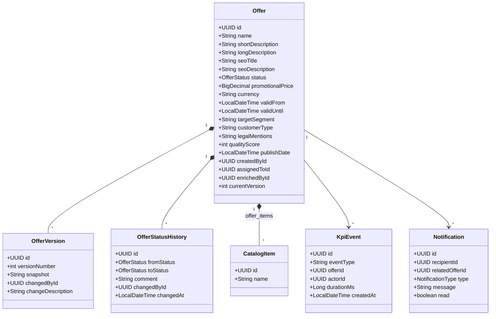
```mermaid
classDiagram
    class Offer {
        +UUID id
        +String name
        +String shortDescription
        +String longDescription
        +String seoTitle
        +String seoDescription
        +OfferStatus status
        +BigDecimal promotionalPrice
        +String currency
        +LocalDateTime validFrom
        +LocalDateTime validUntil
        +String targetSegment
        +String customerType
        +String legalMentions
        +int qualityScore
        +LocalDateTime publishDate
        +UUID createdById
        +UUID assignedToId
        +UUID enrichedById
        +int currentVersion
    }
    class OfferVersion {
        +UUID id
        +int versionNumber
        +String snapshot
        +UUID changedById
        +String changeDescription
    }
    class OfferStatusHistory {
        +UUID id
        +OfferStatus fromStatus
        +OfferStatus toStatus
        +String comment
        +UUID changedById
        +LocalDateTime changedAt
    }
    class KpiEvent {
        +UUID id
        +String eventType
        +UUID offerId
        +UUID actorId
        +Long durationMs
        +LocalDateTime createdAt
    }
    class Notification {
        +UUID id
        +UUID recipientId
        +UUID relatedOfferId
        +NotificationType type
        +String message
        +boolean read
    }
    class CatalogItem {
        +UUID id
        +String name
    }

    Offer "1" *-- "*" OfferVersion
    Offer "1" *-- "*" OfferStatusHistory
    Offer "1" *-- "*" CatalogItem : offer_items
    Offer "1" --> "*" KpiEvent
    Offer "1" --> "*" Notification
```

**Figure II-13 : Diagramme de classes — Médias, diffusion et pilotage**

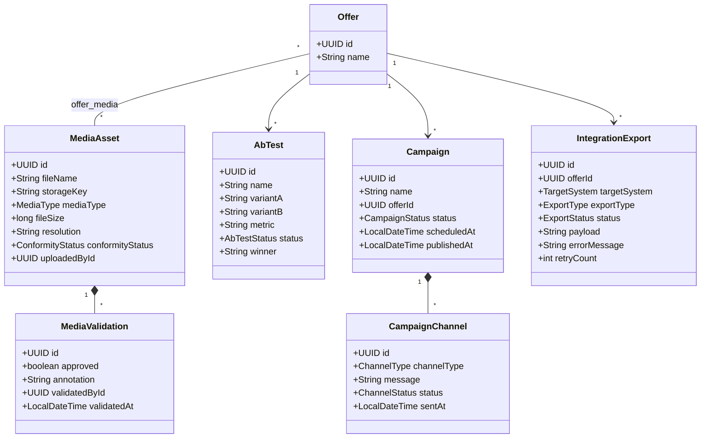
```mermaid
classDiagram
    class MediaAsset {
        +UUID id
        +String fileName
        +String storageKey
        +MediaType mediaType
        +long fileSize
        +String resolution
        +ConformityStatus conformityStatus
        +UUID uploadedById
    }
    class MediaValidation {
        +UUID id
        +boolean approved
        +String annotation
        +UUID validatedById
        +LocalDateTime validatedAt
    }
    class AbTest {
        +UUID id
        +String name
        +String variantA
        +String variantB
        +String metric
        +AbTestStatus status
        +String winner
    }
    class Campaign {
        +UUID id
        +String name
        +UUID offerId
        +CampaignStatus status
        +LocalDateTime scheduledAt
        +LocalDateTime publishedAt
    }
    class CampaignChannel {
        +UUID id
        +ChannelType channelType
        +String message
        +ChannelStatus status
        +LocalDateTime sentAt
    }
    class IntegrationExport {
        +UUID id
        +UUID offerId
        +TargetSystem targetSystem
        +ExportType exportType
        +ExportStatus status
        +String payload
        +String errorMessage
        +int retryCount
    }
    class Offer {
        +UUID id
        +String name
    }

    MediaAsset "1" *-- "*" MediaValidation
    Offer "*" -- "*" MediaAsset : offer_media
    Offer "1" --> "*" AbTest
    Offer "1" --> "*" Campaign
    Campaign "1" *-- "*" CampaignChannel
    Offer "1" --> "*" IntegrationExport
```

### 2. Diagramme de déploiement

**Figure II-14 : Diagramme de déploiement**

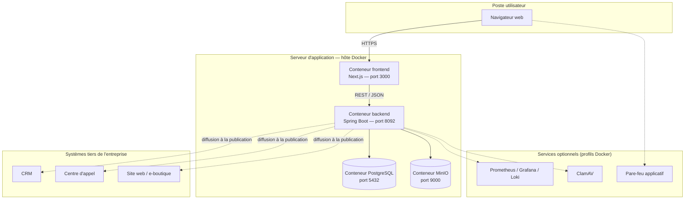
```mermaid
flowchart TD
    subgraph CLIENT["Poste utilisateur"]
        NAV["Navigateur web"]
    end
    subgraph HOST["Serveur d'application — hôte Docker"]
        FRONT["Conteneur frontend<br/>Next.js — port 3000"]
        BACK["Conteneur backend<br/>Spring Boot — port 8092"]
        PG[("Conteneur PostgreSQL<br/>port 5432")]
        MINIO[("Conteneur MinIO<br/>port 9000")]
    end
    subgraph OPT["Services optionnels (profils Docker)"]
        MON["Prometheus / Grafana / Loki"]
        AV["ClamAV"]
        WAF["Pare-feu applicatif"]
    end
    subgraph EXT["Systèmes tiers de l'entreprise"]
        CRM["CRM"]
        CC["Centre d'appel"]
        WEB["Site web / e-boutique"]
    end

    NAV -->|HTTPS| FRONT
    FRONT -->|REST / JSON| BACK
    BACK --> PG
    BACK --> MINIO
    BACK -.->|diffusion à la publication| CRM
    BACK -.->|diffusion à la publication| CC
    BACK -.->|diffusion à la publication| WEB
    BACK -.-> MON
    BACK -.-> AV
    NAV -.-> WAF
```

### 3. Diagramme de composants

**Figure II-15 : Diagramme de composants**

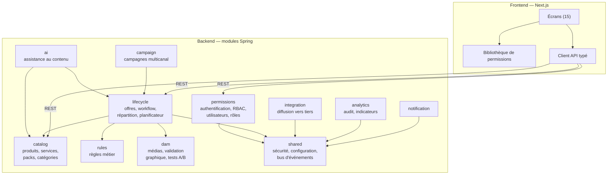
```mermaid
flowchart TD
    subgraph BACK["Backend — modules Spring"]
        PERM["permissions<br/>authentification, RBAC,<br/>utilisateurs, rôles"]
        CAT["catalog<br/>produits, services,<br/>packs, catégories"]
        RUL["rules<br/>règles métier"]
        LIF["lifecycle<br/>offres, workflow,<br/>répartition, planificateur"]
        DAM["dam<br/>médias, validation<br/>graphique, tests A/B"]
        CAM["campaign<br/>campagnes multicanal"]
        INT["integration<br/>diffusion vers tiers"]
        NOT["notification"]
        ANA["analytics<br/>audit, indicateurs"]
        AI["ai<br/>assistance au contenu"]
        SHR["shared<br/>sécurité, configuration,<br/>bus d'événements"]
    end
    subgraph FRONT["Frontend — Next.js"]
        PAGES["Écrans (15)"]
        LIBP["Bibliothèque de permissions"]
        APIC["Client API typé"]
    end

    PAGES --> LIBP
    PAGES --> APIC
    APIC -->|REST| PERM
    APIC -->|REST| CAT
    APIC -->|REST| LIF
    LIF --> CAT
    LIF --> RUL
    LIF --> DAM
    CAM --> LIF
    NOT --> SHR
    ANA --> SHR
    INT --> SHR
    LIF --> SHR
    PERM --> SHR
    AI --> CAT
    AI --> LIF
```

Le module `integration` ne dépend pas de `lifecycle` : il s'abonne à l'événement de publication émis dans `shared`. C'est ce qui permet de brancher la diffusion sans modifier le cycle de vie.

### 4. Diagramme d'activité

**Figure II-16 : Diagramme d'activité — circuit de validation d'une offre**

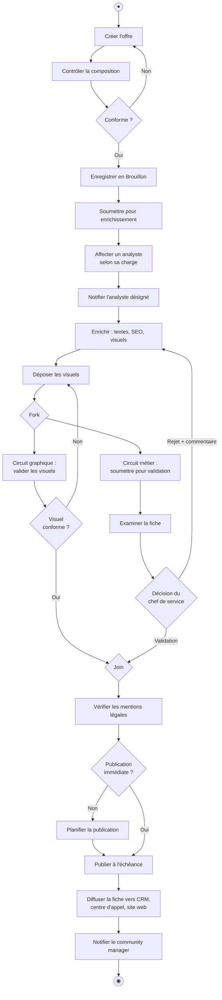
```mermaid
flowchart TD
    S(("●")) --> A1["Créer l'offre"]
    A1 --> A2["Contrôler la composition"]
    A2 --> D1{"Conforme ?"}
    D1 -->|Non| A1
    D1 -->|Oui| A3["Enregistrer en Brouillon"]
    A3 --> A4["Soumettre pour enrichissement"]
    A4 --> A6["Affecter un analyste<br/>selon sa charge"]
    A6 --> A5["Notifier l'analyste désigné"]
    A5 --> A7["Enrichir : textes, SEO, visuels"]
    A7 --> A8["Déposer les visuels"]
    A8 --> P1{"Fork"}
    P1 --> B1["Circuit graphique :<br/>valider les visuels"]
    P1 --> B2["Circuit métier :<br/>soumettre pour validation"]
    B1 --> D2{"Visuel<br/>conforme ?"}
    D2 -->|Non| A8
    D2 -->|Oui| J1{"Join"}
    B2 --> A9["Examiner la fiche"]
    A9 --> D3{"Décision du<br/>chef de service"}
    D3 -->|Rejet + commentaire| A7
    D3 -->|Validation| J1
    J1 --> A10["Vérifier les mentions légales"]
    A10 --> D4{"Publication<br/>immédiate ?"}
    D4 -->|Non| A11["Planifier la publication"]
    A11 --> A12["Publier à l'échéance"]
    D4 -->|Oui| A12
    A12 --> A13["Diffuser la fiche vers CRM,<br/>centre d'appel, site web"]
    A13 --> A14["Notifier le community manager"]
    A14 --> E(("◉"))
```

### 5. Diagramme d'états-transitions

**Tableau II-12 : Statuts du cycle de vie d'une offre**

| Statut | Signification | Acteur en charge |
|---|---|---|
| Brouillon | Offre créée, composition en cours | Chef de produit |
| En enrichissement | Fiche confiée à un analyste pour habillage | Analyste marketing |
| En validation | Fiche soumise au contrôle opérationnel | Chef de service |
| Validée | Contrôle opérationnel favorable | Chef de département |
| Planifiée | Publication programmée à une date future | Chef de département / Système |
| Publiée | Offre en ligne, diffusée aux systèmes tiers | Chef de département |
| Suspendue | Retirée temporairement de la diffusion | Chef de département |
| Obsolète | Offre dépassée, non commercialisable | Chef de département / Système |
| Retirée | Offre définitivement retirée du marché | Chef de département |
| Archivée | Conservée pour l'historique uniquement | Chef de département |

**Figure II-17 : Diagramme d'états-transitions de l'offre**

```mermaid
stateDiagram-v2
    [*] --> Brouillon : créer (OFFER_CREATE)
    Brouillon --> EnEnrichissement : soumettre (OFFER_SUBMIT)
    EnEnrichissement --> Brouillon : rendre la main (OFFER_SUBMIT / OFFER_ENRICH)
    EnEnrichissement --> EnValidation : soumettre (OFFER_SUBMIT)
    EnValidation --> EnEnrichissement : rejeter + commentaire (OFFER_VALIDATE)
    EnValidation --> Validee : valider (OFFER_VALIDATE)
    Validee --> Planifiee : planifier (OFFER_PUBLISH)
    Validee --> Publiee : publier (OFFER_PUBLISH)
    Planifiee --> Publiee : échéance atteinte (Système)
    Planifiee --> Suspendue : suspendre (OFFER_PUBLISH)
    Publiee --> Suspendue : suspendre (OFFER_PUBLISH)
    Publiee --> Obsolete : expiration (Système) ou déclassement (OFFER_PUBLISH)
    Publiee --> Retiree : retirer (OFFER_PUBLISH)
    Suspendue --> Publiee : réactiver (OFFER_PUBLISH)
    Suspendue --> Retiree : retirer (OFFER_PUBLISH)
    Obsolete --> Archivee : archiver (OFFER_PUBLISH)
    Retiree --> Archivee : archiver (OFFER_PUBLISH)
    Archivee --> [*]
```

Deux propriétés de cette machine méritent d'être soulignées.

**Le rejet n'est pas une transition symétrique.** Le passage de *En validation* vers *En enrichissement* et le passage de *Brouillon* vers *En enrichissement* mènent au même statut mais ne relèvent pas du même acteur : le premier est un rejet, qui appartient au valideur ; le second est une soumission, qui appartient au chef de produit. La permission requise dépend donc du **couple** (statut de départ, statut d'arrivée) et non du seul statut d'arrivée.

**Les transitions automatiques empruntent le même chemin que les transitions manuelles.** Une offre publiée à son échéance par le planificateur est historisée, versionnée, notifiée et diffusée exactement comme une offre publiée à la main. Faute de quoi le même circuit produirait deux résultats différents selon qu'il est achevé par un acteur ou par une échéance.

**Tableau II-13 : Transitions autorisées et permissions requises**

| Statut de départ | Statut d'arrivée | Permission requise | Lecture métier |
|---|---|---|---|
| En enrichissement | Brouillon | OFFER_SUBMIT ou OFFER_ENRICH | Rendre la main à l'auteur |
| Brouillon | En enrichissement | OFFER_SUBMIT | Soumission pour habillage |
| En validation | En enrichissement | OFFER_VALIDATE | Rejet par le valideur |
| En enrichissement | En validation | OFFER_SUBMIT | Fin de l'enrichissement |
| En validation | Validée | OFFER_VALIDATE | Validation opérationnelle |
| Toutes les autres | — | OFFER_PUBLISH | Décision de mise sur le marché |

### 6. Conception du contrôle d'accès : la granularité champ par champ

Le point le plus délicat de la conception concerne les **champs partagés**. Un modèle naïf attribuerait la fiche entière à l'acteur de l'étape en cours. Ce modèle est trop grossier : il empêche un chef de produit de corriger un prix erroné pendant la phase d'enrichissement, alors que ce prix relève de son métier et d'aucun autre. Le cahier des charges prévoit d'ailleurs explicitement que le chef de produit corrige et resoumette après un rejet.

La conception retenue attribue **chaque champ à un propriétaire métier**.

**Tableau II-14 : Propriété des champs de la fiche par métier**

| Famille de champs | Champs concernés | Propriétaire | Point d'entrée | Permission |
|---|---|---|---|---|
| Commerciaux | nom, prix promotionnel, devise, dates de validité, segment, type de client, composition | Chef de produit | `PATCH /offers/{id}` | OFFER_CREATE |
| Éditoriaux | description courte, description longue, titre et description de référencement, visuels associés | Analyste marketing | `PATCH /offers/{id}/enrich` | OFFER_ENRICH |
| Répartition | analyste désigné | Chef de service | `PATCH /offers/{id}/assign` | OFFER_ASSIGN |
| Décisionnels | statut, date de publication, commentaire de transition | Valideurs | `POST /offers/{id}/transition` | selon le couple de statuts |

Quatre points d'entrée d'écriture distincts, protégés par quatre permissions distinctes, opérant sur la même ligne en base : c'est ce qui permet à la fiche d'être réellement unique tout en restant gouvernée.

Une borne temporelle complète le dispositif : les champs commerciaux ne restent modifiables qu'aux statuts *Brouillon*, *En enrichissement* et *En validation*. Au-delà de *Validée*, la décision a été prise sur la base de ces valeurs ; les changer ensuite reviendrait à modifier une offre approuvée sans repasser par le circuit.

### 7. Conception de la mesure du Time To Market

Le Time To Market ne peut pas être une donnée saisie : ce serait une déclaration, non une mesure. Il est **reconstitué à partir des transitions réellement enregistrées**.

À chaque changement de statut, un événement est consigné avec l'offre concernée, l'auteur, le type d'événement et l'horodatage. Le TTM d'une offre est l'écart entre son événement de création et son événement de publication ; le temps par étape est l'écart entre deux événements consécutifs ; le goulot d'étranglement est l'étape dont le temps moyen est le plus élevé.

Deux périmètres de restitution découlent de la matrice : le titulaire de ANALYTICS_TEAM_VIEW reçoit les chiffres de toute l'équipe ; celui qui ne la détient pas ne reçoit que les événements dont il est l'auteur. **Le périmètre est décidé par le serveur à partir des permissions, jamais par un paramètre de requête** — sinon il suffirait de modifier l'adresse appelée pour lire les chiffres de ses collègues.

## Conclusion du chapitre II

Ce chapitre a produit l'ensemble des modèles nécessaires à la réalisation : trente cas d'utilisation répartis entre six acteurs, dix-neuf permissions organisées en matrice, une machine à états à dix statuts dont les transitions dépendent du couple de statuts, un modèle de classes fondé sur une table de base et ses spécialisations, et une architecture trois tiers modulaire adossée à un bus d'événements. La conception du contrôle d'accès champ par champ en constitue l'apport principal : c'est elle qui permet à six métiers de partager une fiche unique sans que la séparation des tâches en soit affaiblie.

<div style="page-break-after: always;"></div>
# CHAPITRE III : RÉALISATION ET DÉPLOIEMENT DE L'APPLICATION

## I. Présentation de l'environnement de travail

### 1. Environnement logiciel

#### a. Langage de programmation et framework

**Java 21** est la version à support étendu du langage. Deux de ses apports récents sont directement exploités : les expressions `switch` complètes, utilisées pour déterminer la permission requise par un couple de statuts dans la machine à états, et les types `record`, employés pour tous les objets de transfert et tous les événements applicatifs, ce qui garantit leur immutabilité.

**Spring Boot 3.4** [13] est le cadre applicatif. Trois de ses modules sont centraux : *Spring Security* [14], qui permet d'exprimer le contrôle d'accès de façon déclarative sur chaque point d'entrée ; *Spring Data JPA*, qui assure la correspondance objet-relationnel ; et *Spring Modulith* [15], qui fournit le bus d'événements applicatif et vérifie que les dépendances entre modules respectent l'architecture déclarée.

**PostgreSQL 16** [16] est le système de gestion de base de données. Il est transactionnel, respecte les propriétés ACID, gère nativement les identifiants universels utilisés comme clés primaires et le type JSON employé pour les instantanés de version et les corps de diffusion.

**Next.js 16 / React 19 / TypeScript 5** [17][18][19] composent l'interface web. TypeScript sert principalement à typer les réponses de l'interface de programmation : une divergence entre le contrat du serveur et son usage côté client est détectée à la compilation plutôt qu'à l'exécution.

**Tailwind CSS 4** [20] assure la cohérence visuelle entre les quinze écrans, la prise en charge des thèmes clair et sombre, et l'adaptation aux différentes tailles d'écran exigée par NF5.

**MinIO** [21] fournit un stockage objet compatible S3 : les fichiers médias y sont stockés, seules leurs métadonnées figurent en base.

**Tableau III-1 : Environnement logiciel**

| Couche | Technologie | Version | Rôle |
|---|---|---|---|
| Langage backend | Java | 21 (LTS) | Langage du serveur applicatif |
| Cadre applicatif | Spring Boot | 3.4.1 | Serveur, injection de dépendances, configuration |
| Sécurité | Spring Security, JJWT, WebAuthn | — | Authentification, autorisation, jetons |
| Modularité et événements | Spring Modulith | — | Bus d'événements, contrôle des dépendances |
| Persistance | Spring Data JPA / Hibernate | — | Correspondance objet-relationnel |
| Base de données | PostgreSQL | 16 | Persistance transactionnelle |
| Migrations | Flyway | — | Versionnement du schéma |
| Stockage objet | MinIO | — | Stockage des médias |
| Documentation d'API | Springdoc OpenAPI | — | Documentation générée depuis le code |
| Supervision | Actuator, Micrometer, Prometheus | — | Indicateurs d'exploitation |
| Cadre frontend | Next.js | 16 | Routage, rendu |
| Bibliothèque d'interface | React | 19 | Composants d'interface |
| Langage frontend | TypeScript | 5 | Typage statique |
| Styles | Tailwind CSS | 4 | Feuilles de style, thèmes, responsive |
| Internationalisation | next-intl | — | Interface en français et en anglais |
| Conteneurisation | Docker, Docker Compose | — | Environnement reproductible |
| Versionnement | Git | — | Historique du code |
| Modélisation | UML / Mermaid | 2.5.1 | Diagrammes versionnés avec le code |

#### b. Outils utilisés

| Outil | Usage |
|---|---|
| IntelliJ IDEA | Développement de la partie Java |
| Visual Studio Code | Développement de la partie TypeScript |
| Maven | Compilation, dépendances et exécution des tests du backend |
| Node.js et npm | Compilation et exécution de l'interface web |
| pgAdmin | Administration et inspection de la base de données |
| Postman | Tests manuels de l'interface de programmation |
| Swagger UI | Consultation de la documentation d'API générée |
| Git et GitHub | Versionnement et sauvegarde du code source |
| Docker Desktop | Exécution locale des conteneurs |
| Mermaid | Production des diagrammes UML |

### 2. Environnement matériel

**Tableau III-2 : Environnement matériel**

| Élément | Caractéristiques |
|---|---|
| Poste de développement | Ordinateur portable, processeur multicœur, 16 Go de mémoire vive, disque à mémoire flash, Windows 11 |
| Serveur d'exécution local | Le même poste, exécutant les quatre conteneurs de la plateforme |
| Configuration minimale de déploiement | 4 cœurs, 8 Go de mémoire vive, 100 Go de stockage, système Linux |
| Configuration recommandée en production | 8 cœurs, 16 Go de mémoire vive, stockage redondé, sauvegarde quotidienne de la base et du stockage objet |

## II. Choix architecturaux

### 1. Architecture logicielle

Le code est organisé par domaine fonctionnel, et en couches à l'intérieur de chaque domaine.

**Figure III-1 : Architecture en couches d'un module**

```mermaid
flowchart TD
    subgraph MOD["Un module fonctionnel — exemple : lifecycle"]
        C["api/ — Contrôleur REST<br/>contrôle d'accès déclaratif"]
        D["api/dto/ — Objets de transfert<br/>records immuables"]
        S["service/ — Service métier<br/>règles, transitions, périmètres"]
        E["domain/ — Entités persistantes"]
        R["repository/ — Répertoires JPA"]
    end
    DB[("PostgreSQL")]
    BUS["shared/event — Bus d'événements"]

    C --> D
    C --> S
    S --> R
    S --> E
    R --> DB
    S --> BUS
```

Le dépôt est un monorepo :

```
moov-africa-pim/
├── backend/                 Spring Boot 3.4 · Java 21
│   └── src/main/java/com/moov/pim/
│       ├── permissions/     authentification, RBAC, utilisateurs, rôles
│       ├── catalog/         produits, services, packs, catégories
│       ├── rules/           règles métier et dépendances
│       ├── lifecycle/       offres, workflow, répartition, planificateur
│       ├── dam/             médias, validation graphique, tests A/B
│       ├── campaign/        campagnes multicanal
│       ├── integration/     diffusion vers les systèmes tiers
│       ├── notification/    notifications et alertes
│       ├── analytics/       journal d'audit et indicateurs
│       ├── ai/              assistance à la production de contenu
│       └── shared/          sécurité, configuration, événements
├── frontend/                Next.js · React · TypeScript
├── uml/                     diagrammes de conception
├── infra/                   supervision, journalisation, pare-feu
└── docker-compose.yml
```

L'implémentation représente environ **12 200 lignes de Java** et **12 500 lignes de TypeScript**, pour **20 contrôleurs**, **109 points d'entrée REST**, **32 entités persistantes**, **34 tables** et **42 migrations**.

**Tableau III-3 : Répartition des points d'entrée REST par module**

| Module | Contrôleurs | Points d'entrée |
|---|:---:|:---:|
| `permissions` — authentification, utilisateurs, rôles | 5 | 23 |
| `dam` — médias, validation graphique, tests A/B | 2 | 16 |
| `catalog` — catalogue, catégories, doublons | 2 | 16 |
| `lifecycle` — offres, workflow, répartition, historique | 1 | 13 |
| `rules` — règles métier | 1 | 9 |
| `analytics` — audit et indicateurs | 3 | 8 |
| `notification` — notifications et configuration | 2 | 8 |
| `campaign` — campagnes | 1 | 7 |
| `ai` — assistance à la production de contenu | 1 | 3 |
| `integration` — diffusion et rapprochement | 1 | 4 |
| `shared` — réglages de plateforme | 1 | 2 |
| **Total** | **20** | **109** |

### 2. Présentation de l'architecture de développement : MVC

Le patron **Modèle-Vue-Contrôleur** [3] structure l'application, avec une répartition adaptée à une interface découplée :

- le **Modèle** est constitué des entités persistantes et des services métier, hébergés côté serveur. Il porte l'ensemble des règles : transitions autorisées, permissions requises, périmètres de visibilité, contrôles de composition ;
- la **Vue** est l'application Next.js. Elle n'implémente aucune règle métier : elle interroge le serveur, présente les résultats, et compose ses écrans à partir de la liste de permissions que le serveur lui a transmise ;
- le **Contrôleur** est constitué des contrôleurs REST, qui reçoivent les requêtes, vérifient les habilitations de façon déclarative, délèguent au service métier et renvoient un objet de transfert.

Ce découplage a une conséquence sur la sécurité : la Vue étant exécutée sur le poste de l'utilisateur, **aucune décision de sécurité ne peut lui être confiée**.

**Figure III-2 : Chaîne de composition d'un écran à partir des permissions**

```mermaid
flowchart LR
    DB[("Tables permissions<br/>et role_permissions")] --> AUTH["Authentification :<br/>chargement des permissions<br/>du rôle"]
    AUTH --> PRE["Contrôle serveur<br/>sur chaque point d'entrée"]
    AUTH --> TOK["Profil renvoyé<br/>au client"]
    TOK --> NAV["Filtrage du menu"]
    TOK --> ACT["Affichage des actions"]
    TOK --> QUE["Ouverture sur la file<br/>de travail du rôle"]
    PRE -->|refus| ERR["403 Interdit"]

    style DB fill:#e8f5e9,stroke:#2e7d32
    style PRE fill:#ffebee,stroke:#c62828
    style NAV fill:#e3f2fd,stroke:#1565c0
    style ACT fill:#e3f2fd,stroke:#1565c0
    style QUE fill:#e3f2fd,stroke:#1565c0
```

Le contrôle d'accès est mis en œuvre en **deux détentes complémentaires alimentées par une source unique**. La première, côté serveur, est la mesure de sécurité : elle ne dépend d'aucune information transmise par le client. La seconde, côté interface, est une mesure de **lisibilité** : un bouton proposé puis refusé se lit comme une panne, et une action absente se lit comme une fonctionnalité non développée ; l'une et l'autre discréditent le système de la même manière.

### 3. La chaîne événementielle

Une transition de statut déclenche quatre traitements indépendants, aucun n'étant connu du service qui l'émet.

**Figure III-3 : Chaîne événementielle déclenchée par une transition**

```mermaid
flowchart LR
    T["Transition de statut<br/>(service Offres)"] --> EV1["Événement<br/>de transition"]
    T -->|si statut = Publiée| EV2["Événement<br/>de publication<br/>+ fiche complète"]

    EV1 --> AUD["analytics :<br/>journal d'audit"]
    EV1 --> KPI["analytics :<br/>événement d'indicateur"]
    EV1 --> NOT["notification :<br/>destinataire selon<br/>la permission de l'étape suivante"]
    EV2 --> INT["integration :<br/>diffusion CRM,<br/>centre d'appel, site web"]

    style EV1 fill:#e3f2fd,stroke:#1565c0
    style EV2 fill:#e8f5e9,stroke:#2e7d32
```

Le second événement est distinct du premier parce que son contenu l'est : il transporte la **fiche complète sérialisée au moment de la mise en ligne**. C'est cet état-là qui doit partir vers les systèmes tiers, et non celui du moment où le consommateur se réveille.

## III. Présentation des interfaces homme-machine

L'interface compte quinze écrans. Aucun n'est visible par les six acteurs.

**Tableau III-4 : Composition des écrans par rôle**

| Écran | Permission requise | Admin | CdP | AM | CdS | CdD | CM |
|---|---|:---:|:---:|:---:|:---:|:---:|:---:|
| Tableau de bord | — | ● | ● | ● | ● | ● | ● |
| Catalogue | CATALOG_MANAGE, OFFER_ENRICH, OFFER_VALIDATE ou OFFER_PUBLISH | ● | ● | ● | ● | ● | |
| Catégories | CATALOG_MANAGE | ● | ● | | | | |
| Offres | CATALOG_READ | ● | ● | ● | ● | ● | ● |
| Médiathèque | MEDIA_UPLOAD ou MEDIA_VALIDATE | ● | ● | ● | ● | | |
| Tests A/B | CATALOG_WRITE | ● | | ● | | | |
| Règles métier | RULE_MANAGE | ● | ● | | | | |
| Campagnes | CAMPAIGN_MANAGE | ● | | | | | ● |
| Assistance au contenu | CATALOG_MANAGE ou OFFER_ENRICH | ● | ● | ● | | | |
| Indicateurs | ANALYTICS_VIEW | ● | | ● | ● | ● | |
| Notifications | — | ● | ● | ● | ● | ● | ● |
| Utilisateurs | USER_MANAGE | ● | | | | | |
| Exports | EXPORT_MANAGE | ● | | | | | |
| Journal d'audit | AUDIT_VIEW | ● | | | | | |
| Configuration | CONFIG_MANAGE | ● | | | | | |
| **Nombre d'écrans accessibles** | | **15** | **7** | **8** | **6** | **5** | **4** |

La différenciation ne s'arrête pas au menu : à l'intérieur d'un écran partagé, cinq mécanismes la prolongent.

**Tableau III-5 : Différenciation à l'intérieur des écrans partagés**

| Mécanisme | Écran | Effet par rôle |
|---|---|---|
| Cartes du tableau de bord | Tableau de bord | Chaque rôle voit le chiffre de **son** étape : brouillons pour le chef de produit, fiches à enrichir pour l'analyste, à valider pour le chef de service, visuels en attente pour le circuit graphique, à publier pour le chef de département, campagnes en cours pour le community manager |
| Répartition par statut | Tableau de bord | Masquée pour le community manager : le circuit interne ne le concerne pas |
| File de travail | Offres, Médiathèque | L'écran s'ouvre sur les fiches — ou les visuels — que l'acteur a effectivement à traiter |
| Filtrage des actions | Offres, Catalogue, Médiathèque, Campagnes | *Créer*, *Enrichir*, *Affecter*, *Valider*, *Publier* n'apparaissent qu'aux détenteurs de la permission correspondante |
| Restriction de périmètre | Offres | Le community manager ne voit que les offres publiées ou suspendues, **contrôle appliqué côté serveur** |
| Types de génération | Assistance au contenu | Étiquetage pour le chef de produit ; descriptions, traduction et référencement pour l'analyste marketing |
| Auteur des fiches | Offres, Catalogue | Résolu en clair pour les rôles à vue transversale qui prennent part au circuit ; jamais renseigné pour le chef de produit (l. 115) ni pour le community manager |
| Rapprochement des diffusions | Indicateurs | Réservé aux titulaires du périmètre équipe : l'analyste marketing ne voit pas la diffusion des offres des autres |

Les interfaces réalisées sont les suivantes.

**1. Interface de connexion (Figure III-4)** — Adresse et mot de passe, code temporaire si le second facteur est activé, accès à l'authentification sans mot de passe.

**2. Tableau de bord du chef de produit (Figure III-5)** — Ses brouillons, sa file de travail, répartition de ses offres par statut, accès direct à la création.

**3. Interface de création d'une offre (Figure III-6)** — Champs commerciaux et sélection des briques, avec contrôle des règles avant enregistrement.

**4. Interface du catalogue (Figure III-7)** — Produits, services et packs, filtrage par type, catégorie et statut, signalement des doublons.

**5. Interface de gestion des catégories (Figure III-8)** — Arborescence dépliable, chargée niveau par niveau.

**6. Interface des règles métier (Figure III-9)** — Contraintes de compatibilité, composition obligatoire et vente en pack, avec indicateur bloquant ou non bloquant.

**7. Interface de répartition du travail (Figure III-10)** — Liste des analystes marketing **triés du moins chargé au plus chargé**, avec pour chacun le nombre de fiches en cours et le total déjà traité. C'est l'écran par lequel le chef de service affecte une offre selon la disponibilité réelle.

**8. Interface d'enrichissement de l'analyste marketing (Figure III-11)** — Descriptions, champs de référencement, association des visuels ; champs commerciaux en consultation seule.

**9. Interface de la médiathèque (Figure III-12)** — Bibliothèque réutilisable, dépôt, contrôle automatique de format et de résolution, association à une offre.

**10. Interface de validation du chef de service (Figure III-13)** — File des offres en validation, fiche complète avec ses visuels et son créateur, validation ou rejet avec commentaire obligatoire.

**11. Interface de validation graphique (Figure III-14)** — File des médias en attente, ouverte par défaut sur cette file, approbation ou rejet motivé.

**12. Interface de publication du chef de département (Figure III-15)** — Fiches validées, **mentions légales présentées avant la décision**, publication immédiate ou programmée.

**13. Interface des indicateurs (Figure III-16)** — TTM médian et moyen, temps moyen par étape, goulot d'étranglement, avec un périmètre — équipe ou individu — déterminé par les permissions. Les titulaires du périmètre équipe y disposent en outre du **rapprochement avec les systèmes tiers** : la liste des offres publiées qui ne sont pas parvenues au CRM, au centre d'appel ou au site web. Ce rapprochement est présenté ici plutôt que sur l'écran d'administration des exports, lequel porte aussi le déclenchement manuel et l'export du catalogue, réservés à l'administration.

**14. Interface des campagnes du community manager (Figure III-17)** — Création d'une campagne sur une offre publiée, choix des canaux, programmation, et **statistiques de diffusion par canal**.

> **[À COMPLÉTER]** — Insérer les captures d'écran correspondant aux figures III-4 à III-17, prises sur l'application en fonctionnement, en veillant à illustrer la différenciation par rôle établie aux tableaux III-4 et III-5.

## IV. Test du système

### 1. Environnement de test

Les tests automatisés du backend s'exécutent au moyen de Maven sur une base isolée, réinitialisée entre les campagnes. Les tests manuels de l'interface s'exécutent sur l'environnement conteneurisé complet, avec un compte par rôle.

### 2. Tests unitaires

Les tests unitaires portent sur les services métier pris isolément, leurs dépendances étant remplacées par des doublures. Ils couvrent notamment :

- le calcul de la permission requise pour chaque couple de statuts de la machine à états ;
- le contrôle des règles de composition dans les cas conforme, violation bloquante et violation non bloquante ;
- le calcul du TTM et du temps par étape à partir d'une suite d'événements ;
- la détermination du périmètre de visibilité selon le rôle et les permissions ;
- le calcul du score de qualité d'une fiche ;
- la constitution du corps de diffusion et son refus lorsqu'il est vide.

### 3. Tests d'intégration

Les tests d'intégration portent sur la chaîne complète, du point d'entrée REST jusqu'à la base. Ils vérifient en particulier que le contrôle d'accès déclaratif est effectivement appliqué : pour chaque point d'entrée protégé, un test vérifie l'acceptation avec la permission requise et le refus sans elle.

**Tableau III-6 : Couverture des tests automatisés par module**

| Module | Classes de test |
|---|:---:|
| `permissions` — authentification, RBAC | 13 |
| `shared` — sécurité, configuration | 10 |
| `analytics` — audit, indicateurs | 9 |
| `lifecycle` — workflow des offres | 5 |
| `notification` | 5 |
| `catalog` | 4 |
| `dam` | 4 |
| `ai` | 3 |
| `campaign` | 2 |
| `integration` | 2 |
| `rules` | 2 |
| **Total** | **59 classes — 444 cas de test** |

La répartition n'est pas homogène, et ce déséquilibre est délibéré : les modules les plus testés sont ceux dont une défaillance serait à la fois **silencieuse et grave**. Une erreur d'habilitation n'échoue pas bruyamment, elle donne accès.

### 4. Tests fonctionnels et tests de sécurité

Les tests fonctionnels ont été conduits selon un **protocole de recette par rôle**. Pour chacun des six profils :

1. la connexion aboutit et le profil renvoyé contient les permissions attendues ;
2. le menu ne contient que les écrans prévus au tableau III-4 ;
3. chaque écran accessible s'ouvre sans erreur ;
4. chaque action visible s'exécute sans refus du serveur ;
5. **chaque responsabilité inscrite au tableau II-3 dispose d'une action atteignable dans l'interface** ;
6. aucune donnée affichée ne disparaît après rafraîchissement de la page.

Le point 5 est celui dont l'omission est la plus fréquente : il vérifie la **réciproque** du contrôle d'accès. Une capacité accordée en base mais introuvable à l'écran équivaut, pour l'utilisateur, à une fonctionnalité manquante. C'est cette lecture inverse qui a fait apparaître trois écarts : le chef de service ne disposait d'aucun élément pour arbitrer sa répartition, le chef de département d'aucun rappel des mentions légales, et le community manager d'aucune statistique par canal.

Les tests de sécurité ont porté sur l'accès direct par adresse à des écrans non autorisés, l'appel des points d'entrée avec un jeton de rôle insuffisant, le verrouillage après échecs répétés et la révocation effective du jeton de renouvellement.

### 5. Cas de tests réalisés

**Tableau III-7 : Cas de tests réalisés (extrait)**

| N° | Cas de test | Résultat attendu | Résultat obtenu |
|---|---|---|---|
| T01 | Connexion avec identifiants valides | Session ouverte, permissions chargées | Conforme |
| T02 | Échecs de connexion répétés | Compte verrouillé, tentatives journalisées | Conforme |
| T03 | Réutilisation du jeton après déconnexion | Jeton refusé | Conforme |
| T04 | Création d'une offre par un analyste marketing | Refus : OFFER_CREATE absente | Conforme |
| T05 | Assemblage violant une règle bloquante | Refus, règle affichée | Conforme |
| T06 | Assemblage violant une règle non bloquante | Avertissement, enregistrement autorisé | Conforme |
| T07 | Transition directe de Brouillon à Publiée | Refus : transition non autorisée | Conforme |
| T08 | Validation par un chef de produit | Refus : OFFER_VALIDATE absente | Conforme |
| T09 | Rejet sans commentaire | Refus : commentaire obligatoire | Conforme |
| T10 | Affectation à un compte sans OFFER_ENRICH | Refus avec message explicite | Conforme |
| T11 | Affectation à un analyste | Analyste seul notifié, charge mise à jour | Conforme |
| T12 | Consultation d'une offre d'un autre chef de produit | Refus : hors périmètre | Conforme |
| T13 | Consultation de la même offre par le chef de service | Accès autorisé, créateur visible | Conforme |
| T14 | Liste des offres pour le community manager | Seules les offres publiées ou suspendues | Conforme |
| T15 | Ouverture d'un brouillon par le community manager | Refus côté serveur | Conforme |
| T16 | Demande explicite du statut Brouillon par le community manager | Résultat vide, périmètre non contourné | Conforme |
| T17 | Publication d'une offre validée | Statut Publiée, diffusion déclenchée | Conforme |
| T18 | Diffusion à la publication | Trois exports créés, corps non vide | Conforme |
| T19 | Diffusion d'une fiche vide | Export en échec, motif enregistré | Conforme |
| T20 | Reprise d'un export en échec sans fiche | Reste en échec après la tentative | Conforme |
| T21 | Réexpédition manuelle d'une offre jamais publiée | Refus explicite, aucun export créé | Conforme |
| T22 | Publication programmée à échéance | Bascule automatique, historisée et diffusée | Conforme |
| T23 | Échec sur une offre planifiée | Les offres suivantes partent quand même | Conforme |
| T24 | Dépôt d'un visuel non conforme | Signalement, mise en attente | Conforme |
| T25 | Rejet d'un visuel | Analyste notifié, statut de l'offre inchangé | Conforme |
| T26 | Indicateurs consultés par l'analyste marketing | Périmètre individuel, flux d'événements compris | Conforme |
| T27 | Indicateurs consultés par le chef de département | Périmètre équipe complet | Conforme |
| T28 | Alerte d'expiration répétée | Une seule notification par offre et par destinataire | Conforme |
| T29 | Restauration d'une version antérieure | Fiche rétablie, action journalisée | Conforme |
| T31 | Auteur d'une fiche vu par le chef de service | Nom résolu en clair | Conforme |
| T32 | Auteur d'une fiche vu par le community manager | Nom absent, et jamais résolu | Conforme |
| T33 | Auteur d'une fiche vu par un chef de produit | Nom absent (l. 115) | Conforme |
| T34 | Rapprochement après un échec puis une reprise réussie | Statut le plus favorable retenu | Conforme |
| T35 | Assemblage réunissant deux briques déclarées incompatibles | Refus, règle nommée | Conforme |
| T36 | Offre convergente sans sa composante obligatoire | Refus, règle nommée | Conforme |
| T37 | Composante obligatoire apportée par un pack | Acceptée : le contenu du pack compte | Conforme |
| T38 | Règle déclarée non bloquante | Signalée, enregistrement autorisé | Conforme |
| T39 | Brique « vendable uniquement en pack » ajoutée seule | Refus | Conforme |
| T40 | Score de qualité d'une fiche complète sans référencement | 85 sur 100 | Conforme |
| T41 | Score de qualité après enrichissement | Progresse | Conforme |
| T42 | « Tecno Spark 10 » puis « TECNO Spark10 » | Doublon suspecté | Conforme |
| T43 | « Forfait 5 Go » puis « Forfait 50 Go » | Aucun rapprochement | Conforme |
| T44 | Restauration d'une version antérieure | Contenu rétabli, statut inchangé | Conforme |
| T30 | Rafraîchissement après création | Élément toujours présent (NF8) | Conforme |

### 6. Synthèse des tests

**Tableau III-8 : Synthèse des tests**

| Type de test | Volume | Couverture | Observations |
|---|---|---|---|
| Tests unitaires et d'intégration | 61 classes, 444 cas | Règles métier, transitions, habilitations, périmètres, diffusion | Concentrés sur les défaillances silencieuses |
| Tests fonctionnels manuels | 6 protocoles de recette | Les 15 écrans et leurs actions | Réalisés à chaque fin d'itération |
| Tests de sécurité | 30 cas | Authentification, autorisation, périmètres | Aucune élévation de privilège constatée |
| Tests de bout en bout automatisés | Aucun | — | Limite assumée |

Les campagnes de test ont fait apparaître quatre défauts corrigés depuis, tous relevant de la même famille — **un traitement écrit mais jamais déclenché, ou déclenché sans effet réel** :

1. un écran affichant un succès sur un échec du serveur, à l'origine de l'exigence NF8 ;
2. une notification d'enrichissement adressée à tous les analystes au lieu de l'analyste désigné, à l'origine du cas d'utilisation CU14 ;
3. la **diffusion multicanale jamais déclenchée** : la fonction existait et était testée, mais aucun code de production ne l'appelait — une offre publiée n'ouvrait aucun export ;
4. le **planificateur court-circuitant le circuit** : une offre publiée à son échéance modifiait son statut sans historique, sans version et sans événement, donc sans audit, sans indicateur, sans notification et sans diffusion ;
5. le **moteur de règles jamais interrogé** : le module savait créer, modifier et supprimer des règles, mais aucun code n'en évaluait jamais une seule. Les contraintes saisies à l'écran n'avaient donc aucun effet, et une offre convergente pouvait être assemblée sans sa composante Mobile Money ;
6. le **score de qualité jamais calculé** : le champ existait, l'interface en affichait une barre de progression sur chaque ligne d'offre, mais rien ne l'avait jamais renseigné — il valait zéro pour toutes les offres ;
7. l'**historique écrit mais jamais lu** : `offer_status_history` et `offer_versions` étaient alimentées à chaque transition depuis l'origine, sans qu'aucun endpoint ne les relise. Conséquence la plus visible : le commentaire qu'un chef de service est *obligé* de saisir pour rejeter une offre n'était lisible nulle part, et le chef de produit voyait sa fiche revenir sans savoir pourquoi ;
8. la **détection de doublons jamais écrite** : la table `duplicate_flags` et son entité existaient depuis l'origine, mais rien ne les alimentait.

Ces défauts partagent une même leçon, et c'est la plus importante du projet : **un traitement peut être correct, testé, et pourtant sans effet, parce que rien ne l'appelle**. Cinq des huit relevaient exactement de cette forme — une table alimentée que personne ne lit, une fonction écrite que personne n'invoque, un champ affiché que personne ne calcule. Aucun ne se voit à la lecture du module concerné, qui est correct isolément ; tous apparaissent dès qu'on déroule le circuit complet de bout en bout. La recherche systématique des *appelants* d'une fonction supposée automatique est devenue, à partir de ce constat, un contrôle de relecture à part entière.

Un neuvième défaut a été révélé non par le circuit mais par un test : la première version de la détection de doublons rapprochait « Forfait 5 Go » et « Forfait 50 Go », qui ne diffèrent que d'un caractère sur onze. La correction retenue est une règle de domaine — dans un catalogue télécom les chiffres désignent un volume, une capacité ou une génération de modèle, et deux libellés dont les nombres diffèrent ne sont jamais un doublon.

## V. Politique de sécurité

La politique repose sur le principe de **défense en profondeur** : aucune mesure n'est supposée suffire seule.

**Tableau III-9 : Menaces et mesures de sécurité**

| Menace | Mesure implémentée |
|---|---|
| Interception des échanges | Chiffrement du transport ; secrets hors dépôt, injectés par variables d'environnement |
| Vol de session | Jeton d'accès de courte durée ; jeton de renouvellement stocké sous forme d'empreinte et révocable |
| Attaque par force brute | Verrouillage progressif après échecs répétés, journalisation de chaque tentative |
| Usurpation de compte | Authentification multifacteur par code temporaire ; authentification sans mot de passe WebAuthn [9], avec contrôle du compteur de signature |
| Élévation de privilège | Contrôle par permission sur chacun des 109 points d'entrée ; périmètre de visibilité contrôlé dans le service métier |
| Contournement du périmètre par l'URL | Le périmètre est décidé par le serveur à partir des permissions, jamais par un paramètre de requête |
| Injection SQL | Requêtes paramétrées via la couche de correspondance objet-relationnel |
| Données invalides | Validation déclarative des objets de transfert entrants |
| Répudiation | Journal d'audit horodaté et nominatif sur toute action sensible, y compris les transitions automatiques |
| Fichier malveillant déposé | Contrôle du type et de la taille ; analyse antivirale en profil optionnel |
| Rejeu de requête | Clés d'idempotence sur les opérations de diffusion |
| Compromission d'un compte administrateur | Changement de mot de passe forcé à la première connexion ; second facteur exigible |
| Divulgation de données personnelles | Champs personnels limités au nécessaire ; l'écran de répartition n'expose que l'identité et la charge des analystes, ni adresse ni téléphone |

Les recommandations de l'OWASP [10] ont servi de grille de référence.

### Limites assumées

1. **Les intégrations vers les systèmes tiers sont des adaptateurs.** La plateforme constitue réellement la fiche complète et la dépose ; le point de raccordement au CRM, au centre d'appel et au site web est isolé en un seul endroit du code. Aucun accès à ces systèmes n'a été ouvert pendant le projet : la destination reste un adaptateur, clairement identifié comme tel dans le code et dans ce mémoire.
2. **Les statistiques de vues et de clics sur les réseaux sociaux ne peuvent pas être mesurées.** Elles supposent une connexion aux interfaces de ces plateformes. L'écran des campagnes présente donc les statistiques de diffusion **réellement mesurables** — nombre de campagnes par canal, diffusées, programmées, date de dernière diffusion — et n'affiche aucun chiffre d'audience, qui serait inventé.
3. **L'application mobile n'a pas été développée.** L'interface web est en revanche pleinement utilisable sur écran mobile.
4. **La couverture de test de l'interface est manuelle.** Aucun test automatisé de bout en bout n'a été mis en place.
5. **Le module d'assistance n'appelle aucun service externe.** Il exploite exclusivement les données présentes en base : vérifiable et sans dépendance réseau, mais produisant des textes plus formatés qu'un modèle génératif. L'appel est isolé derrière un adaptateur.

## VI. Coût de réalisation

L'estimation est conduite selon la méthode des **points de fonction** définie par l'IFPUG [8], qui mesure la taille fonctionnelle d'un logiciel indépendamment de la technologie employée.

### 1. Calcul des points de fonction bruts

Cinq composants sont dénombrés : groupes de données internes (GDI), groupes de données externes (GDE), entrées (ENT), sorties (SOR) et interrogations (INT). Le dénombrement s'appuie sur les 34 tables et les 109 points d'entrée effectivement réalisés.

**Tableau III-10 : Calcul des points de fonction bruts**

| Composant | Simple | Moyen | Complexe | Sous-total |
|---|---|---|---|---|
| **Groupes de données internes (GDI)** | 4 × 7 = 28 | 7 × 10 = 70 | 4 × 15 = 60 | **158** |
| **Groupes de données externes (GDE)** | 0 × 5 = 0 | 3 × 7 = 21 | 0 × 10 = 0 | **21** |
| **Entrées (ENT)** | 20 × 3 = 60 | 28 × 4 = 112 | 10 × 6 = 60 | **232** |
| **Sorties (SOR)** | 3 × 4 = 12 | 7 × 5 = 35 | 5 × 7 = 35 | **82** |
| **Interrogations (INT)** | 18 × 3 = 54 | 12 × 4 = 48 | 0 × 6 = 0 | **102** |
| **Total (PFB)** | | | | **595** |

Détail du dénombrement :

- **15 GDI** : habilitations, catalogue, catégories, règles métier, offres, versions et historique, médias et validations, tests A/B, campagnes, exports, notifications, journal d'audit, événements d'indicateurs, paramètres, signalements de doublons ;
- **3 GDE** : CRM, centre d'appel et site web, en tant que systèmes destinataires ;
- **58 ENT** : les requêtes de création, de modification partielle, de remplacement et de suppression ;
- **15 SOR** : restitutions comportant un calcul ou une dérivation — synthèse des indicateurs, charge des analystes, analyse de qualité, score de fiche, compteur de notifications, rapports d'audit, génération de contenu ;
- **30 INT** : restitutions simples sans traitement dérivé.

### 2. Ajustement et calcul des points de fonction ajustés

**Tableau III-11 : Facteurs d'ajustement du système**

| # | Caractéristique | Note | Justification |
|---|---|:---:|---|
| 1 | Communication de données | 4 | Application web, REST, diffusion vers trois systèmes tiers |
| 2 | Traitement distribué | 3 | Serveur, base et stockage objet sur des conteneurs distincts |
| 3 | Performance | 3 | Exigence NF1 |
| 4 | Configuration fortement utilisée | 2 | Charge interne, sans contrainte matérielle particulière |
| 5 | Volume de transactions | 3 | Volume modéré mais appelé à croître (NF4) |
| 6 | Saisie interactive | 5 | La quasi-totalité des fonctions est interactive |
| 7 | Efficacité pour l'utilisateur final | 4 | Files de travail par rôle, composition dynamique des écrans |
| 8 | Mise à jour en temps réel | 4 | Transitions, notifications et diffusion immédiates |
| 9 | Complexité des traitements | 3 | Machine à états, moteur de règles, calcul des indicateurs |
| 10 | Réutilisabilité | 4 | Découpage modulaire, permissions en données, adaptateurs |
| 11 | Facilité d'installation | 3 | Déploiement conteneurisé en une commande |
| 12 | Facilité d'exploitation | 3 | Migrations automatiques, supervision exposée |
| 13 | Sites multiples | 2 | Un site aujourd'hui, extension au groupe envisagée |
| 14 | Facilité de modification | 4 | Permissions configurables sans recompilation |
| | **Total des degrés d'influence (TDI)** | **47** | |

> **VAF = 0,65 + (0,01 × TDI) = 0,65 + 0,47 = 1,12**
>
> **PFA = PFB × VAF = 595 × 1,12 = 666,4 ≈ 666 points de fonction**

### 3. Estimation de l'effort et du coût

Pour un développement en Java/Spring Boot et React, technologies à fort taux de réutilisation de composants, un ratio de **6 heures par point de fonction** est retenu.

> **Effort = 666 × 6 = 3 996 heures ≈ 4 000 heures**
>
> **Charge = 4 000 / 8 = 500 jours-homme**

Avec une équipe de quatre personnes, cela représente environ **125 jours ouvrés**, soit approximativement **six mois calendaires**.

### 4. Coût total du projet

**Tableau III-12 : Coût total du projet**

| Poste | Base de calcul | Montant (FCFA) |
|---|---|---|
| Main-d'œuvre de développement | 500 jours-homme × 50 000 FCFA | 25 000 000 |
| Environnement matériel et hébergement | Forfait | 3 000 000 |
| Gestion de projet et recette | 10 % de la main-d'œuvre | 2 500 000 |
| Formation des utilisateurs et documentation | Forfait | 1 500 000 |
| **Coût total estimé** | | **32 000 000** |

> **[À VALIDER auprès de la DSI]** — Le taux journalier de 50 000 FCFA et les postes forfaitaires sont des hypothèses de travail, à confronter aux grilles réellement pratiquées avant toute utilisation hors de ce mémoire.

**Lecture de ce chiffre.** Cette estimation évalue ce que coûterait la réalisation du système par une équipe projet dans des conditions professionnelles normales — gestion de projet, assurance qualité, documentation et formation comprises. Elle ne mesure pas l'effort réellement consenti pendant le stage, d'environ **480 heures** pour une personne sur trois mois. L'écart s'explique par trois facteurs : la réutilisation massive de composants fournis par les cadres applicatifs, l'absence de charge de gestion de projet et d'assurance qualité formalisée, et un périmètre qui exclut la préparation à l'exploitation en production ainsi que l'application mobile. Le chiffre du tableau III-12 est une **valorisation du produit livré**, non un relevé d'heures.

## VII. Bilan de stage

### 1. Apports techniques

**Conception.** La modélisation UML complète d'un système réel — trente cas d'utilisation, trente-deux entités, une machine à états à dix statuts — a montré la différence entre un modèle d'exercice et un modèle destiné à être implémenté. Un diagramme de classes se juge à sa capacité à supporter les requêtes que l'application devra formuler ; c'est ce critère qui a conduit au choix de la table de base et de ses spécialisations.

**Sécurité applicative.** La mise en œuvre d'un contrôle d'accès fondé sur les rôles a fait passer la notion d'habilitation du statut de concept théorique à celui de contrainte concrète : où charger les permissions, comment les propager, comment les vérifier sans les dupliquer, et comment garantir que l'interface ne les contredit pas. La leçon la plus utile est venue d'une erreur : définir un rôle par l'**absence** de permissions produit un classement instable, car un compte dont les permissions ne sont pas chargées tombe alors dans la mauvaise catégorie. Une condition de sécurité doit être **positive**.

**Architecture événementielle.** Le découpage par domaine et le recours à un bus d'événements ont montré l'intérêt d'un couplage faible : brancher la diffusion multicanale n'a demandé aucune modification du service des offres. Mais le même mécanisme apprend sa contrepartie — un consommateur qui n'existe pas ne se signale pas. La diffusion était écrite et testée, et pourtant sans effet, faute d'être abonnée.

**Persistance et migrations.** Le versionnement du schéma par migrations successives, chacune commentée avec l'écart constaté et la décision prise, s'est révélé être la documentation la plus fiable du projet, parce qu'elle est nécessairement synchrone avec l'état réel de la base.

**Tests.** L'écriture de 444 cas de test a fait comprendre qu'une couverture uniforme n'est pas un objectif pertinent : l'effort doit se porter là où une défaillance serait silencieuse. Elle a aussi montré qu'un test peut valider une fonction parfaitement correcte que rien n'appelle.

### 2. Apports professionnels et humains

**Le recueil du besoin est un travail à part entière.** Les entretiens ont montré que le processus décrit spontanément par les acteurs n'est jamais exactement celui qu'ils appliquent. Reconstituer le circuit réel a demandé de croiser plusieurs témoignages et d'observer les supports effectivement utilisés.

**La démonstration régulière est un mécanisme de correction.** Les décisions de conception les plus importantes ne sont pas issues de l'analyse initiale mais de remarques formulées en fin d'itération : raisonner champ par champ plutôt que fiche par fiche, désigner nominativement l'analyste chargé d'une fiche, présenter la charge de chacun au moment de répartir.

**Une interface qui ment est pire qu'une interface incomplète.** Un écran affichant un succès sur un échec du serveur est passé inaperçu pendant une démonstration entière. Cet incident a durablement modifié ma façon de traiter les erreurs, et s'est étendu aux traces : un export enregistré comme réussi mais au corps vide est le même mensonge, adressé cette fois à celui qui lira le journal.

**Une plateforme n'automatise pas un processus : elle l'explicite.** La difficulté principale n'a pas été de coder le workflow, mais de répondre, champ par champ, à la question « qui a le droit d'écrire ceci ? » — question à laquelle l'organisation elle-même n'avait pas de réponse écrite. Cet apport dépasse le cadre technique : il touche à la gouvernance de la donnée.

**Insertion dans une équipe.** Le stage a été l'occasion de travailler dans une organisation structurée, de rendre compte régulièrement, d'accepter la remise en cause de choix techniques et d'apprendre à défendre une décision par ses conséquences plutôt que par sa préférence.

## Conclusion du chapitre III

Ce chapitre a présenté la réalisation effective : onze modules, 109 points d'entrée REST, 34 tables, quinze écrans différenciés par rôle, 444 cas de test et un déploiement conteneurisé en une commande. La politique de sécurité repose sur la défense en profondeur, et cinq limites sont explicitement assumées. L'estimation par points de fonction valorise le produit livré à 666 points ajustés, soit environ 500 jours-homme dans des conditions professionnelles normales.

<div style="page-break-after: always;"></div>

# CONCLUSION GÉNÉRALE

Ce mémoire est parti d'un constat simple : chez Moov Africa Burkina Faso, l'information sur les produits et les offres circule entre les directions sans jamais résider nulle part. De cette absence de lieu découlaient neuf dysfonctionnements — divergences entre canaux, ressaisies multiples, absence de trace du circuit de validation, impossibilité de mesurer le délai de mise sur le marché — qui ne pouvaient être corrigés séparément parce qu'ils avaient une cause commune.

La question posée était de savoir comment concevoir un référentiel unique qui réunisse six métiers autour d'une même fiche tout en garantissant à chacun un périmètre d'intervention conforme à sa responsabilité, et qui rende mesurable le délai de mise sur le marché.

La réponse tient en un principe : **faire de la permission la donnée pivot du système**. Modélisées en base plutôt que codées en dur, dix-neuf permissions protègent les 109 points d'entrée du serveur, composent les quinze écrans de l'interface, déterminent le périmètre des indicateurs restitués et fixent, transition par transition, qui peut faire avancer une offre. C'est ce principe unique qui répond aux trois sous-questions de l'introduction : il rend le modèle de catalogue gouvernable, il permet la cohabitation de six acteurs sur une fiche unique, et il fournit la grille de lecture des mesures de productivité.

Deux prolongements de ce principe méritent d'être retenus. Le premier est la **granularité de champ** : ce n'est pas la fiche qui appartient à un acteur, c'est chaque champ, ce qui permet au chef de produit de corriger un prix pendant que l'analyste rédige les textes. Le second est l'**effectivité** : une règle vérifiée seulement dans l'interface n'est pas une règle, un traitement que rien n'appelle n'est pas une fonctionnalité, et un export enregistré au corps vide n'est pas une diffusion. Le circuit complet, de la création à la diffusion, doit être déroulé de bout en bout pour que ces écarts apparaissent.

Sur le plan méthodologique, la démarche hybride 2TUP et Scrum s'est révélée pertinente : le 2TUP a fourni la structure, Scrum le rythme, et les démonstrations de fin d'itération ont joué le rôle de mécanisme de correction pour les trois décisions les plus structurantes du projet.

Sur le plan des résultats, les dix objectifs spécifiques sont atteints, deux avec des réserves explicites : le module d'assistance n'appelle aucun modèle génératif externe, et les statistiques d'audience sur les réseaux sociaux ne sont pas mesurables faute d'accès aux interfaces de ces plateformes. Ces deux écarts tiennent à l'absence d'accès à des systèmes externes, non à des choix de conception ; les mécanismes correspondants sont implémentés et attendent leur raccordement.

Enfin, l'enseignement le plus durable n'est pas technique. Une plateforme de gestion de l'information produit ne remplace pas un processus : **elle l'explicite**. La difficulté principale du projet n'a pas été de coder le workflow, mais de répondre, champ par champ, à la question « qui a le droit d'écrire ceci ? », question à laquelle l'organisation elle-même n'avait pas de réponse écrite.

## Perspectives

**À court terme.** Développer l'application mobile prévue par le cahier des charges. Raccorder les adaptateurs de diffusion aux interfaces réelles du CRM, du centre d'appel et du site web — le point de raccordement est isolé en un seul endroit du code, ce qui limite l'intervention à l'implémentation de trois clients.

**À moyen terme.** Raccorder le module d'assistance à un modèle génératif externe, l'adaptateur étant déjà en place. Étendre le rapprochement CRM aux **données de vente** : le rapprochement de diffusion est en place — il indique, pour chaque offre publiée, si elle est effectivement parvenue au CRM, au centre d'appel et au site web — mais le croisé ventes/offres demandé par le cahier des charges suppose un accès aux données commerciales du CRM, qui n'a pas été ouvert. Compléter la couverture par des tests automatisés de bout en bout, en particulier sur les parcours par rôle : ce sont ces parcours qui ont révélé les défauts les plus coûteux du projet.

**À long terme.** Étendre la plateforme aux autres filiales du groupe Moov Africa. Cette perspective supposerait d'introduire une notion d'entité organisationnelle dans le modèle et d'isoler les périmètres de visibilité en conséquence. La conception actuelle ne l'interdit pas : les périmètres étant déjà centralisés dans les services métier, leur extension à un axe supplémentaire reste localisée.

**En gouvernance.** L'apport le plus durable sera atteint le jour où la matrice rôles/permissions ne sera plus modifiée par un développeur mais par l'organisation elle-même, à travers l'écran de configuration. Les permissions étant déjà des données et non du code, cette évolution ne demande pas de refonte.

<div style="page-break-after: always;"></div>

# BIBLIOGRAPHIE

[1] *Product Information Management : principes, gouvernance et mise en œuvre*. Ouvrage de référence sur la discipline PIM.

[2] ROQUES, P. et VALLÉE, F., *UML 2 en action — De l'analyse des besoins à la conception*, Éditions Eyrolles, Paris.

[3] FOWLER, M., *Patterns of Enterprise Application Architecture*, Addison-Wesley.

[4] KRUCHTEN, P., *The Rational Unified Process: An Introduction*, Addison-Wesley.

[5] SCHWABER, K. et SUTHERLAND, J., *Le Guide Scrum — Les règles du jeu*.

[6] OBJECT MANAGEMENT GROUP, *Unified Modeling Language Specification*, version 2.5.1.

[7] EVANS, E., *Domain-Driven Design: Tackling Complexity in the Heart of Software*, Addison-Wesley.

[8] INTERNATIONAL FUNCTION POINT USERS GROUP, *Function Point Counting Practices Manual*, version 4.3.1.

[9] WORLD WIDE WEB CONSORTIUM, *Web Authentication: An API for accessing Public Key Credentials (WebAuthn), Level 2*.

[10] OPEN WORLDWIDE APPLICATION SECURITY PROJECT, *OWASP Top Ten — Web Application Security Risks*.

[11] INTERNET ENGINEERING TASK FORCE, *RFC 7519 — JSON Web Token (JWT)*.

[12] INTERNET ENGINEERING TASK FORCE, *RFC 6238 — TOTP: Time-Based One-Time Password Algorithm*.

[24] MOOV AFRICA BURKINA FASO, *Cahier des charges fonctionnel de la plateforme de gestion de l'information produits et offres*, version 1.0. Document interne : 182 exigences réparties en 11 modules, matrice RACI, découpage en 6 lots.

# WEBOGRAPHIE

[13] Documentation Spring Boot — https://docs.spring.io/spring-boot/

[14] Documentation Spring Security — https://docs.spring.io/spring-security/

[15] Documentation Spring Modulith — https://docs.spring.io/spring-modulith/

[16] Documentation PostgreSQL 16 — https://www.postgresql.org/docs/16/

[17] Documentation Next.js — https://nextjs.org/docs

[18] Documentation React — https://react.dev/

[19] Documentation TypeScript — https://www.typescriptlang.org/docs/

[20] Documentation Tailwind CSS — https://tailwindcss.com/docs

[21] Documentation MinIO — https://min.io/docs/

[22] Akeneo, *What is Product Information Management?* — https://www.akeneo.com/

[23] Pimcore, *Product Information Management Documentation* — https://pimcore.com/docs/

[25] Documentation Flyway — https://documentation.red-gate.com/flyway

[26] Documentation Docker Compose — https://docs.docker.com/compose/

> **[À VÉRIFIER avant dépôt]** — Compléter chaque référence bibliographique par son éditeur, son année et son ISBN lorsqu'il existe, et chaque référence de la webographie par sa date de consultation, conformément à la norme de citation exigée par l'établissement.

<div style="page-break-after: always;"></div>

# TABLE DES MATIÈRES

**INTRODUCTION GÉNÉRALE**

**CHAPITRE I : CADRE THÉORIQUE ET CONCEPTUEL**
- I. La gestion de l'information produits
  - 1. Définition et périmètre
  - 2. Spécificités du secteur des télécommunications
  - 3. Contexte de l'étude
- II. Étude préalable
  - 1. Présentation du thème
  - 2. Problématique
  - 3. Objectifs de l'étude
  - 4. Résultats attendus
- III. Analyse de l'existant
  - 1. Présentation de l'existant
  - 2. Diagnostic de l'existant
  - 3. Étude comparative des outils existants
  - 4. Solution proposée
- IV. Méthode d'analyse et de conception
  - 1. Cycle de développement
  - 2. Langage de modélisation
  - 3. Planning de réalisation

**CHAPITRE II : ANALYSE ET CONCEPTION DU SYSTÈME**
- I. Expression des besoins
  - 1. Description du processus de fonctionnement du futur système
  - 2. Spécification fonctionnelle
    - a. Exigences fonctionnelles
    - b. Exigences non fonctionnelles
    - c. Identification des acteurs
    - d. Matrice rôles / permissions
    - e. Identification des cas d'utilisation
    - f. Diagrammes de cas d'utilisation
    - g. Description textuelle des principaux cas d'utilisation
    - h. Diagrammes de séquence
- II. Spécification technique
  - 1. Architecture logicielle
  - 2. Contraintes et exigences techniques
- III. Conception globale
  - 1. Diagramme de classes
  - 2. Diagramme de déploiement
  - 3. Diagramme de composants
  - 4. Diagramme d'activité
  - 5. Diagramme d'états-transitions
  - 6. Conception du contrôle d'accès : la granularité champ par champ
  - 7. Conception de la mesure du Time To Market

**CHAPITRE III : RÉALISATION ET DÉPLOIEMENT DE L'APPLICATION**
- I. Présentation de l'environnement de travail
  - 1. Environnement logiciel
    - a. Langage de programmation et framework
    - b. Outils utilisés
  - 2. Environnement matériel
- II. Choix architecturaux
  - 1. Architecture logicielle
  - 2. Présentation de l'architecture de développement : MVC
  - 3. La chaîne événementielle
- III. Présentation des interfaces homme-machine
- IV. Test du système
  - 1. Environnement de test
  - 2. Tests unitaires
  - 3. Tests d'intégration
  - 4. Tests fonctionnels et tests de sécurité
  - 5. Cas de tests réalisés
  - 6. Synthèse des tests
- V. Politique de sécurité
- VI. Coût de réalisation
  - 1. Calcul des points de fonction bruts
  - 2. Ajustement et calcul des points de fonction ajustés
  - 3. Estimation de l'effort et du coût
  - 4. Coût total du projet
- VII. Bilan de stage
  - 1. Apports techniques
  - 2. Apports professionnels et humains

**CONCLUSION GÉNÉRALE**

**BIBLIOGRAPHIE — WEBOGRAPHIE**

> **[À GÉNÉRER dans Word]** — Remplacer cette table par une table des matières automatique avec numéros de page, à partir des styles de titre du document.
