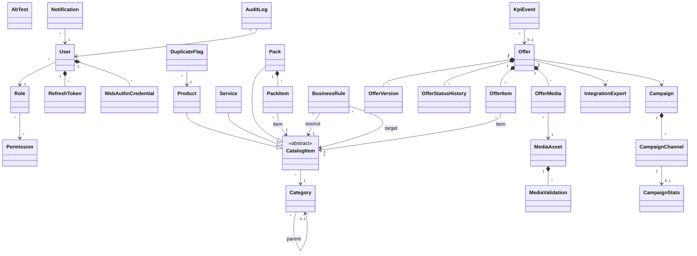
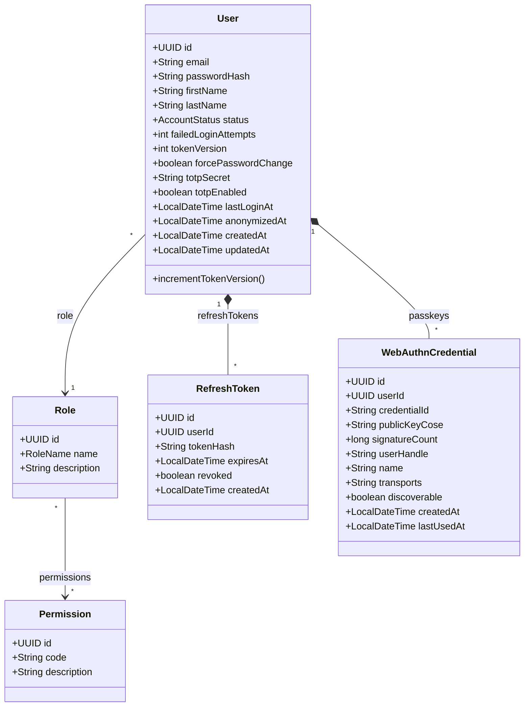
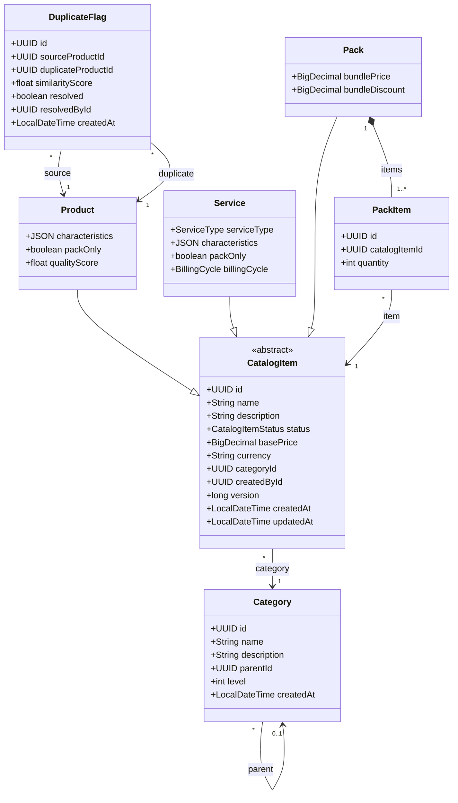
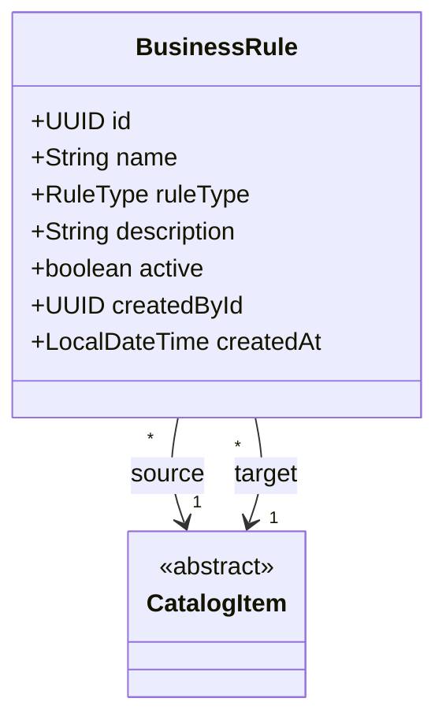
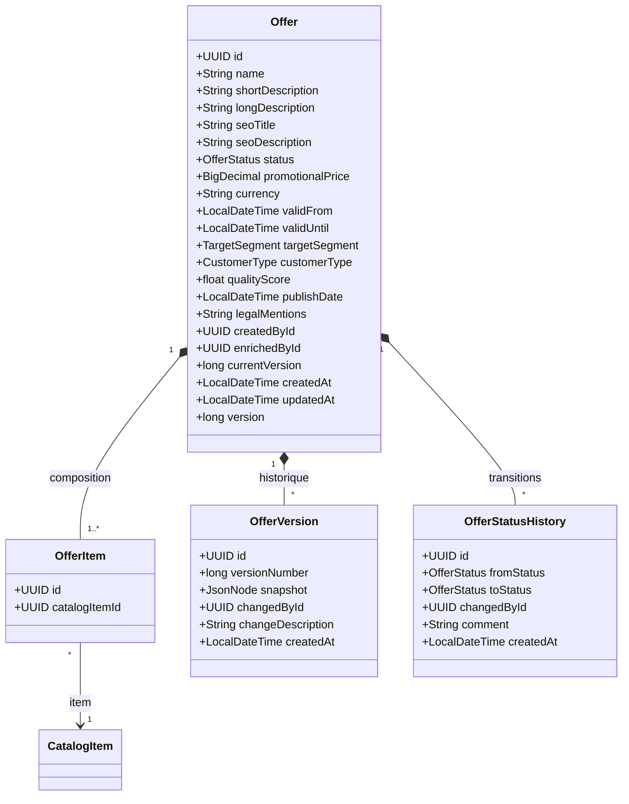
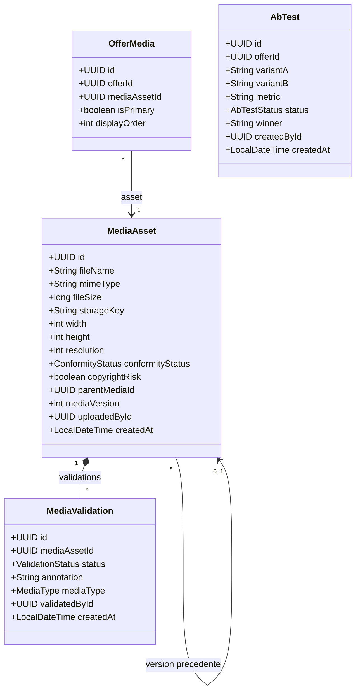
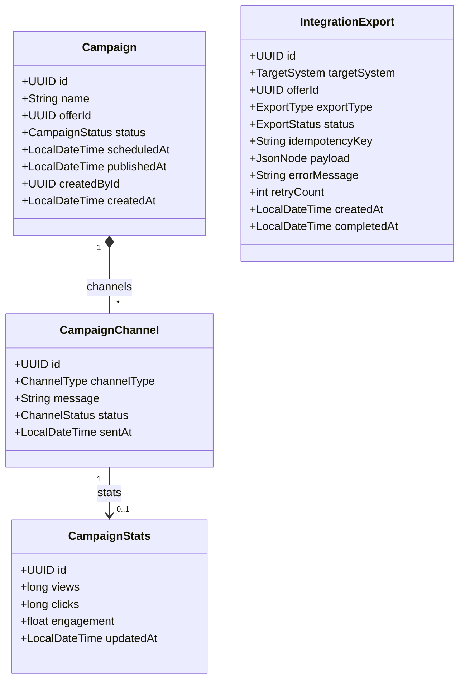
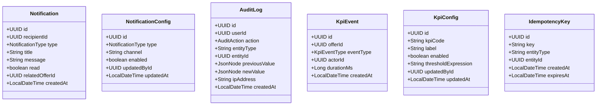

# Diagramme de Classes — PIM Moov Africa Burkina Faso

> **Phase 1 — Analyse et modélisation UML**
> Licence 3 SIR — Koussoube Drissa — Encadrant académique : M. Tindano Olivier

---

## Table des matières

1. [Vue d'ensemble](#1-vue-densemble)
2. [Identité et Sécurité](#2-identité-et-sécurité)
3. [Catalogue — Héritage CatalogItem](#3-catalogue--héritage-catalogitem)
4. [Règles et Dépendances](#4-règles-et-dépendances)
5. [Offres et Cycle de Vie](#5-offres-et-cycle-de-vie)
6. [Médias et Validation Graphique](#6-médias-et-validation-graphique)
7. [Diffusion et Intégration Multicanale](#7-diffusion-et-intégration-multicanale)
8. [Support Transversal](#8-support-transversal)
9. [Énumérations](#9-énumérations)
10. [Justifications de conception](#10-justifications-de-conception)

---

## 1. Vue d'ensemble

30 entités organisées en 7 domaines. `CatalogItem` est la classe abstraite parente de Product, Service et Pack. Les relations de composition (*--) indiquent une dépendance de cycle de vie (le composant n'existe pas sans le composite). Le domaine Identité et Sécurité inclut désormais l'authentification multi-facteur (TOTP + WebAuthn/FIDO2), la gestion des refresh tokens, et le chiffrement des données sensibles.

---

## 2. Identité et Sécurité

Authentification JWT stateless avec fingerprint binding et token versioning. MFA double canal : TOTP (RFC 6238) et WebAuthn/FIDO2 (Passkeys). 6 rôles fixes prédéfinis, permissions associées par rôle. Chaque utilisateur a exactement un rôle ; chaque rôle confère un ensemble fixe de permissions. Les refresh tokens sont stockés en base (hash SHA-256) avec rotation à chaque usage. Les clés de session WebAuthn sont stockées comme credentials FIDO2.

| Classe | Attributs clés | Contraintes |
|--------|---------------|-------------|
| `User` | email (unique), passwordHash (bcrypt cost 12), status, failedLoginAttempts, tokenVersion, totpSecret (chiffré AES-256-GCM), totpEnabled, forcePasswordChange, anonymizedAt | Verrouillage après 5 échecs. Suppression logique (status=DISABLED). Mot de passe jamais stocké en clair. `tokenVersion` incrémenté à chaque changement de mot de passe (invalide tous les tokens existants). `totpSecret` chiffré via EncryptionService (Vault KMS). `anonymizedAt` positionné lors de l'anonymisation RGPD. |
| `Role` | name (enum 6 valeurs) | 6 rôles fixes, insérés par migration Flyway. Pas de CRUD dynamique. |
| `Permission` | code (ex. CATALOG_MANAGE, OFFER_CREATE) | ~15 codes fixes. Table configurable pour évolution future. |
| `RefreshToken` | tokenHash (SHA-256, unique), expiresAt, revoked | Stocké en base (jamais le token brut). Rotation à chaque usage : l'ancien est révoqué, un nouveau est émis. TTL 7 jours. Révocation en masse possible (changement de mot de passe, urgence). |
| `WebAuthnCredential` | credentialId (unique), publicKeyCose (clé publique COSE), signatureCount, discoverable | Credential FIDO2/WebAuthn. `signatureCount` incrémenté à chaque authentification (protection contre le clonage). Support multi-clés par utilisateur. |

---

## 3. Catalogue — Héritage CatalogItem

**Choix d'architecture** : Product, Service et Pack héritent d'une classe abstraite `CatalogItem` qui factorise les attributs communs (nom, description, statut, prix, catégorie, versioning). Cela élimine la duplication d'attributs et simplifie les associations (PackItem et OfferItem référencent `CatalogItem` au lieu d'un XOR polymorphe).

| Classe | Rôle | Contraintes |
|--------|------|-------------|
| `CatalogItem` | Classe abstraite parente. Factorise : nom, description, statut, prix de base, catégorie, versioning optimiste. | `basePrice` en XOF (franc CFA). `currency` = "XOF" par défaut. `version` pour le verrouillage optimiste. |
| `Product` | Produit physique (terminal, équipement, SIM). | Détection de doublons automatique à la création. `packOnly` = vendable uniquement en pack. `qualityScore` = score de complétude de la fiche. |
| `Service` | Service d'offre (forfait data, voix, Mobile Money). | `billingCycle` : MONTHLY, WEEKLY, DAILY, ONE_TIME. `serviceType` classifie la nature. |
| `Pack` | Assemblage de produits et/ou services. | Au moins un PackItem. `bundlePrice` remplace la somme des composants si renseigné. `bundleDiscount` = réduction pack. |
| `Category` | Catégorie hiérarchique (arbre via parentId). | Nom unique par niveau. Suppression impossible si des items y sont rattachés. |
| `PackItem` | Liaison pack — produit ou service. | Référence un CatalogItem de type Product ou Service (pas un autre Pack — contrainte métier, pas structurelle). |
| `DuplicateFlag` | Signalement de doublon détecté. | Créé automatiquement. Peut être résolu (faux positif) par le chef de produit. |

---

## 4. Règles et Dépendances

Grâce à l'héritage `CatalogItem`, les règles référencent directement la classe abstraite (plus besoin de sourceType/sourceId polymorphe).

| Champ | Rôle |
|-------|------|
| `ruleType` | COMPATIBILITY (peuvent coexister), INCOMPATIBILITY (mutuellement exclusifs), MANDATORY_COMPOSITION (l'un exige l'autre), PACK_ONLY (non vendable seul) |
| `source` | Premier élément de la règle (référence CatalogItem : Product, Service ou Pack) |
| `target` | Second élément de la règle |
| `active` | Permet de désactiver une règle sans la supprimer |

---

## 5. Offres et Cycle de Vie

Ajouts par rapport à la version précédente : **tarification** (prix promotionnel), **validité temporelle** (dates de début/fin), **segmentation client** (prépayé/postpayé, particulier/entreprise), **score de qualité** de la fiche.

| Classe | Rôle | Contraintes |
|--------|------|-------------|
| `Offer` | Fiche d'offre commerciale assemblée à partir du catalogue. | `promotionalPrice` remplace la somme des prix de base si renseigné. `validFrom`/`validUntil` délimitent la période commerciale (le système passe automatiquement en OBSOLETE à expiration). `targetSegment` et `customerType` ciblent le marché. `qualityScore` = score de complétude avant soumission. `createdById` détermine la visibilité (un CdP ne voit que ses offres). |
| `OfferItem` | Liaison offre — élément du catalogue. | Référence un CatalogItem (Product, Service ou Pack). Une offre doit contenir au moins un item. |
| `OfferVersion` | Snapshot complet d'une version de la fiche. | Créé à chaque modification. Le `snapshot` (JSON) permet le rollback intégral par l'administrateur. |
| `OfferStatusHistory` | Trace de chaque transition de statut. | Traçabilité : qui, quand. Commentaire obligatoire en cas de rejet. |

---

## 6. Médias et Validation Graphique

DAM intégré avec vérification automatique de conformité (résolution, format, droits d'auteur) et scan antivirus ClamAV. Circuit de validation graphique **dédié et indépendant** de la validation métier. La relation Offer — MediaAsset passe par la table de jointure `OfferMedia`.

**Règle importante** : une offre ne peut PAS passer en statut `VALIDATED` si elle possède des médias dont le `conformityStatus` est `NON_COMPLIANT` ou dont la `MediaValidation` est en statut `REJECTED`.

| Classe | Rôle | Contraintes |
|--------|------|-------------|
| `MediaAsset` | Fichier média stocké dans MinIO (S3). | Vérification automatique de conformité à l'upload (résolution, format). Scan antivirus ClamAV avant stockage. `parentMediaId` + `mediaVersion` pour le versioning des visuels (comparaison avant/après). |
| `OfferMedia` | Table de jointure Offer — MediaAsset. | `isPrimary` = visuel principal. `displayOrder` pour l'ordonnancement. |
| `MediaValidation` | Résultat de la validation graphique par le CdS. | Circuit indépendant de la validation métier. `annotation` = commentaire détaillé par type de média. |
| `AbTest` | Test A/B sur le contenu marketing. | Deux variantes comparées sur une métrique (ex. taux de clic). |

---

## 7. Diffusion et Intégration Multicanale

**Deux blocs distincts :**

1. **Diffusion automatique** (`IntegrationExport`) : déclenchée par le système dès publication, sans intervention humaine. Cible : CRM, centre d'appel, site web/e-boutique.
2. **Diffusion manuelle** (`Campaign`) : pilotée par le Community Manager. Cible : réseaux sociaux (Facebook, Instagram, LinkedIn) et sites partenaires.

---

## 8. Support Transversal

Notifications par étape du cycle de vie, configuration des canaux de notification par l'administrateur, journalisation de chaque action sensible (audit), événements KPI pour le calcul du Time To Market et de la productivité, configuration des indicateurs suivis.

| Classe | Rôle |
|--------|------|
| `Notification` | Notification in-app envoyée à un utilisateur à chaque étape du workflow. |
| `NotificationConfig` | Configuration par l'administrateur : activer/désactiver un type de notification, choisir le canal (in-app, email). |
| `AuditLog` | Trace immuable de chaque action sensible (création, modification, validation, rejet, publication, connexion, MFA, changement de mot de passe, révocation d'urgence, export RGPD, anonymisation). L'adresse IP est enregistrée pour la traçabilité. |
| `KpiEvent` | Événement horodaté pour le calcul des indicateurs (Time To Market, temps de traitement par étape). |
| `KpiConfig` | Configuration par l'administrateur : activer/désactiver un indicateur, définir des seuils d'alerte. |
| `IdempotencyKey` | Clé d'idempotence pour éviter les doublons d'export/intégration. TTL configurable. |

---

## 9. Énumérations

Types énumérés utilisés par le modèle de données. Stockés en `VARCHAR` dans PostgreSQL pour la lisibilité des requêtes.

| Enum | Valeurs | Description |
|------|---------|-------------|
| **AccountStatus** | `ACTIVE`, `LOCKED`, `DISABLED`, `ANONYMIZED` | Statut du compte utilisateur. `ANONYMIZED` pour les comptes traités par la procédure RGPD. |
| **RoleName** | `ADMIN_SYSTEME`, `CHEF_PRODUIT`, `ANALYSTE_MARKETING`, `CHEF_SERVICE`, `CHEF_DEPARTEMENT`, `COMMUNITY_MANAGER` | 6 rôles fixes |
| **CatalogItemStatus** | `ACTIVE`, `ARCHIVED` | Statut d'un élément du catalogue |
| **ServiceType** | `DATA`, `VOICE`, `MOBILE_MONEY`, `OTHER` | Nature du service |
| **BillingCycle** | `MONTHLY`, `WEEKLY`, `DAILY`, `ONE_TIME` | Cycle de facturation d'un service |
| **RuleType** | `COMPATIBILITY`, `INCOMPATIBILITY`, `MANDATORY_COMPOSITION`, `PACK_ONLY` | Type de règle métier |
| **OfferStatus** | `DRAFT`, `IN_ENRICHMENT`, `IN_VALIDATION`, `VALIDATED`, `PLANNED`, `PUBLISHED`, `SUSPENDED`, `OBSOLETE`, `WITHDRAWN`, `ARCHIVED` | 10 statuts du cycle de vie |
| **TargetSegment** | `PREPAID`, `POSTPAID`, `HYBRID` | Segment client visé par l'offre |
| **CustomerType** | `INDIVIDUAL`, `BUSINESS`, `ALL` | Type de clientèle |
| **ConformityStatus** | `PENDING`, `COMPLIANT`, `NON_COMPLIANT` | Conformité technique d'un média |
| **ValidationStatus** | `PENDING`, `APPROVED`, `REJECTED` | Statut de validation graphique |
| **MediaType** | `IMAGE`, `VIDEO`, `PDF` | Type de média |
| **NotificationType** | `ENRICHMENT_REQUIRED`, `VALIDATION_REQUIRED`, `STRATEGIC_VALIDATION`, `OFFER_REJECTED`, `OFFER_PUBLISHED`, `OFFER_EXPIRING`, `CAMPAIGN_READY` | Déclencheurs de notification |
| **AuditAction** | `CREATE`, `UPDATE`, `DELETE`, `VALIDATE`, `REJECT`, `PUBLISH`, `ROLLBACK`, `LOGIN`, `LOGIN_FAILED`, `EXPORT`, `CHANGE_PASSWORD`, `MFA_SETUP`, `MFA_DISABLE`, `EMERGENCY_REVOKE`, `KEY_ROTATE`, `DATA_EXPORT`, `ANONYMIZE` | Actions auditées (enrichi avec les actions de sécurité) |
| **CampaignStatus** | `DRAFT`, `SCHEDULED`, `PUBLISHED`, `COMPLETED` | Statut d'une campagne CM |
| **ChannelType** | `FACEBOOK`, `INSTAGRAM`, `LINKEDIN`, `PARTNER_SITE` | Canal de diffusion CM |
| **ChannelStatus** | `PENDING`, `SENT`, `FAILED` | Statut d'envoi par canal |
| **TargetSystem** | `CRM`, `CALL_CENTER`, `WEBSITE` | Système cible (diffusion auto) |
| **ExportType** | `AUTO_PUBLISH`, `MANUAL_EXPORT`, `RESYNC`, `CATALOG_EXPORT` | Type d'export |
| **ExportStatus** | `PENDING`, `SUCCESS`, `FAILED` | Statut d'un export |
| **AbTestStatus** | `RUNNING`, `COMPLETED` | Statut d'un test A/B |

---

## 10. Justifications de conception

| Décision | Justification |
|----------|--------------|
| **Héritage CatalogItem** | Product, Service et Pack partagent 7 attributs identiques. L'abstraction élimine la duplication et simplifie les références depuis PackItem, OfferItem et BusinessRule (une seule FK au lieu d'un XOR polymorphe sourceType/sourceId qui casse l'intégrité référentielle). En JPA : stratégie `JOINED` (une table par sous-classe + table parent). |
| **Prix sur CatalogItem + Offer** | Le `basePrice` sur CatalogItem est le prix catalogue unitaire. Le `promotionalPrice` sur Offer est le prix commercial éventuel qui remplace la somme des composants. Monnaie explicite (`currency` = "XOF") même en mono-tenant, pour la rigueur et l'extensibilité multi-filiales. |
| **validFrom / validUntil sur Offer** | Une offre télécom a une durée de vie. Sans dates de validité, le passage en OBSOLETE ne peut être qu'humain et manuel, ce qui est fragile. Le système peut déclencher automatiquement la transition PUBLISHED -> OBSOLETE à expiration + envoyer une alerte anticipée (OFFER_EXPIRING). |
| **targetSegment + customerType** | Chez un opérateur télécom, une offre cible un segment (prépayé/postpayé/hybride) et un type de client (particulier/entreprise/tous). Sans ça, le CRM ne sait pas à qui pousser l'offre. |
| **qualityScore sur Offer** | Le CDCF mentionne un "score de qualité de fiche avant soumission". Ce score mesure la complétude (description renseignée, médias présents, mentions légales, SEO). Calculé automatiquement, bloquant si sous un seuil configurable. |
| **characteristics en JSON** | Les caractéristiques techniques sont variables selon le type de produit/service (un forfait data n'a pas les mêmes champs qu'un terminal). Le JSON offre la flexibilité sans multiplier les colonnes. Les champs critiques pour le filtrage sont indexés via des index GIN PostgreSQL. |
| **NotificationConfig + KpiConfig** | Le CDCF demande que l'administrateur puisse configurer les canaux de notification et les indicateurs suivis. Sans ces entités, la configuration est en dur dans le code. |
| **parentMediaId sur MediaAsset** | Permet le versioning des visuels (comparer avant/après lors de la validation graphique) sans créer une entité MediaVersion séparée. Chaînage simple : chaque nouveau upload référence son prédécesseur. |
| **RefreshToken en base** | Le stockage des refresh tokens en base (hash SHA-256) permet la révocation individuelle et en masse (changement de mot de passe, révocation d'urgence). La rotation à chaque usage détecte le vol de token (le token volé sera rejeté à la prochaine utilisation légitime). |
| **WebAuthnCredential** | Support des Passkeys (FIDO2/WebAuthn) comme second facteur d'authentification, en complément du TOTP. Le `signatureCount` est vérifié à chaque authentification pour détecter le clonage de clé. Support multi-clés par utilisateur pour la résilience. |
| **tokenVersion sur User** | Incrémenté à chaque changement de mot de passe. Les tokens JWT contiennent la version ; si la version du token ne correspond plus à celle de l'utilisateur en base, le token est rejeté. Permet l'invalidation de tous les tokens sans lister les refresh tokens. |
| **totpSecret chiffré** | Le secret TOTP est chiffré en AES-256-GCM via le service EncryptionService (clé maître dans HashiCorp Vault). Jamais stocké en clair en base. Permet la conformité aux exigences de chiffrement au repos. |
| **anonymizedAt sur User** | Conformité RGPD : date à laquelle les données personnelles ont été anonymisées. Les champs PII (email, prénom, nom) sont remplacés par des valeurs anonymisées irréversibles. Le compte passe en status `ANONYMIZED`. |
