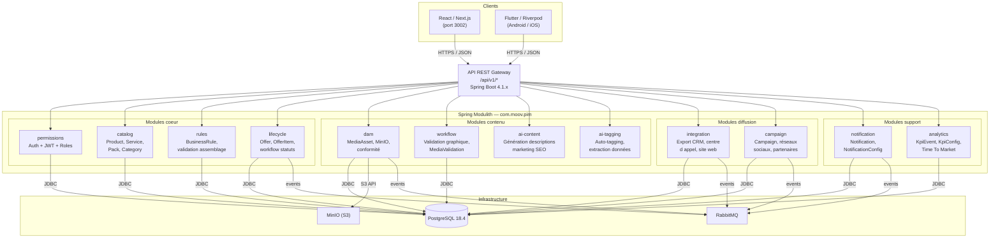
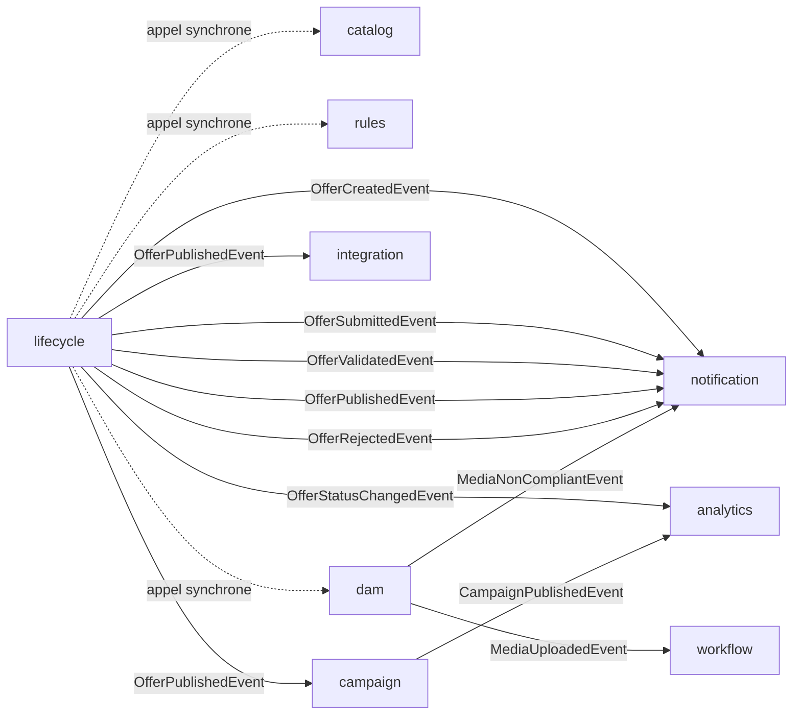

# Diagramme de Composants — PIM Moov Africa Burkina Faso

> **Phase 1 — Analyse et modélisation UML**
> Licence 3 SIR — Koussoube Drissa — Encadrant académique : M. Tindano Olivier

---

## Architecture modulaire (Spring Modulith)

Le backend est organisé en **monolithe modulaire** avec Spring Modulith. Chaque module expose une API publique (`*Api`) et communique avec les autres exclusivement via des événements Spring ou des interfaces publiques. Aucun accès direct aux classes `internal` d'un autre module.



---

## Détail des modules et de leurs responsabilités

| Module | Package | Responsabilités | Dépendances internes |
|--------|---------|-----------------|---------------------|
| **permissions** | `com.moov.pim.permissions` | Authentification JWT, gestion des utilisateurs, rôles, permissions, verrouillage de compte | Aucune (module racine) |
| **catalog** | `com.moov.pim.catalog` | CRUD Product, Service, Pack, Category. Détection doublons. Score qualité. | permissions (vérification droits) |
| **rules** | `com.moov.pim.rules` | CRUD BusinessRule. Validation automatique à l'assemblage d'une offre. | catalog (lecture des CatalogItems) |
| **lifecycle** | `com.moov.pim.lifecycle` | CRUD Offer, OfferItem. Machine à états (10 statuts). Versioning + rollback. Scheduler (publication planifiée, expiration). | catalog (lecture items), rules (validation), permissions (visibilité CdP) |
| **dam** | `com.moov.pim.dam` | Stockage MinIO, CRUD MediaAsset, OfferMedia. Vérification conformité automatique. | permissions |
| **workflow** | `com.moov.pim.workflow` | Validation graphique (MediaValidation). Circuit indépendant du lifecycle. | dam (lecture médias), permissions |
| **ai-content** | `com.moov.pim.aicontent` | Génération de descriptions marketing SEO (courte, longue). Test A/B. | catalog (caractéristiques), lifecycle (offre) |
| **ai-tagging** | `com.moov.pim.aitagging` | Auto-tagging, extraction de données depuis fiches techniques. | catalog |
| **integration** | `com.moov.pim.integration` | Export automatique vers CRM, centre d'appel, site web. Idempotence. Retry avec backoff. | lifecycle (événement publication) |
| **campaign** | `com.moov.pim.campaign` | Campagnes CM vers réseaux sociaux et partenaires. Statistiques. | lifecycle (offre publiée), permissions |
| **notification** | `com.moov.pim.notification` | Envoi de notifications in-app. Configuration des canaux par l'admin. | permissions (destinataires) |
| **analytics** | `com.moov.pim.analytics` | KpiEvent, calcul Time To Market, productivité par étape. Configuration indicateurs. | lifecycle (événements), permissions (droits CdD) |

---

## Communication inter-modules



**Conventions :**
- **Trait plein (-->)** : communication asynchrone via événements Spring / RabbitMQ (couplage faible)
- **Trait pointillé (-..->)** : appel synchrone via l'API publique du module (couplage contrôlé)
- Jamais d'accès direct aux classes `internal` d'un autre module

---

## Structure de dossiers d'un module (convention)

```
com.moov.pim.lifecycle/
├── LifecycleApi.java              # Interface publique du module
├── event/
│   ├── OfferCreatedEvent.java
│   ├── OfferPublishedEvent.java
│   └── OfferStatusChangedEvent.java
├── spi/                           # Interfaces pour dépendances externes
│   └── CatalogItemProvider.java
└── internal/
    ├── domain/
    │   ├── Offer.java
    │   ├── OfferItem.java
    │   ├── OfferVersion.java
    │   └── OfferStatusHistory.java
    ├── dto/
    │   ├── CreateOfferRequest.java
    │   └── OfferResponse.java
    ├── repository/
    │   └── OfferRepository.java
    ├── service/
    │   └── OfferService.java
    └── web/
        └── OfferController.java
```
