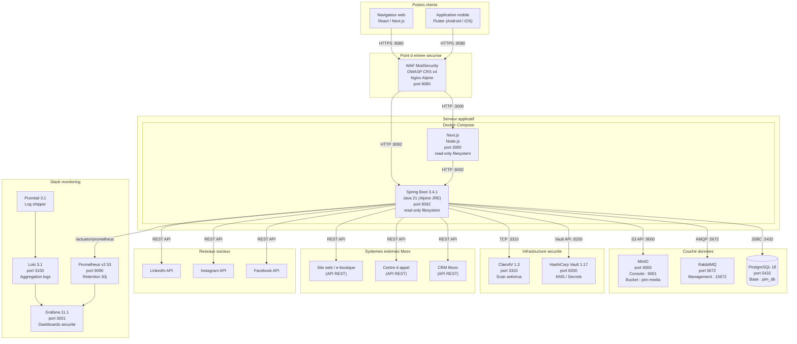
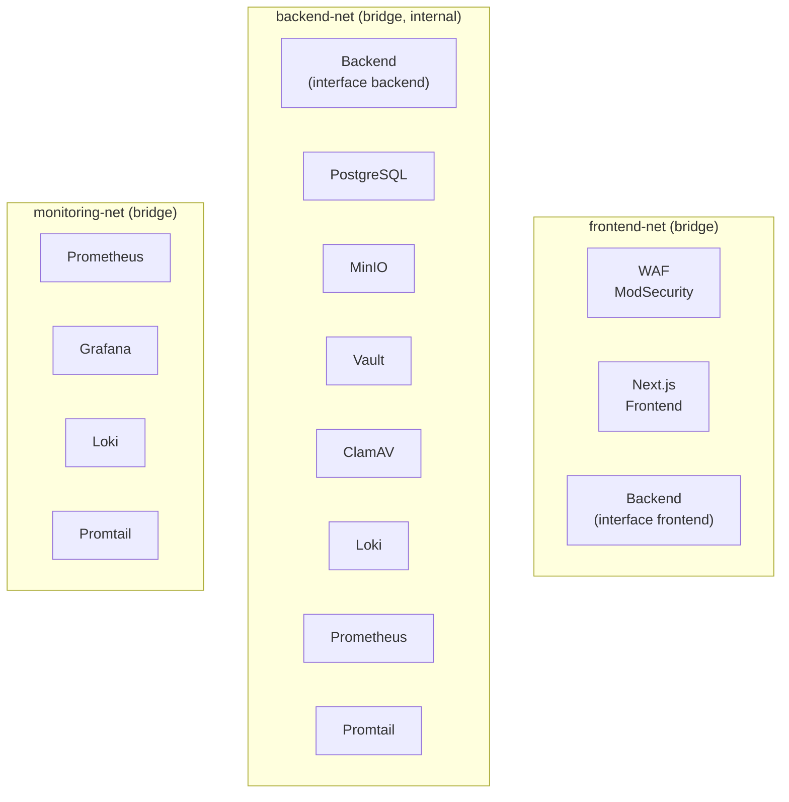
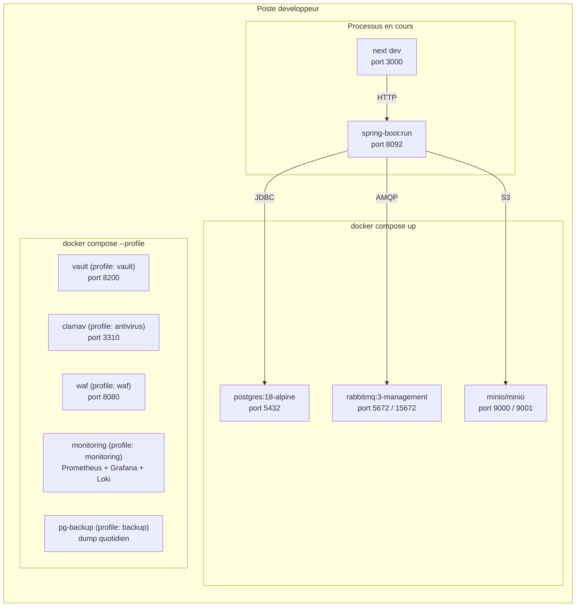
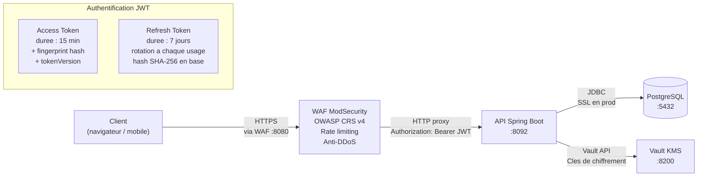

# Diagramme de Déploiement — PIM Moov Africa Burkina Faso

> **Phase 1 — Analyse et modélisation UML**
> Licence 3 SIR — Koussoube Drissa — Encadrant académique : M. Tindano Olivier

---

## Vue d'ensemble de l'infrastructure

L'architecture de déploiement s'organise en couches avec un WAF ModSecurity comme point d'entrée, un backend Spring Boot sécurisé, et une infrastructure de services spécialisés (base de données, stockage objet, antivirus, KMS, monitoring).



---

## Architecture réseau Docker

Trois réseaux isolés pour la défense en profondeur :



| Réseau | Type | Accès externe | Services |
|--------|------|--------------|----------|
| `frontend-net` | bridge | Oui (ports 8080, 3000) | WAF, Frontend, Backend |
| `backend-net` | bridge, **internal** | Non (aucun port exposé) | Backend, PostgreSQL, MinIO, Vault, ClamAV, Loki, Prometheus, Promtail |
| `monitoring-net` | bridge | Oui (ports 9090, 3001, 3100) | Prometheus, Grafana, Loki, Promtail |

**Principes de segmentation :**
- `backend-net` est marqué `internal: true` — aucun accès direct depuis l'extérieur. PostgreSQL, MinIO, Vault et ClamAV ne sont jamais exposés.
- Le WAF est le seul point d'entrée pour le trafic client. Il filtre via OWASP CRS v4 avant de proxifier vers le backend/frontend.
- Le backend a une interface sur les deux réseaux (frontend-net et backend-net) pour servir les clients et accéder aux services internes.

---

## Environnement de développement local

Toute l'infrastructure locale est containerisée via Docker Compose. Le backend Spring Boot et le frontend Next.js tournent en mode dev hors Docker (rechargement à chaud). Les services de sécurité (ClamAV, Vault, WAF) et de monitoring sont activables via des profils Docker Compose.



| Composant | Image / Version | Port | Données persistantes | Profil |
|-----------|----------------|------|---------------------|--------|
| PostgreSQL | `postgres:18-alpine` | 5432 | Volume `pim-pgdata` | (default) |
| RabbitMQ | `rabbitmq:3-management` | 5672 / 15672 | — | (default) |
| MinIO | `minio/minio` | 9000 / 9001 | Volume `pim-minio` | (default) |
| Spring Boot | Dev local (`mvn spring-boot:run`) | 8092 | — | — |
| Next.js | Dev local (`pnpm dev`) | 3000 | — | — |
| Flutter | Dev local (`flutter run`) | — | — | — |
| WAF ModSecurity | `owasp/modsecurity-crs:4-nginx-alpine` | 8080 | — | `waf` |
| ClamAV | `clamav/clamav:1.3` | 3310 | Volume `pim-clamav-data` | `antivirus` |
| HashiCorp Vault | `hashicorp/vault:1.17` | 8200 | Volume `pim-vault-data` | `vault` |
| Prometheus | `prom/prometheus:v2.53.0` | 9090 | Volume `pim-prometheus-data` | `monitoring` |
| Grafana | `grafana/grafana:11.1.0` | 3001 | Volume `pim-grafana-data` | `monitoring` |
| Loki | `grafana/loki:3.1.0` | 3100 | Volume `pim-loki-data` | `monitoring` |
| Promtail | `grafana/promtail:3.1.0` | — | — | `monitoring` |
| PG Backup | `postgres:18-alpine` | — | Volume `pim-backups` | `backup` |

---

## Schéma de migration (Flyway)

```
src/main/resources/db/migration/
├── V001__create_users_roles_permissions.sql
├── V002__create_categories.sql
├── V003__create_catalog_items.sql
├── V004__create_business_rules.sql
├── V005__create_offers.sql
├── V006__create_media_assets.sql
├── V007__create_ab_tests.sql
├── V008__create_campaigns.sql
├── V009__create_integration_exports.sql
├── V010__create_notifications.sql
├── V011__create_audit_logs.sql
├── V012__create_kpi_events.sql
├── V013__create_idempotency_keys.sql
├── V014__seed_roles_permissions.sql
├── V015__seed_admin_user.sql
├── V016__create_event_publication.sql
├── V017__add_catalog_write_permission.sql
├── V018__security_hardening.sql           ← Rate limiting, token versioning, audit enrichment
├── V019__add_mfa_and_audit_fields.sql     ← TOTP secret, MFA enabled, force password change
├── V020__add_gdpr_and_security_fields.sql ← anonymizedAt, account status ANONYMIZED
└── V021__create_webauthn_credentials.sql  ← Table webauthn_credentials (FIDO2/Passkeys)
```

**Stratégie JPA pour l'héritage CatalogItem** : `JOINED` — une table `catalog_items` (colonnes communes) + tables `products`, `services`, `packs` (colonnes spécifiques) liées par FK sur `id`. Choix justifié : pas de colonnes nullables inutiles (contrairement à SINGLE_TABLE), requêtes sur le type parent efficaces (contrairement à TABLE_PER_CLASS).

---

## Flux réseau et sécurité



| Couche | Mécanisme de sécurité |
|--------|----------------------|
| **WAF** | ModSecurity avec OWASP Core Rule Set v4. Paranoia niveau 2. Rate limiting (API 30r/s, auth 5r/min). Anti-scanner, anti-DDoS (slow loris, connection limits). Blocage auto après violations. |
| **Transport** | HTTPS obligatoire en production. HTTP autorisé uniquement en dev local. HSTS activé (max-age 1 an, includeSubDomains, preload). |
| **Authentification** | JWT stateless avec fingerprint binding et token versioning. Access token (15 min) + Refresh token (7 jours, rotation). Mot de passe hashé en bcrypt (cost 12). MFA TOTP (RFC 6238) + WebAuthn/FIDO2. MFA obligatoire pour ADMIN_SYSTEME. |
| **Autorisation** | @PreAuthorize deny-by-default. Filtre Spring Security vérifie le rôle (RoleName) et les permissions associées à chaque endpoint. |
| **Politique de mot de passe** | Min 12 caractères, majuscule, minuscule, chiffre, caractère spécial, vérification HIBP (k-anonymity SHA-1). Changement de mot de passe = révocation de tous les tokens. |
| **Chiffrement au repos** | AES-256-GCM via EncryptionService. Clé maître dans HashiCorp Vault. Secrets TOTP chiffrés en base. |
| **Chiffrement en transit** | TLS 1.2+ entre tous les composants en production. Monitoring certificats (CertificateMonitorScheduler, alertes à 30j et 7j). |
| **DLP** | Filtre DLP sur les réponses HTTP : détection de numéros de carte, SSN, emails en masse. Limite de taille des réponses (5 Mo). Limitation requêtes (200/min). |
| **Antivirus** | Scan ClamAV de chaque fichier uploadé avant stockage MinIO. Fichiers infectés rejetés (HTTP 422). |
| **Rotation des clés** | Clés de session : cycle 90 jours. Clé maître : cycle 365 jours. Vérification automatique hebdomadaire. Révocation d'urgence possible. |
| **Données** | Mots de passe jamais stockés en clair. Secrets (JWT secret, credentials MinIO/RabbitMQ) dans variables d'environnement, jamais dans le code ou le dépôt Git. PII masqués dans les logs (PiiMaskConverter). |
| **RGPD** | Export des données personnelles (GdprExportService). Anonymisation irréversible (DataAnonymizationService). Nettoyage automatique des données expirées (DataCleanupScheduler). |
| **Audit** | Chaque action sensible est tracée dans `audit_logs` (qui, quoi, quand, IP, valeur avant/après). Actions de sécurité auditées : login, MFA, changement de mot de passe, révocation, export RGPD, anonymisation. |
| **Monitoring** | Prometheus (métriques applicatives + sécurité), Grafana (dashboards), Loki (agrégation logs), Promtail (collecte logs). Alertes automatiques sur : login échoués, lockouts, MFA failures, malware détecté, certificats expirants. |
| **Idempotence** | Clé d'idempotence sur les exports pour éviter les doublons en cas de retry. |
| **Conteneurs** | Filesystem read-only, tmpfs pour /tmp et /app/logs, no-new-privileges, limites mémoire/CPU, images Alpine. |
| **Headers de sécurité** | CSP (`default-src 'none'`), X-Content-Type-Options, X-Frame-Options (DENY), Referrer-Policy, Permissions-Policy. |

---

## Sécurisation des conteneurs Docker

| Mesure | Application |
|--------|-------------|
| **Read-only filesystem** | `read_only: true` sur backend et frontend. Seuls `/tmp` et `/app/logs` sont en tmpfs (noexec, nosuid). |
| **No new privileges** | `security_opt: no-new-privileges:true` sur tous les conteneurs. |
| **Limites de ressources** | Mémoire et CPU limités par conteneur (ex. backend 1G/2CPU, PostgreSQL 512M/1CPU). |
| **Images minimales** | Images Alpine pour PostgreSQL, Vault, WAF. JRE Alpine pour le backend (multi-stage build). |
| **Réseau interne** | `backend-net` marqué `internal: true` — aucun port exposé vers l'extérieur. |
| **Healthchecks** | Healthcheck configuré sur chaque service critique (PostgreSQL, MinIO, Vault, ClamAV). |
| **Backup automatique** | pg_dump quotidien avec rétention 7 jours (profil `backup`). |

---

## CI/CD (GitHub Actions)

| Étape | Outil | Description |
|-------|-------|-------------|
| **Build** | Maven + JDK 21 | Compilation, tests unitaires, packaging |
| **SAST** | CodeQL, SpotBugs | Analyse statique du code source |
| **SCA** | OWASP Dependency-Check | Scan des dépendances (CVE) |
| **DAST** | OWASP ZAP | Scan dynamique de l'API déployée |
| **Secret scanning** | Gitleaks | Détection de secrets dans le code |
| **SBOM** | CycloneDX Maven Plugin | Génération du Software Bill of Materials |
| **Container signing** | Cosign (Sigstore) | Signature cryptographique des images Docker |
| **Container scan** | Trivy | Scan de vulnérabilités des images Docker |

---

## Contraintes de déploiement pour la soutenance

| Contrainte | Décision |
|-----------|----------|
| Pas d'accès aux systèmes réels de Moov (CRM, centre d'appel, site web) | Les connecteurs `integration` utilisent des **mocks/stubs** qui simulent les réponses. Documenté clairement dans le mémoire comme "simulé". |
| Pas de serveur de production | Démonstration en local (docker-compose + dev servers). |
| Dépôt sur GitHub personnel | Aucune donnée de production, aucun secret, aucune credential réelle dans le dépôt. |
| Flutter non encore installé | Le mobile est modélisé et conçu (maquettes, architecture), implémenté si le temps le permet. |
| Services optionnels via profils | ClamAV, Vault, WAF et monitoring sont activables via `--profile` pour ne pas surcharger la machine de développement. |
