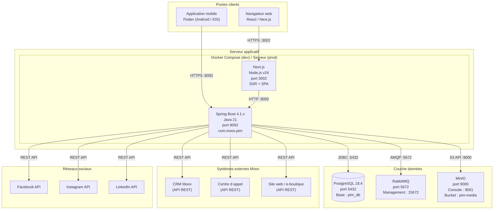
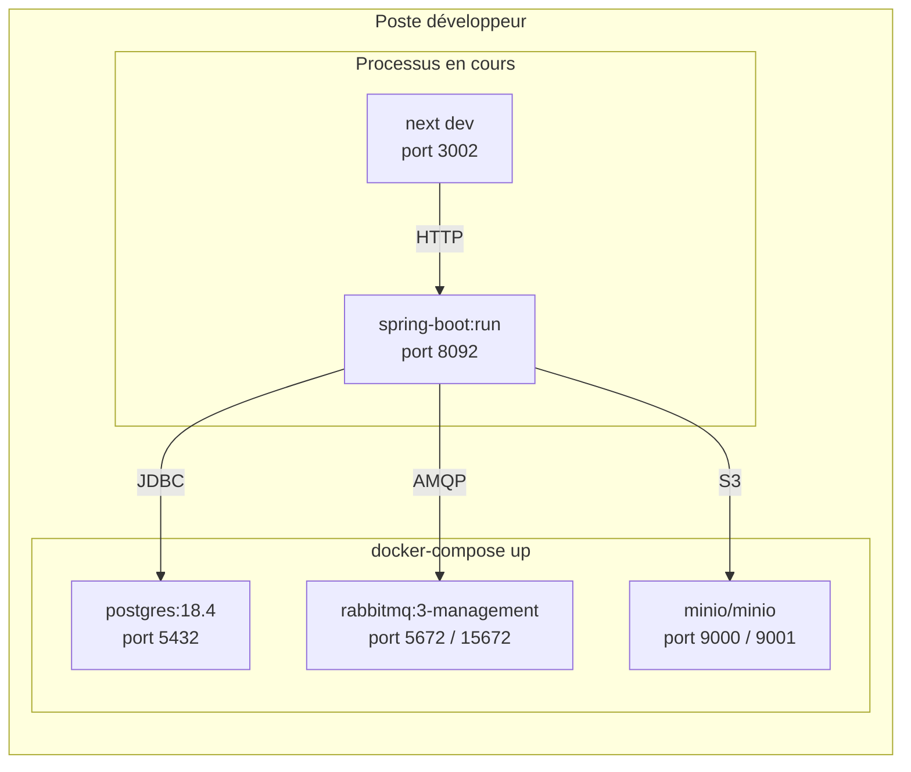
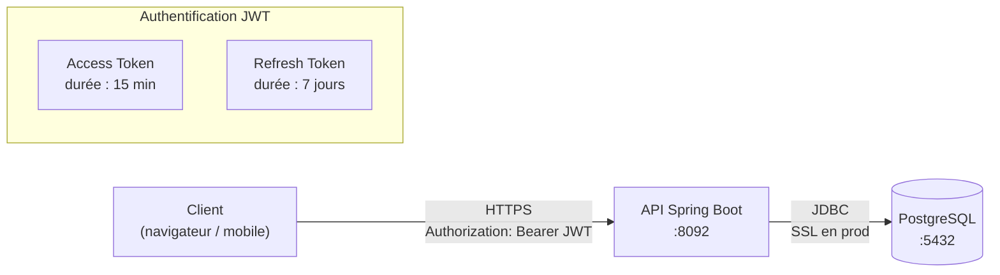

# Diagramme de Déploiement — PIM Moov Africa Burkina Faso

> **Phase 1 — Analyse et modélisation UML**
> Licence 3 SIR — Koussoube Drissa — Encadrant académique : M. Tindano Olivier

---

## Vue d'ensemble de l'infrastructure



---

## Environnement de développement local

Toute l'infrastructure locale est containerisée via Docker Compose. Le backend Spring Boot et le frontend Next.js tournent en mode dev hors Docker (rechargement à chaud).



| Composant | Image / Version | Port | Données persistantes |
|-----------|----------------|------|---------------------|
| PostgreSQL | `postgres:18.4` | 5432 | Volume Docker `pim-pgdata` |
| RabbitMQ | `rabbitmq:3-management` | 5672 (AMQP) / 15672 (UI) | Volume Docker `pim-rmqdata` |
| MinIO | `minio/minio` | 9000 (API) / 9001 (Console) | Volume Docker `pim-minio` |
| Spring Boot | Dev local (`mvn spring-boot:run`) | 8092 | — |
| Next.js | Dev local (`pnpm dev`) | 3002 | — |
| Flutter | Dev local (`flutter run`) | — | — |

---

## Schéma de migration (Flyway)

```
src/main/resources/db/migration/
├── V001__create_users_roles_permissions.sql
├── V002__create_categories.sql
├── V003__create_catalog_items.sql
├── V004__create_business_rules.sql
├── V005__create_offers.sql
├── V006__create_media_assets.sql
├── V007__create_campaigns.sql
├── V008__create_integration_exports.sql
├── V009__create_notifications.sql
├── V010__create_audit_logs.sql
├── V011__create_kpi_events.sql
├── V012__seed_roles_permissions.sql
└── V013__create_idempotency_keys.sql
```

**Stratégie JPA pour l'héritage CatalogItem** : `JOINED` — une table `catalog_items` (colonnes communes) + tables `products`, `services`, `packs` (colonnes spécifiques) liées par FK sur `id`. Choix justifié : pas de colonnes nullables inutiles (contrairement à SINGLE_TABLE), requêtes sur le type parent efficaces (contrairement à TABLE_PER_CLASS).

---

## Flux réseau et sécurité



| Couche | Mécanisme de sécurité |
|--------|----------------------|
| **Transport** | HTTPS obligatoire en production. HTTP autorisé uniquement en dev local. |
| **Authentification** | JWT stateless. Access token (15 min) + Refresh token (7 jours). Mot de passe hashé en bcrypt. |
| **Autorisation** | Filtre Spring Security vérifie le rôle (RoleName) et les permissions associées à chaque endpoint. |
| **Données** | Mots de passe jamais stockés en clair. Secrets (JWT secret, credentials MinIO/RabbitMQ) dans variables d'environnement, jamais dans le code ou le dépôt Git. |
| **Audit** | Chaque action sensible est tracée dans `audit_logs` (qui, quoi, quand, IP, valeur avant/après). |
| **Idempotence** | Clé d'idempotence sur les exports pour éviter les doublons en cas de retry. |

---

## Contraintes de déploiement pour la soutenance

| Contrainte | Décision |
|-----------|----------|
| Pas d'accès aux systèmes réels de Moov (CRM, centre d'appel, site web) | Les connecteurs `integration` utilisent des **mocks/stubs** qui simulent les réponses. Documenté clairement dans le mémoire comme "simulé". |
| Pas de serveur de production | Démonstration en local (docker-compose + dev servers). |
| Dépôt sur GitHub personnel | Aucune donnée de production, aucun secret, aucune credential réelle dans le dépôt. |
| Flutter non encore installé | Le mobile est modélisé et conçu (maquettes, architecture), implémenté si le temps le permet. |
