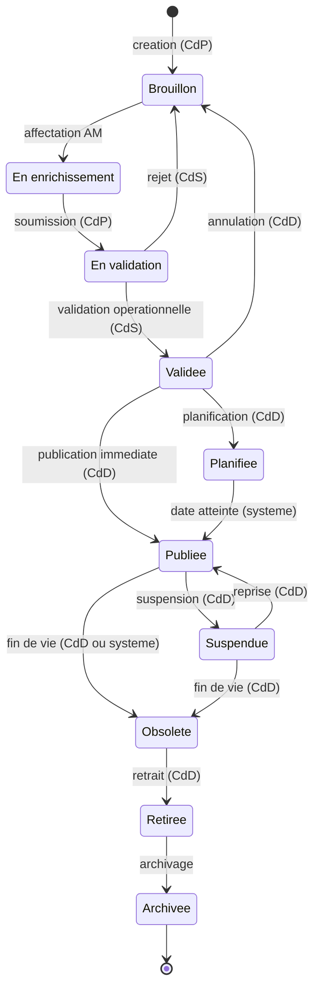

# Diagramme d'États — Cycle de Vie d'une Offre

> **Phase 1 — Analyse et modélisation UML**
> Licence 3 SIR — Koussoube Drissa — Encadrant académique : M. Tindano Olivier

---

## Les 10 statuts et leurs transitions

Chaque transition est associée à un acteur responsable. En cas de rejet, le chef de produit corrige et resoumet au même point du circuit. Deux transitions automatiques gérées par le système : publication planifiée (PLANNED -> PUBLISHED) et expiration (PUBLISHED -> OBSOLETE quand `validUntil` est atteint).

**Légende :**
- **CdP** = Chef de produit
- **AM** = Analyste marketing
- **CdS** = Chef de service
- **CdD** = Chef de département marketing et produits
- **(systeme)** = transition automatique, sans intervention humaine

---

## Détail de chaque statut

| Statut | Description | Qui y amène | Conditions de sortie |
|--------|-------------|-------------|---------------------|
| `BROUILLON` | État initial ou retour après rejet. Fiche en cours de création/correction. | CdP (création) ou CdS/CdD (rejet/annulation) | Le CdP affecte à l'AM pour enrichissement. |
| `EN_ENRICHISSEMENT` | L'analyste marketing enrichit : descriptions, visuels, SEO, mentions légales. | CdP (affectation) | Le CdP soumet pour validation quand l'enrichissement est terminé. |
| `EN_VALIDATION` | Soumise au chef de service pour validation opérationnelle. | CdP (soumission) | Le CdS valide ou rejette avec commentaire obligatoire. **Pré-requis** : tous les médias doivent être conformes (conformityStatus != NON_COMPLIANT) et la validation graphique ne doit pas être en statut REJECTED. |
| `VALIDEE` | Validée par le CdS. Attend la décision stratégique du CdD. | CdS (validation) | Le CdD publie, planifie, ou annule (retour en BROUILLON sur consigne de la direction). |
| `PLANIFIEE` | Publication différée à une date/heure future. | CdD (planification) | Le système publie automatiquement quand `publishDate` est atteint. |
| `PUBLIEE` | En ligne. Déclenche la diffusion automatique vers CRM, centre d'appel, site web. | CdD (publication) ou système (date atteinte) | Peut être suspendue (CdD) ou passer en obsolète (CdD ou système si `validUntil` est atteint). |
| `SUSPENDUE` | Temporairement retirée de la diffusion. Peut être réactivée. | CdD (suspension) | Reprise (retour en PUBLIEE) ou passage en OBSOLETE. |
| `OBSOLETE` | Fin de vie de l'offre, plus commercialisée. | CdD ou système (expiration `validUntil`) | Retrait (passage en RETIREE). |
| `RETIREE` | Retirée définitivement du catalogue actif. | CdD (retrait) | Archivage. |
| `ARCHIVEE` | État terminal. Conservée pour l'historique et l'audit. Non modifiable. | Admin ou CdD | Aucune — état final. |

---

## Transitions automatiques (système)

| Transition | Déclencheur | Mécanisme |
|-----------|-------------|-----------|
| PLANNED -> PUBLISHED | `publishDate <= now()` | Job planifié (Spring `@Scheduled`) vérifie périodiquement les offres PLANNED dont la date est passée. |
| PUBLISHED -> OBSOLETE | `validUntil <= now()` | Même job planifié. Notification OFFER_EXPIRING envoyée au CdP et au CdD un délai configurable avant l'expiration. |

---

## Tableau complet des transitions

| # | De | Vers | Déclencheur | Acteur | Commentaire requis |
|---|-----|------|-------------|--------|-------------------|
| 1 | — | BROUILLON | Création d'une nouvelle offre | Chef de produit | Non |
| 2 | BROUILLON | EN_ENRICHISSEMENT | Affectation à l'analyste marketing | Chef de produit | Non |
| 3 | EN_ENRICHISSEMENT | EN_VALIDATION | Soumission après enrichissement | Chef de produit | Non |
| 4 | EN_VALIDATION | VALIDEE | Validation opérationnelle | Chef de service | Optionnel |
| 5 | EN_VALIDATION | BROUILLON | Rejet | Chef de service | **Obligatoire** |
| 6 | VALIDEE | PUBLIEE | Publication immédiate | Chef de département | Non |
| 7 | VALIDEE | PLANIFIEE | Planification à une date | Chef de département | Non |
| 8 | VALIDEE | BROUILLON | Annulation (consigne direction) | Chef de département | **Obligatoire** |
| 9 | PLANIFIEE | PUBLIEE | Date/heure atteinte | Système | Automatique |
| 10 | PUBLIEE | SUSPENDUE | Suspension temporaire | Chef de département | Optionnel |
| 11 | SUSPENDUE | PUBLIEE | Reprise de la diffusion | Chef de département | Non |
| 12 | PUBLIEE | OBSOLETE | Fin de vie manuelle | Chef de département | Non |
| 13 | PUBLIEE | OBSOLETE | Expiration (`validUntil`) | Système | Automatique |
| 14 | SUSPENDUE | OBSOLETE | Fin de vie depuis état suspendu | Chef de département | Non |
| 15 | OBSOLETE | RETIREE | Retrait du catalogue actif | Chef de département | Non |
| 16 | RETIREE | ARCHIVEE | Archivage définitif | Admin ou CdD | Non |

---

## Pré-requis par transition

| Transition | Pré-requis vérifiés par le système |
|-----------|-----------------------------------|
| BROUILLON -> EN_ENRICHISSEMENT | L'offre contient au moins un OfferItem (produit/service/pack). |
| EN_ENRICHISSEMENT -> EN_VALIDATION | `qualityScore` >= seuil configurable. Au moins une description (courte ou longue) renseignée. |
| EN_VALIDATION -> VALIDEE | Tous les médias associés sont conformes. Aucune MediaValidation en statut REJECTED. Règles métier respectées (BusinessRule). |
| VALIDEE -> PUBLIEE / PLANIFIEE | Mentions légales renseignées (`legalMentions` non vide). `targetSegment` et `customerType` renseignés. |
