# Diagrammes de Séquence — PIM Moov Africa Burkina Faso

> **Phase 1 — Analyse et modélisation UML**
> Licence 3 SIR — Koussoube Drissa — Encadrant académique : M. Tindano Olivier

---

## Table des matières

1. [Création d'une offre](#1-création-dune-offre)
2. [Enrichissement par l'analyste marketing](#2-enrichissement-par-lanalyste-marketing)
3. [Circuit de validation complet](#3-circuit-de-validation-complet)
4. [Rejet et correction](#4-rejet-et-correction)
5. [Validation graphique (circuit dédié)](#5-validation-graphique-circuit-dédié)
6. [Publication et diffusion automatique](#6-publication-et-diffusion-automatique)
7. [Publication planifiée et expiration automatique](#7-publication-planifiée-et-expiration-automatique)
8. [Rollback d'une offre par l'administrateur](#8-rollback-dune-offre-par-ladministrateur)
9. [Authentification (login)](#9-authentification-login)
10. [Création d'un produit avec détection de doublons](#10-création-dun-produit-avec-détection-de-doublons)
11. [Campagne de diffusion réseaux sociaux (Community Manager)](#11-campagne-de-diffusion-réseaux-sociaux-community-manager)

---

## 1. Création d'une offre

Le chef de produit crée une offre à partir de produits/packs existants du catalogue. Le système vérifie les règles métier, crée la fiche et notifie l'analyste marketing.

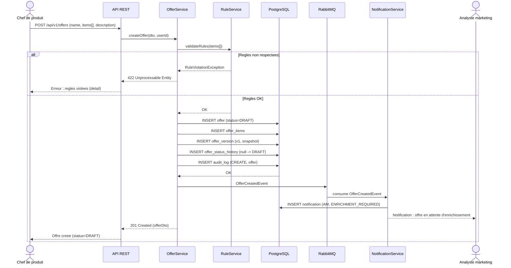

---

## 2. Enrichissement par l'analyste marketing

L'analyste marketing enrichit la fiche (descriptions marketing, SEO, visuels) sur la même fiche que celle créée par le chef de produit.

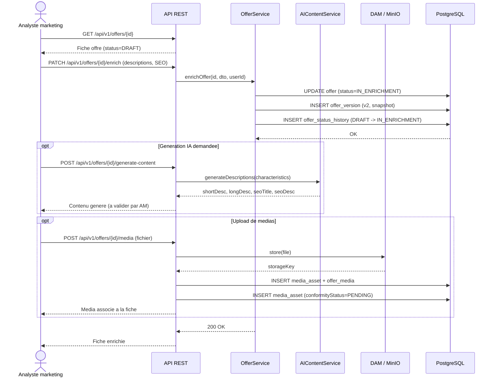

---

## 3. Circuit de validation complet

Après enrichissement, le chef de produit soumet l'offre. Le chef de service fait la validation opérationnelle, puis le chef de département fait la validation stratégique et décide de publier.

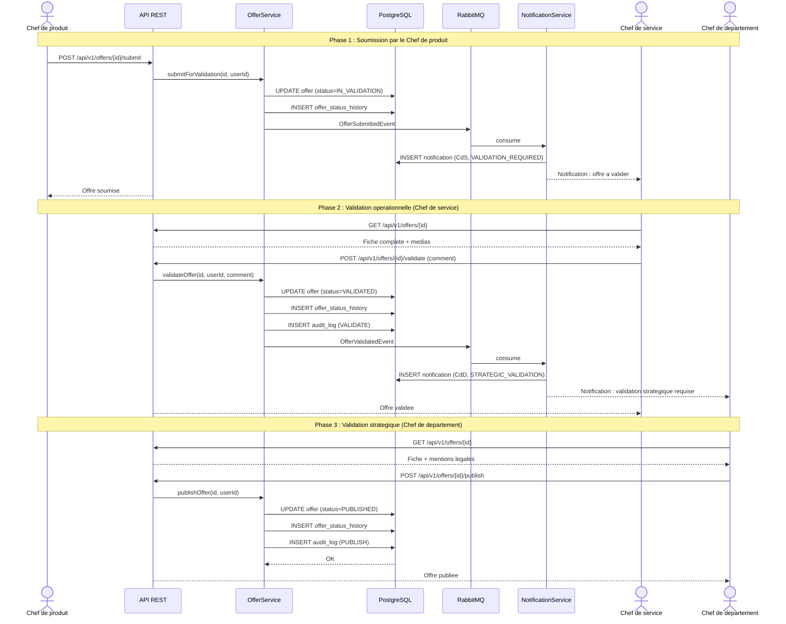

---

## 4. Rejet et correction

Le chef de service rejette l'offre avec un commentaire obligatoire. Le chef de produit est notifié, corrige et resoumet.

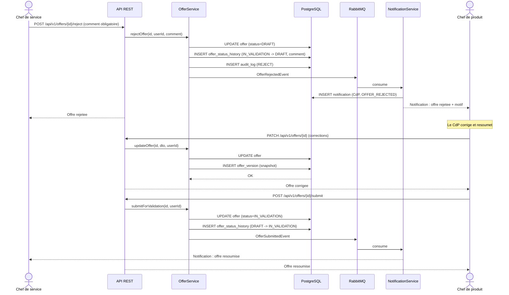

---

## 5. Validation graphique (circuit dédié)

Circuit indépendant de la validation métier. L'analyste marketing dépose les visuels, le système vérifie automatiquement la conformité (résolution, format, droits d'auteur), puis le chef de service annote et valide ou rejette chaque média. Ce circuit se déroule **en parallèle** de l'enrichissement et doit être terminé AVANT que l'offre ne puisse passer en EN_VALIDATION.

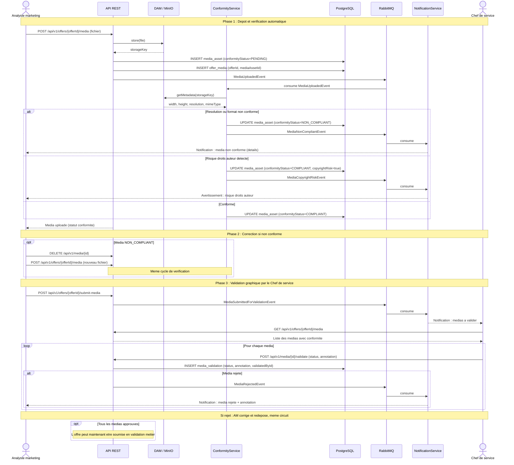

**Articulation avec le circuit de validation métier :**
- La validation graphique et l'enrichissement de contenu se déroulent en parallèle pendant la phase EN_ENRICHISSEMENT.
- Lors de la soumission (EN_ENRICHISSEMENT -> EN_VALIDATION), le système vérifie que **tous les médias sont conformes** et qu'**aucune MediaValidation n'est en statut REJECTED**.
- Si cette condition n'est pas remplie, la soumission est bloquée avec un message explicite.

---

## 6. Publication et diffusion automatique

À la publication, le système diffuse **automatiquement** la fiche vers CRM, centre d'appel et site web (bloc 1 — diffusion automatique). Le Community Manager est notifié pour préparer ses campagnes (bloc 2 — voir diagramme 11).

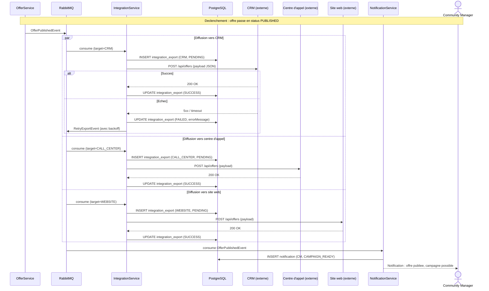

---

## 7. Publication planifiée et expiration automatique

Deux transitions automatiques gérées par le même scheduler : publication différée (PLANNED -> PUBLISHED quand `publishDate` est atteint) et expiration (PUBLISHED -> OBSOLETE quand `validUntil` est atteint). Notification anticipée d'expiration au CdP et CdD.

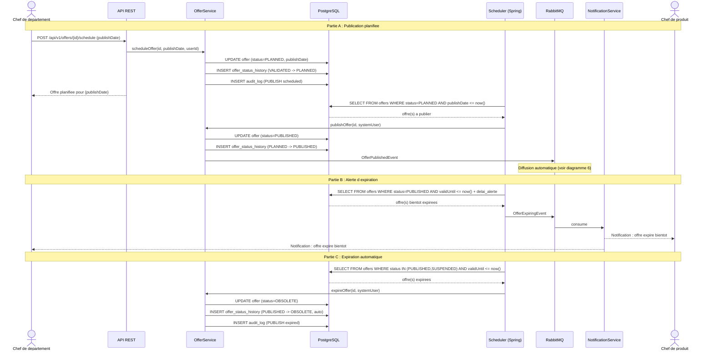

---

## 8. Rollback d'une offre par l'administrateur

L'administrateur système consulte l'historique des versions et restaure une version antérieure.

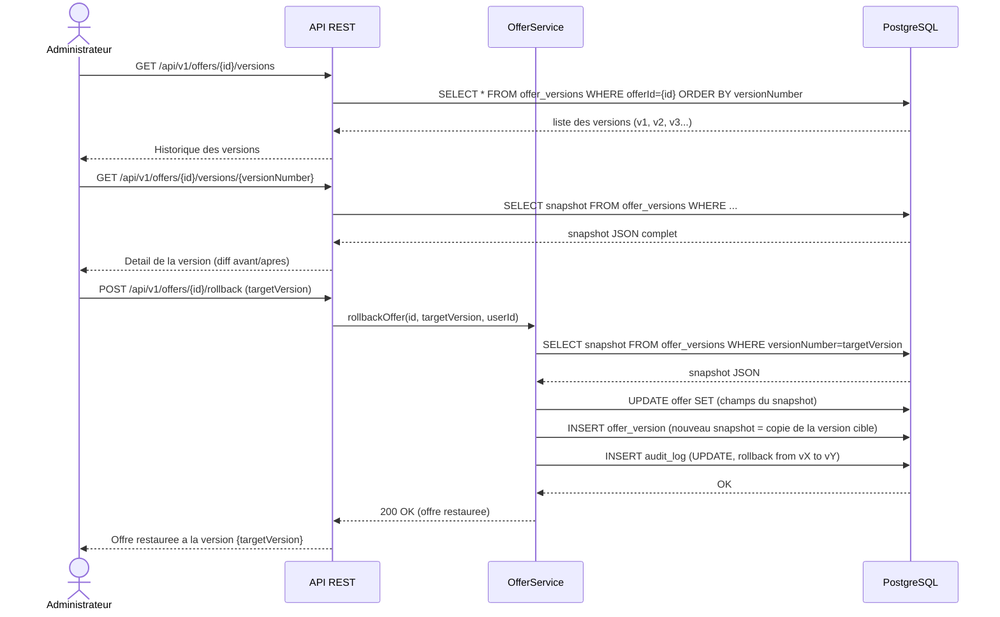

---

## 9. Authentification (login)

Connexion sécurisée avec JWT (access + refresh token). Verrouillage du compte après N échecs.

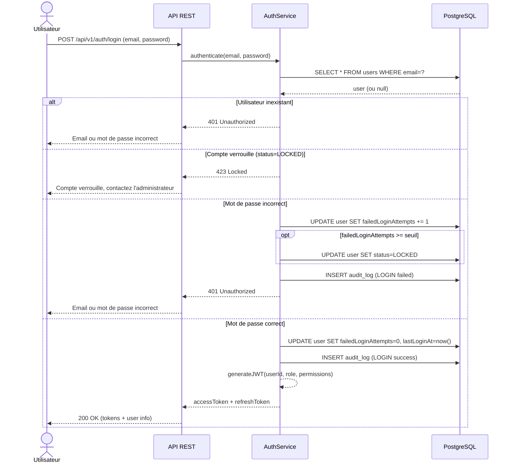

---

## 10. Création d'un produit avec détection de doublons

Le chef de produit crée un produit. Le système vérifie automatiquement s'il existe un doublon potentiel et le signale.

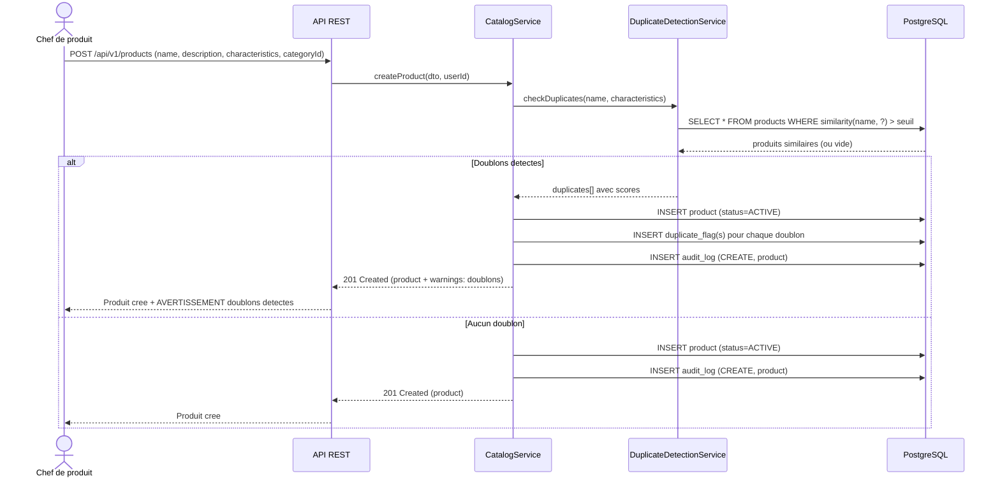

---

## 11. Campagne de diffusion réseaux sociaux (Community Manager)

Le Community Manager prépare et lance une campagne de diffusion vers les réseaux sociaux et sites partenaires, avec suivi des statistiques.

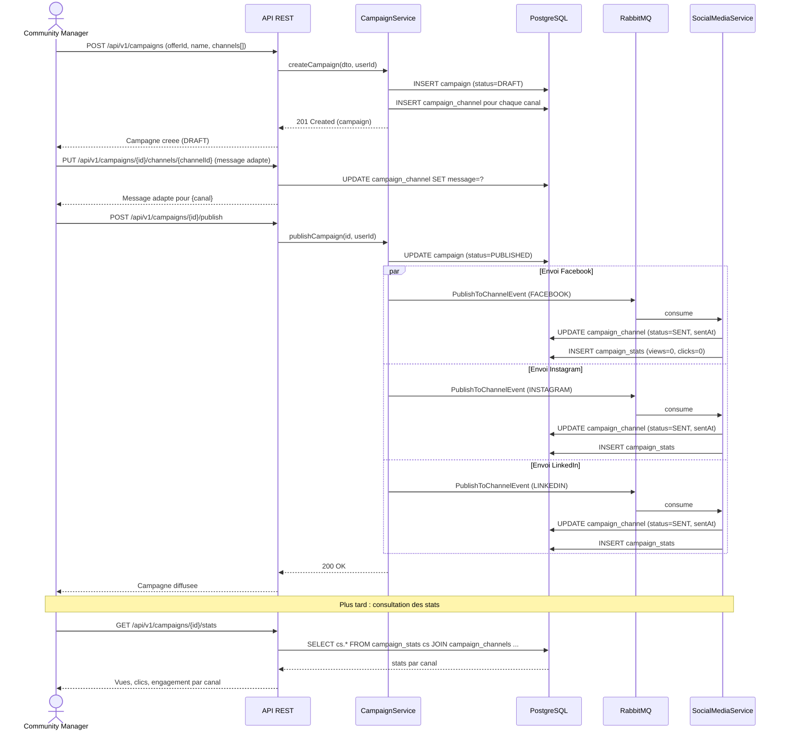
